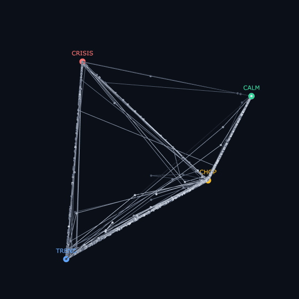
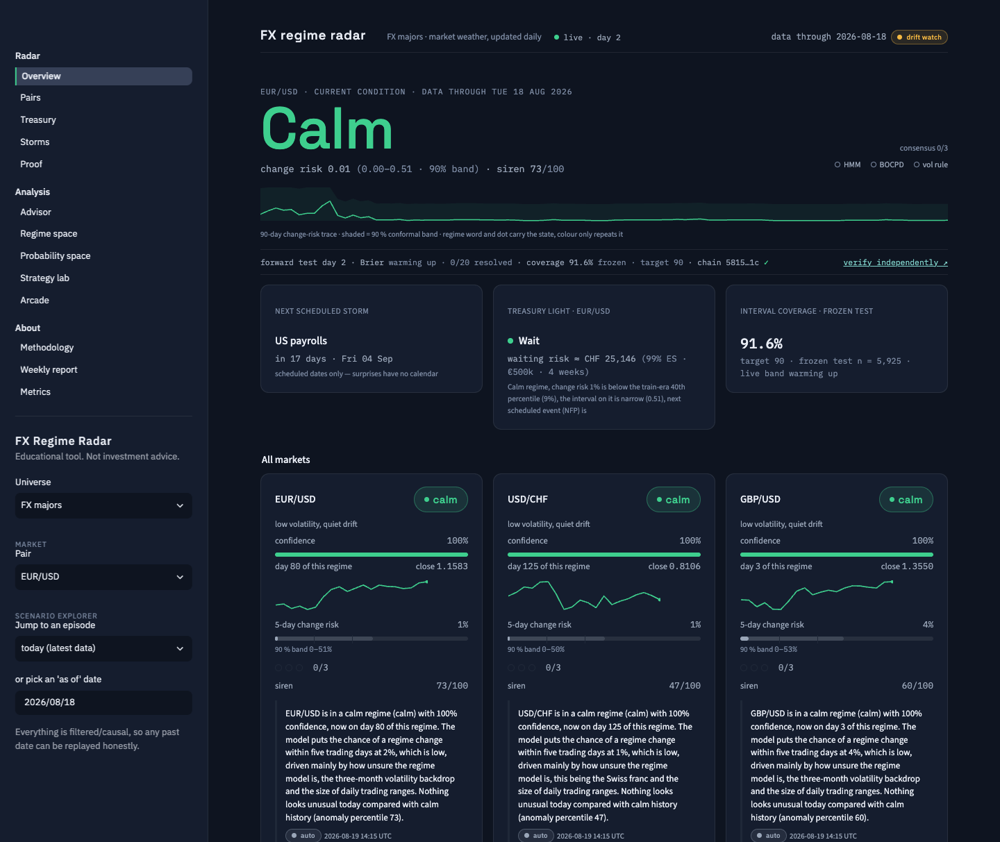
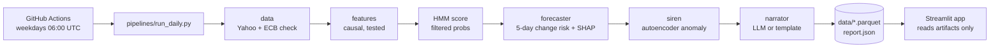
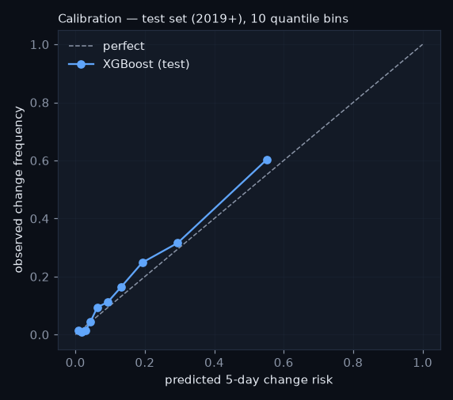
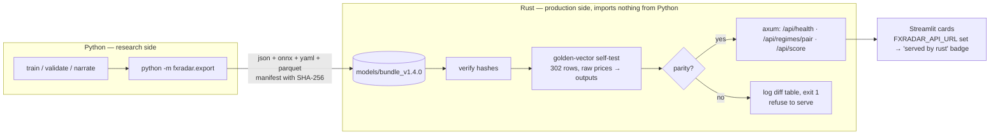

# FX Regime Radar

[](https://github.com/daniil-777/fx-regime-radar/actions/workflows/ci.yml) [](https://github.com/daniil-777/fx-regime-radar/actions/workflows/daily.yml) [](https://github.com/daniil-777/fx-regime-radar/actions/workflows/rust.yml) [](#track-record--frozen-test-vs-live-forward-record)  

<sub>Badges are real: <code>ci</code> runs lint + the full test suite on every push, <code>daily refresh</code> is the 06:00 UTC pipeline, <code>rust engine</code> replays the golden vectors, and <code>live record</code> is regenerated by the pipeline from the ledger below. After forking, run <code>make set-repo REPO=you/your-fork</code> once (the daily job also does this on its first run).</sub>

<p align="center"></p>
<p align="center"><sub>Every day's regime probabilities are one point in this tetrahedron — this is the full history moving through them.</sub></p>



A **weather station for currency markets**. Every weekday a pipeline downloads daily prices for
EUR/USD, USD/CHF and GBP/USD, computes strictly backward-looking features, and runs three small
models matched to three different questions: a hidden Markov model *nowcasts* the current regime
(calm · trend · chop · crisis), an XGBoost classifier *forecasts* the 5-day risk that the regime
changes (with SHAP explanations), and a tiny autoencoder *detects* days that look unlike any calm
day it has seen. A short LLM call then narrates the computed numbers in plain English. Nothing
here predicts price direction — by design.

**Live app:** https://fx-regime-radar.streamlit.app · **Code:** https://github.com/daniil-777/fx-regime-radar

> **Technical report (53 pages, PDF):** [docs/paper/FX_Regime_Radar_Report.pdf](docs/paper/FX_Regime_Radar_Report.pdf) — methods, mathematics, results, failures, engineering, design and go-to-market in one document.
>
> **Why we refuse to backtest the language models** → [docs/why-we-refuse-the-backtest.md](docs/why-we-refuse-the-backtest.md)

## Track record — frozen test vs live forward record

One table, two columns, same metric code. The left column is the out-of-sample number frozen in
phase 07 (test set 2019+, scored once). The right column is the one no backtest can fake: what the
deployed pipeline actually said, written down before the outcome existed.

<!-- live-record:start -->
| 5-day regime-change forecaster | frozen test · 2019+ · scored once (n = 5,922) | **live forward record** · since 2026-08-17 · 0 resolved of 12 |
|---|---|---|
| PR-AUC ↑ | 0.548 (base rate 0.162) | — |
| Brier ↓ | 0.102 (base rate 0.136) | — |
| precision · recall @ 0.22 | 0.45 · 0.59 | — · — |
| positive rate | 16% | — |

**Warming up:** 12 forecasts recorded, 0 resolved — numbers appear at 20 resolved (≈ 7 trading days after the first entry + 5-day horizon). Every weekday the pipeline appends its just-published forecasts (one row per pair, newest date only, never backfilled) to an append-only SHA-256 hash-chained ledger (`data/ledger.parquet`) *before* the outcome exists; five trading days later each row is resolved against the regimes that actually arrived and scored with the same code as the frozen test. A model refit starts a new segment — it cannot rewrite this one. Chain ✓ verified · updated 2026-08-21.
<!-- live-record:end -->

Model refits start a new ledger segment (a refit can never rewrite the old record); the ledger's hash
chain is verified in CI. Details: [`src/fxradar/ledger.py`](src/fxradar/ledger.py),
`data/ledger.parquet`, `data/live_record.json`.

**Don't trust us — verify** (phase 20). Every ledger row since 2026-08-18 carries the four filtered
probabilities, the conformal band, the three consensus votes, the git SHA of the code and a
`schema` tag; `row_hash = sha256(prev_hash | canonical sorted-key JSON)`. Corrections are new rows that
point at the original hash — nothing is ever edited. `data/ledger_head.txt` (head hash + date) is
committed by the daily Action, so GitHub's commit timestamps notarise the chain head for free. On a
fresh clone, standard library only:

```bash
python scripts/verify_ledger.py     # VALID/BROKEN + head hash, from data/ledger.jsonl
cat data/ledger_head.txt
```

The app's **Proof** page shows the per-segment scoreboard (`reports/live_scoreboard.md`), the
conformal coverage receipt, the drift monitor (`data/status.json`: PSI / KS per feature, HMM
staleness from the saved models' predictive log-likelihood, a `model_stale` flag — refits stay a
human decision) and the verify instructions.

**Error bars (phase 22).** Every published change risk wears a Mondrian split-conformal band
(`risk_lo`, `risk_hi`): per-regime 90 % quantiles of |outcome − p̂| calibrated on the 2017–2018
validation years only (also used for early stopping and the threshold — a documented dual use); the
2019+ test was touched once, for the receipt: empirical coverage 91.6 % (calm 92 %, chop 90 %,
trend 92 %, crisis 93 %, n = 5,922). Time series violate exchangeability, so we report empirical
coverage — frozen and, as ledger rows mature, live — instead of citing the theorem. That is a
feature, not a confession: the receipt is the claim.

**Second opinion (phase 21).** A from-scratch Bayesian online changepoint detector (Adams–MacKay,
Normal-Inverse-Gamma, hazard 1/60) asks "how old is the current era?"; its P(change ≤ 5 days) votes
beside the HMM's crisis probability and the phase-04 vol rule (vol_20 above its trailing 80th
percentile). Agreement 0–3 and a template sentence ("3/3 agree: storm conditions") sit on every
weather card and in every ledger row; thresholds are train-era percentiles, nothing is smoothed.

## Architecture



Pipeline writes, app reads: all compute happens in the scheduled job, which commits small
artifacts; the dashboard only reads them and paints in about a second.

## How it works

1. **Data.** Daily OHLC since 2005 from Yahoo Finance, cross-checked against ECB reference rates
   (mean deviation ≈ 0.2 %). Corrupted prints are dropped and logged, never repaired; the
   in-progress day is excluded so reruns are reproducible.
2. **Features.** Returns, 20/60-day realised vol, a 5-day/60-day vol ratio ("storm front"),
   one-month momentum, intraday range, cross-pair correlation, one-week move. Every value at day
   *t* uses rows ≤ *t*; a truncation-invariance test proves it.
3. **Regimes → HMM.** One 4-state Gaussian HMM per pair, fit on 2005–2016 only, scored with
   *filtered* (forward-algorithm) probabilities — what you could have known on the day — never
   smoothed posteriors. States are named by a frozen rule (vol ordering + momentum).
4. **Change risk → XGBoost.** "Will the regime differ at any point in the next five days?"
   Pooled across pairs, time-ordered splits with a 5-day embargo, probabilities recalibrated on
   validation, SHAP top-3 drivers per day.
5. **Siren → autoencoder.** An 8-3-8 MLP trained only on confident calm days; the reconstruction
   error's percentile against calm history is the anomaly score.
6. **Narration.** Three sentences from a small model that sees only a JSON of the numbers above
   (deterministic template if no key). Never advice, never a price call.

## Results (frozen test set, 2019+, scored once)

The forecaster is the only model with a prediction target, so it is the one we score. Accuracy is
never reported: with a positive rate of 16 %, "never changes" would score 84 % and mean nothing.

| model | PR-AUC | precision | recall | Brier |
|---|---|---|---|---|
| XGBoost (ours, calibrated) | **0.548** | 0.45 | 0.59 | **0.102** |
| logistic regression, same features | 0.431 | 0.38 | 0.63 | 0.116 |
| one-feature rule (days_in_regime > median) | 0.143 | 0.11 | 0.38 | 0.584 |
| base rate | 0.162 | 0.16 | 1.00 | 0.136 |

Threshold 0.22 chosen on validation for recall ≥ 60 % (early-warning economics: false alarms are
cheap, missed storms are not). Full report: [reports/forecaster_eval.md](reports/forecaster_eval.md).



Regime validation ([reports/hmm_validation.md](reports/hmm_validation.md)) is deliberately
unflattering where the data is: five-seed label agreement is 40–100 % (the trend/chop split is
fragile), the HMM does not systematically lead a one-line vol rule, and a toy trend strategy is
*not* best inside the "trend" label. The siren's audit
([reports/siren_validation.md](reports/siren_validation.md)) shows the SNB shock of 2015-01-15 as
USD/CHF's loudest day in history and Brexit as GBP/USD's.

### Strategy layer (phases 14–16) — the honest part

A lag-law backtest engine (`backtest.py`), three mechanical strategies with an insurance overlay
and a blend (`strategies.py`), and a stress lab (`stress.py`) turn the signals into risk decisions
and then attack them. Result, stated up front and confirmed: **after realistic, volatility-scaled
costs there is no edge.** Test-period (2019+) net Sharpe: S1 trend −1.23, S2 mean reversion −1.36,
S3 regime gate −1.30, blend −2.18; gross Sharpe is negative for three of four, so the **breakeven
cost multiplier is 0** — nothing here survives its own transaction costs. Cost drag runs 4–7 %/yr;
one extra day of lag barely matters (there was little to lose); a ×1.5 crisis-return shock deepens
the worst drawdown by only 0.5 % because the siren stop and crisis-flat gate take risk off; block
bootstrap puts the blend's one-year max drawdown at −6 % median / −10 % 5th-percentile pain; a ±30 %
parameter sweep is a flat negative plateau (nothing overfit, nothing good). Reports:
[strategy_eval.md](reports/strategy_eval.md), [stress_report.md](reports/stress_report.md).
The deliverable is the framework and the honesty — a research demonstration, not a trading system.

## Limitations

- **Daily data only**; Yahoo's daily close is a start-of-day snapshot, so returns run a day behind highs/lows.
- **Regime labels are noisy and seed-sensitive** — read the confidence and entropy with the label.
- **Descriptive, not predictive.** Regimes describe conditions; change risk is a calibrated probability
  about the HMM's own label, not about prices; the siren detects, it does not forecast.
- **One extreme event can own a state**: for USD/CHF the "crisis" state is essentially the January-2015 shock.
- **Single training window** (2005–2016); refits are manual and re-validated.
- **Educational tool. Not investment advice.**

## Repo tour

```
src/fxradar/      config · data · features · hmm_model · validate · forecaster · siren · narrate · ledger (live record)
pipelines/        run_daily.py — the only place heavy compute happens
app/              app.py (router), views/{overview,advisor,regime_space,strategy_lab,arcade,methodology}.py, ui.py, orb.py — reads artifacts only
data/             prices/features/regimes parquet, report.json, pipeline_status.json, ledger.parquet + live_record.json + badges/ (committed)
models/           hmm_*_v0.4.0.joblib, forecaster_v1.1.0.json, siren_v1.2.0.joblib, manifest.json
reports/          validation markdown + png plots (HMM, forecaster, siren)
docs/             screenshots, model cards, interview notes, demo script, build kit
tests/            77 tests: contracts, leakage (truncation invariance), embargo, financial calcs, app
.github/          ci.yml (lint + tests, the badge), daily.yml (cron refresh), rust.yml, refit.yml (manual, re-validated refits)
```

## Run locally

```bash
make setup      # venv + pinned dependencies
make pipeline   # data → features → HMM → forecaster → siren → narrator → data/*  (loads saved models)
make run        # Streamlit dashboard, reads artifacts only
make test       # pytest — no network, no API key needed
make lint       # ruff + black
```

To retrain: `python -m fxradar.hmm_model --refit`, `python -m fxradar.forecaster --train`,
`python -m fxradar.siren --train`, then `python -m fxradar.validate` — each writes its report.

## Deploy

1. **Push to GitHub.** `.github/workflows/daily.yml` runs weekdays at 06:00 UTC (and on demand),
   refreshes `data/` and commits `data: daily refresh [skip ci]`. Check the first run is green.
2. **Streamlit Community Cloud** (free): https://share.streamlit.io → *Create app* → repo
   `daniil-777/fx-regime-radar`, branch `main`, main file `app/app.py`, app URL
   `fx-regime-radar` → *Advanced settings*: Python **3.11** → *Deploy*. `requirements.txt` ends
   with `-e .` so the `fxradar` package installs; `.python-version` pins 3.11. It redeploys on
   every commit, so the daily data commit keeps it fresh; the header shows "Data through …" and
   "updated …" from the artifacts.
   *Community Cloud sleeps idle apps* (a "wake up" screen after ~12 h without visitors). For an
   **always-on** deployment use the Docker path: `deploy/` holds a self-contained app image
   (`deploy/Dockerfile`, amd64 + arm64), a Caddy reverse proxy with automatic HTTPS
   (`deploy/docker-compose.yml`), a nightly artifact refresh (`deploy/refresh.sh`) and a first-boot
   script for an **Oracle Cloud Always-Free VM** (`deploy/cloud-init.yaml`) — step by step in
   [docs/DEPLOY_ORACLE.md](docs/DEPLOY_ORACLE.md); €0/month, loads in ~1 s, survives reboots. The
   `docker image` GitHub Action builds and health-checks the image on every relevant push.
   Locally (with Docker): `make docker` → http://localhost. Prefer managed containers? The same image
   deploys to **Google Cloud Run** (HTTPS URL, zero ops, ≈ $8–10/month kept warm or free with cold
   starts) — [docs/DEPLOY_CLOUD_RUN.md](docs/DEPLOY_CLOUD_RUN.md); the `cloud run` workflow redeploys
   after every daily refresh once `GCP_PROJECT` / `GCP_SA_KEY` are set.
3. **Secrets (optional).** Live narration needs `ANTHROPIC_API_KEY` under *App settings → Secrets*
   on Streamlit Cloud and as a GitHub repository secret. Without it everything runs on the
   deterministic template. Cost with it: ≈ 5 cents per month (three Haiku calls per weekday).
4. **Refits are manual and deliberate:** `make refit TRAIN_END=… HMM_VERSION=…` or the
   `refit-models` workflow; both regenerate `reports/hmm_validation.md` — read it before merging.

If a daily fetch fails, the pipeline exits nonzero, nothing under `data/` changes, and the app keeps
serving the last good state with its "Data through" date.

## Production serving (the wall)



The Rust crate (`rust/fxradar-serve`) computes the same features from raw price windows, runs the
HMM forward filter with precomputed precision matrices, and calls the two ONNX models. Before it
binds a port it replays every golden vector and compares with Python's exact outputs (features
1e-8, model outputs 1e-6, labels exact); on the shipped bundle the worst feature difference is
1e-13 and the worst model-output difference 3.8e-7. If any output diverges — or any file hash
does — it logs the table and exits nonzero: it would rather die than serve numbers that disagree
with research. `--skip-selftest` exists for development and logs a loud warning.

Measured (`rust/BENCH.md`): 0.43 ms per full single-row scoring path; service p50 0.42 ms /
p99 0.48 ms server-side, ~1 ms round trip; ~2 260 rows/s single-threaded.

Run it: `cargo run --release --bin fxradar-serve -- --bundle models/bundle_v1.4.0 --data-dir data`
(port 8080), or `docker compose up` (Rust service on :8080, dashboard on :8501 reading live state
from it). `POST /api/score` takes `{"pair": "USDCHF", "windows": [{pair, dates, close, high, low} × 3]}`
with ≥ 600 rows per pair (see `docs/bundle_format.md`).

## API — keys, alerts, docs, metrics, widget

The Rust service ships as a product: `X-API-Key` auth with free / pro / partner tiers (sha256-only
sqlite store, `make rust-keys ARGS="--label acme --tier pro"`), signed webhook alerts (regime flips,
siren > 98, consensus 3/3; HMAC-SHA256, at-least-once with idempotent last-alerted state) to generic /
Slack / Telegram receivers, Swagger docs at `/docs`, Prometheus `/metrics`, an embeddable
`/widget.js` badge, `GET /api/treasury`, and a Stripe test-mode webhook that moves a key between
tiers. The startup gate and golden self-test are untouched — the service still refuses to serve on
any mismatch. See [docs/API.md](docs/API.md) and [docs/DEPLOY_ORACLE.md](docs/DEPLOY_ORACLE.md) §7.
Educational tool. Not investment advice.

## The Advisor — how stable, how durable, how much (never which way)

The one page most tools get wrong. It never says buy or sell (rules 4/5); it says what the models can
defend: a **Market Stability Index** (0–100, transparent weights over regime, change risk, siren,
volatility front and model uncertainty), **regime durability** (typical run length 1/(1−p) from the
HMM's self-transition probability vs the current run), a **risk budget** per market — the share of *your*
normal position size the models justify, with reasons (crisis ½, chop 0.8, ×(1−risk) above 30 %,
siren stop above 98) — an inverse-vol **allocation** across markets, a beginner **sizing calculator**
(capital × vol-target ÷ realised vol × budget, capped 2×), and **Ask the radar**: an LLM that answers
plain-language questions strictly from a JSON snapshot of these numbers (no web, no opinions, cites the
fields it used; template answers without a key). Everything works in the scenario explorer, so you can
ask "how much risk on 2022-11-09?" and get the honest answer: FTX day, BTC 35 % of normal size, ETH/LTC 0.

## Model choice — champions, and the bench behind them

No model in this system is an article of faith. Each seat has a **registry of alternatives raced
under one protocol** (`make model-lab` → [reports/model_lab.md](reports/model_lab.md)), an
interactive bench in the app — **Analysis → Model lab**: click between the HMM, jump-model and
GMM lenses and watch the same history re-labelled, with the three-lens comparison strip and the
engine scoreboard beside it (the page reads lab artifacts only; the record always runs on the
champion) — and a documented promotion path — never a silent swap.

**Regime models** (`fxradar.regime_models`, selected per universe with `FXRADAR_REGIME_MODEL`;
the `fx` universe is hard-locked to the champion — its bundle, golden vectors and live ledger
define the public record): the champion **HMM** (filtered forward algorithm); the **statistical
jump model** — the modern industry alternative (Bemporad et al. 2018; Nystrup, Lindström & Madsen
2020/21; Aydınhan, Kolm, Mulvey & Shu 2024, *Annals of OR*): k-means-style state centres plus an
explicit penalty λ per switch, fitted by coordinate descent on train and inferred with the
**greedy online rule** (causal, truncation-tested bit-for-bit), λ matched per pair to the
champion's train-era switching rate; and a **GMM** with no temporal coupling as the persistence
ablation. On the fx universe the lab reproduces the literature's claim on our own data: at matched
training persistence the jump model is far steadier out of sample (EUR/USD: 1.7 switches/yr, mean
run 139 days vs the HMM's 10.3 and 24) with the calm-lowest-vol anatomy intact, while the GMM
flickers at 35–88 switches/yr — what the persistence machinery is buying. Trade-off, stated: the
jump model barely uses its crisis state out of sample (0–1.4 %), so the HMM stays champion for
now; the jump model is the first candidate for the next deliberate refit.

**Forecaster engines** (`fxradar.forecaster_models`): the **XGBoost** champion; scikit-learn's
**HistGradientBoosting** (the LightGBM-style histogram GBDT already inside our pinned sklearn —
zero new dependencies), tree count chosen on validation over an explicit grid; and the **logistic**
reference. Same splits, embargo, Platt calibration and recall-targeted threshold for all; each
frozen test scored once: xgb **0.548** / histgb **0.546** / logistic 0.433 PR-AUC. Two different
GBDT implementations within noise of each other is the robustness result — the signal lives in the
features and protocol, not a library. Research context: GBDTs remain state of the art at this
data scale (Grinsztajn et al. 2022; McElfresh et al. 2023); TabPFN-class foundation models are
interesting below ~10k rows but require torch, which our CI bans by design. There is deliberately
**no env switch for the production forecaster**: a new engine reaches the daily path only through
the challenger-ledger protocol (race live under its own `model_version`, promote after ≥ 60
matured days by a deliberate refit-path act).

## Calendar & context — the challenger (the wall stays shut)

A second forecaster conditions on what the frozen champion cannot see: countdowns to scheduled
FOMC / ECB / SNB / BoE / NFP / CPI dates (leakage-safe because schedules are published a year ahead;
unscheduled shocks like 2015-01-15 are deliberately unknown to it), a lagged cross-asset context
(Fed broad dollar index as DXY proxy, VIX, US 2y, daily EPU, EURCHF) standardised on train only,
CFTC leveraged-money EUR positioning used only from its Friday release date, Yang-Zhang range
volatility, and the central-bank tone features below. Frozen test: challenger PR-AUC 0.544 / Brier
0.103 vs champion 0.548 / 0.102 — no lift; both write to the live ledger and the challenger is
promoted only if its live PR-AUC beats the champion over ≥ 60 matured days with Brier not worse, by
a deliberate refit-path act. YZ ablation: refitting the HMM on vol_20_yz changes labels on 33–69 %
of days — adopting YZ is a full bundle rebuild, scheduled as a follow-up. `features.parquet`, the
bundle, the goldens and the Rust service are byte-identical. See
[reports/challenger_eval.md](reports/challenger_eval.md), [event_study.md](reports/event_study.md),
[yz_ablation.md](reports/yz_ablation.md).

## Central-bank communication index

About forty official statements a year (FOMC, ECB, SNB, BoE) are scored two ways with a hard wall
between them: a frozen, sha256-pinned word list (Loughran-McDonald uncertainty + a cited
hawkish/dovish lexicon) scores history; a pinned FinBERT and — once the gate in
[docs/stage2-decision.md](docs/stage2-decision.md) opens — an LLM score only statements published
after the 2026-08-17 deploy date, into the hash-chained ledger. Daily point-in-time features
(`cb_<bank>_tone / _uncert / _tone_surprise / _days_since`) feed the challenger only.

**Parametric look-ahead.** Language models were trained on text written after our history —
including commentary on how markets reacted to each statement. That knowledge lives in the weights,
so scoring a 2015 statement with them tests memory of the ending, not reading skill; any such
backtest would look great and mean nothing. Hence history is word-lists only, and models with memory
are evaluated live, forward, with receipts (prompt hash, model string, date, raw reply). Details:
[docs/CB_INDEX.md](docs/CB_INDEX.md), [reports/cb_index.md](reports/cb_index.md).

## Treasury mode — hedge / wait / ladder, in francs

The one question a treasurer with a foreign-currency receivable or payable keeps asking: how large
could the adverse move be this week, and is now a defensible moment to act? The **Treasury** page
turns an exposure (amount, currency, horizon, home currency — CHF by default) into a traffic light —
**hedge / wait / ladder** — and a price tag: VaR and expected shortfall of the 1-week move,
conditioned on the current filtered regime, converted at the latest close ("Waiting 1 more week on
€800,000 risks ≈ CHF 20,000 at the 99 % level"). Numbers come from a historical simulation of
absolute 5-day moves on the train era only (`data/treasury_risk.json`, written by the pipeline),
labelled by the regime at the window start; the page does no modelling and never says which way
the rate will move. The light combines regime, change risk, the conformal band width and days to the
next scheduled central-bank event. Method, limits, compliance posture:
[docs/TREASURY.md](docs/TREASURY.md). Educational tool. Not investment advice.

## Storm replays — three crises, replayed as the radar would have seen them

COVID 2020, Credit Suisse March 2023 and the SNB floor removal of 15 January 2015, replayed day by
day through the real scoring path with prices truncated at each day (`make storms`, page **Storms**,
[reports/storms/](reports/storms/)). The windows were fixed in advance; no window was chosen after
seeing the results, and every replayed row equals the full-history artifact and the live ledger
(tested). The honest part: on 15 January 2015 the radar did **not** warn — change risk sat at
14–23 % in the days before, a marginal alarm at best; the siren's 100 that day is detection of an
unprecedented move, not a prediction, and a vol-based radar is blind to a pegged cross. Causal
reconstruction, not the live record — the live record is the ledger on the Proof page.

## Weekly report & metrics

Every Monday 06:30 UTC the repo publishes a free FX weather report — regime, change risk ± band,
siren, a *generic* hedge / wait / ladder light (never personalised), days to the next central-bank
decision, three template sentences per pair, and the live-record line:
[latest](docs/weekly/index.md) · [RSS](docs/feed.xml) · e-mail-safe HTML twin beside each page
(`docs/EMAIL_HOOK.md` for a provider later). Educational tool. Not investment advice.

The five numbers investors ask about, auto-filled where possible and honest zeros otherwise
(`data/metrics.json`, app page **Metrics**):

| Metric | Value |
|---|---:|
| Ledger days live | 2 |
| Report subscribers | 0 |
| Active API keys | 0 |
| Design partners | 0 |
| MRR (CHF) | 0 |
| Forecasts recorded / resolved | 6 / 0 |
| Weekly reports published | 1 |

_Zeros are real zeros — updated 2026-08-19T14:02:25Z by `make metrics`._

## The AI presenter — grounded, gated, disclosed

Ask the radar a question and a computer-generated presenter answers — from today's published
numbers and a fixed methodology FAQ, and from nothing else. The brand law survives by relocating:
instead of pre-approving scripts, **every generated sentence passes two hard gates before any
audio** — the rule-5 direction-word lint, and a *numeric-grounding* check against the closed set of
numbers the pipeline published today (`allowed_numbers` in `data/avatar_context.json`); a number
not in the pack cannot be spoken, one corrective regeneration, then a branded refusal. Direction
and advice questions short-circuit to refusals that say what the radar *can* tell you. The first
sentence of every session is the disclosure ("I am the radar's AI presenter — an AI, not a
person"), and the widget carries a permanent "AI presenter · risk information, not investment
advice" caption. Off by default (`FXRADAR_AVATAR=on`); faces render in the vendor cloud (Anam
BYO-LLM primary, HeyGen fallback) or, keyless, the regime-coloured presenter disc + browser voice —
fully real-time with zero external services. Transcripts are logged and human-reviewed weekly; the
Proof page stays presenter-free on purpose. Setup and policy: [docs/AVATAR.md](docs/AVATAR.md);
the presenter's entire knowledge: [docs/avatar_knowledge.md](docs/avatar_knowledge.md).

## Pricing & design partners

Free: weekly report + public widget · Pro CHF 79/month: alerts, Treasury mode, monthly PDF ·
Partner CHF 500+/month: API + white-label. Monthly, cancel any time — TEST MODE until the first
design partner converts ([PRICING](docs/PRICING.md), [TERMS](docs/TERMS.md),
[PRIVACY](docs/PRIVACY.md) — drafts, FinSA review pending). Looking for five Swiss SMEs /
fiduciaries as design partners: [outreach kit](docs/outreach/). The ledger and the traffic light are
the pitch; there are no direction promises anywhere in the sales copy.

## Universes and the scenario explorer

The pipeline is universe-agnostic. `src/fxradar/universes.py` holds one record per instrument set;
the app's sidebar and header tabs switch between them, and each has its own artifacts, models,
reports and live ledger (`data/<universe>/`, `models/<universe>/`, `reports/<universe>/`).

| universe | instruments | why these | frozen test (2019+ / 2023+ for crypto, scored once) |
|---|---|---|---|
| **FX majors** (`fx`, the defaults) | EUR/USD · USD/CHF · GBP/USD | the original three; wall-protected (bundle, goldens, Rust), the live ledger since 2026-08-17 — byte-identical since phase 11 | PR-AUC 0.548 · Brier 0.102 · n = 5,922 |
| **FX G10** (`g10`) | EUR/USD · USD/JPY · GBP/USD · USD/CAD · AUD/USD · USD/CHF · NZD/USD · EUR/GBP · EUR/JPY · USD/SEK | the ten most important **free-floating** pairs by BIS April-2025 turnover (EUR/USD 21.2 %, USD/JPY 14.3 %, GBP/USD 7.6 %, USD/CAD 5.3 %, AUD/USD 4.9 %, USD/CHF 4.9 %, then the euro crosses, NZD/USD, USD/SEK). USD/CNY (8.1 %), USD/HKD (3.6 %), USD/SGD, USD/INR rank higher by turnover but are managed floats / pegs — a volatility-regime model is blind to a managed currency by construction, so they are excluded on purpose. EUR/CHF was tried and rejected by the data: inside its 2011–15 floor returns are ~0 and EM collapses a state onto a singular covariance; it stays a context series. Same splits, cleaning and cost model as `fx`; the three shared pairs get **identical** regimes (each HMM sees only its own features) | PR-AUC 0.551 vs 0.455 logistic vs 0.177 base · Brier 0.110 vs 0.146 · n = 19,746 |
| **EM majors** (`em`) | USD/MXN · USD/BRL · USD/ZAR · USD/PLN · USD/RUB | the free-floating emerging-market majors with clean daily data (USD/MXN is the most traded EM pair, BIS 2025), plus **USD/RUB — flagged**: a managed corridor until Nov 2014 (inside the training years), a free float 2015–21, and a sanctioned, capital-controlled, onshore-only market since 2022. Yahoo's RUB=X is an offshore *indicative* series (2022: thirty-two moves > 5 %; 17 % stale days in 2024 after MOEX halted USD trading), the ECB stopped publishing a RUB reference in March 2022 (no official cross-check), and because RUB's calm training days come from the corridor era the siren reads > 98 on most post-2014 days — for this pair the regime and change risk are the useful signals, the siren is a saturated one. USD/TRY (managed depreciation + controls) excluded by the same rule as CNY/HKD. EM cost model 3 bp + 120 × vol; the honest verdicts hold: 2014 ruble crisis and 2022 invasion light the siren at rank ≤ 35, strategy breakeven costs 0.00–0.15× | PR-AUC 0.548 vs 0.471 logistic vs 0.216 base · Brier 0.135 vs 0.172 · n = 9,867 |
| **Crypto majors** (`crypto`) | BTC · ETH · XRP · BNB · ADA (vs USD) | the five largest non-stablecoins with ≥ 3 years of history before the frozen split; SOL (listed 2020-04) would leave ~205 training days for a ~50-parameter HMM and waits for the next split revision; LTC retired 2026-08-19. History from 2017-11-09 (the first day all five trade); 7-day markets, 65–120 % vol; train ≤ 2020, val 2021–22, test 2023+; exchange-fee cost model; refit under `hmm 0.4.1`, so its ledger carries the old three-coin rows as a closed segment | PR-AUC 0.574 vs 0.405 logistic vs 0.167 base · Brier 0.110 vs 0.141 · n = 6,579 |

Build any universe from scratch with `make train-universe UNIVERSE=g10` (or `em`) (data → features → HMM →
validation → forecaster → siren → daily pipeline → strategies → stress; then `make viz3d
UNIVERSE=g10`); the daily Action refreshes all three. FX-only stages (calendar, challenger, treasury
in francs) skip themselves with a log line on other universes. The strategy layer stays honest
everywhere: net of costs, G10's breakeven cost multipliers are 0.00–0.15×; crypto's regime gate is
the one series with a positive net test Sharpe (0.34, breakeven 1.55×) — reported, not celebrated.
With ten markets the Overview switches from cards to a dense market table (regime, confidence, age,
change risk ± band, consensus, siren, close, 20-day sparkline).

The **scenario explorer** replays any past date — jump to a named episode or pick an "as of" date —
showing the weather station exactly as it was computable that day (filtered regimes, causal risk
and siren; nothing after the date is drawn). Deep links work: `?universe=g10&pair=USDJPY`,
`?universe=crypto&pair=BTC-USD&asof=2022-11-09`.

## The regime orb

The dashboard hero carries an ambient three.js particle orb for the selected pair: regime → colour and motion,
change risk → jitter, siren → a decaying pulse (`app/orb.py`; four presets mirrored in Python and JS). ≤ 900
particles, paused when the tab is hidden, gentle drift under `prefers-reduced-motion`, flat regime dot with zero
layout shift if WebGL/three.js is unavailable, no sound, no faces. Measured cost ≈ 0.3 ms per frame of JS +
render submission (≈ 2 % of one core at 60 fps under software GL; less on a real GPU). Screenshots of all states:
`docs/screenshots/orb/`. The v3 React port will use react-three-fiber with the same presets.

## Regime space — the model's feature space in 3-D

`Regime space` (Radar → Regime space) is the one place the app plots *data* in three dimensions (the orb is ambient, not a chart), and only
because the third axis is real: a hidden Markov model is a clustering of days in feature space with memory, so the features *are*
the coordinates. Two WebGL views (Plotly `Scatter3d` / `Surface`, no new dependency), read from
`features.parquet` + `regimes.parquet` and filtered to the as-of date so the scenario explorer replays honestly:

- **State-space portrait** — every trading day as a point at (realised vol, 1-month momentum, third axis: HMM
  entropy · cross-pair correlation · vol ratio · 5-day change risk · days in regime), coloured by the regime the
  filtered HMM assigned *on that day*; regime centres (medians) as diamonds; the last 20–120 days as a trail ending
  in the ringed as-of marker; the other pairs' same-day positions as hollow ghosts; ▶ replays the trail through the
  last year (Plotly frames, ~125, built in < 0.5 s). Orbit, zoom, hide a regime from the legend.
- **Regime landscape** — a density terrain of history over (vol, momentum): height = how many days lived there
  (log), colour = the regime the model most often called there (calm hill at low vol, crisis ridge at high vol),
  the same trail walking over the hills. Plain numpy (2-D histogram + binomial blur); empty cells are cut out.
- **Geometry readout** — realised-vol percentile, momentum, and z-scored distance from today to each regime's
  centre — labelled as a reading aid, distinct from the HMM's own filtered probability (which also uses persistence).

Nothing on the page predicts; the axes are computed from data up to each day (rule 1). Screenshots:
`docs/screenshots/regime_space.png` (today), `docs/screenshots/regime_space_snb.png` (USD/CHF as of 2015-01-15 —
watch the entropy axis: the model's doubt spikes on the SNB day before the label moves).

## Probability space — the tetrahedron and the landscape (display layer only)

`src/fxradar/viz3d.py` + the *Probability space* page. **(A) Regime tetrahedron:** the HMM's four
*filtered* probabilities sum to one, so each day is a point in a 3-simplex — `simplex_coords` is
exactly `probs @ V` with `V = [[1,1,1],[1,-1,-1],[-1,1,-1],[-1,-1,1]]` in the frozen order
calm · trend · chop · crisis (asserted, never inferred); the uniform ¼ row is the origin. A corner is
certainty, the centre is "no idea", an edge is a two-way tie; the path is the market's history through
those beliefs. Axes are hidden on purpose — simplex coordinates have no units. **(B) Market landscape:**
PCA(3) of the eight backward-looking features, fit on train rows only (`train_end` and the fit-row
count are stored on the object and asserted by tests), then frozen and applied to all history; days
coloured by regime, the last 60 days as a trail, today ringed. The embedding is fit *offline*
(`make viz3d`, persisted next to the models) and only loaded by the app; the four probabilities are
replayed from the frozen bundle's forward filter — the same causal function the pipeline used, and a
test checks the replay reproduces `regimes.parquet` exactly. Nothing else in the app went 3-D: the daily
operational views stay flat on purpose. `make gif` renders `assets/tetrahedron.gif` (kaleido + imageio,
dev-only, `requirements-dev.txt`).

## Trust-first UI (phase 31)

One design token file (`design/tokens.json`) drives the Streamlit CSS, the Plotly template, the
matplotlib report figures, the orb presets, the e-mail report and `widget.js`; `make lint-ui` (in CI)
fails on any hex literal elsewhere. Two signature structures on every surface: the **condition
banner** — the regime word huge in its colour, change risk ± 90 % band, siren, the quiet 90-day risk
trace, the three-dot consensus — and the **trust strip** — forward-test day count, live Brier vs
frozen, coverage vs target, chain head ✓, "verify independently". Space Grotesk for the regime
word, IBM Plex Sans for UI, IBM Plex Mono with tabular figures for every number. Regime colours are
data and status only, never decoration; regime is never colour-only; every text/surface pair clears
4.5:1 (tested); the orb is the one ambient element and the live dot's pulse the only other motion,
both off under reduced motion. Target: `design/design-target-mockup.html`. Screenshots:
`docs/screenshots/overview_v3.png`, `pairs_v3.png`, `treasury.png`, `storms.png`, `proof.png`,
`mobile_overview_v3.png`, `orb/orb_states.png`.

## Runs on desktop, tablet and phone

One layout that adapts — no device sniffing, no separate mobile app. Responsive CSS in `app/ui.py`
(`@media` blocks) does the work: on phones the header stacks, the KPI strip becomes a 2×2 grid, cards
and columns stack, tables scroll inside their own box (the page never scrolls sideways), touch targets
are ≥ 40 px, the decorative 3-D orb is hidden, and a compact control bar (universe · market as
segmented controls) appears at the top because Streamlit collapses the sidebar on small screens — the
bar and the sidebar are two views of the same choice, kept in sync by callbacks. Episode replay and the
as-of date stay in the side panel (the » button, top left). Tablets keep the sidebar and show
three-across blocks two-across. Verify any width with the dev tool:
`.venv/bin/python tools/screenshot.py http://localhost:8501/ out.png --width 390 --height 844 --mobile`.
Screenshots: `docs/screenshots/mobile_overview.png`, `docs/screenshots/mobile_sidebar.png`.

## Interview material

`docs/model_cards.md` (one card per model), `docs/INTERVIEW_NOTES.md` (answers in the developer's
voice + a hard question each), `docs/DEMO_SCRIPT.md` (90-second walkthrough).

---

**Educational tool. Not investment advice.**
