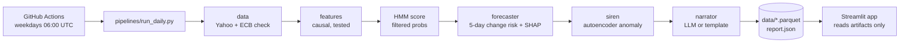
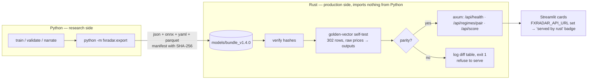

# FX Regime Radar

   


A **weather station for currency markets**. Every weekday a pipeline downloads daily prices for
EUR/USD, USD/CHF and GBP/USD, computes strictly backward-looking features, and runs three small
models matched to three different questions: a hidden Markov model *nowcasts* the current regime
(calm · trend · chop · crisis), an XGBoost classifier *forecasts* the 5-day risk that the regime
changes (with SHAP explanations), and a tiny autoencoder *detects* days that look unlike any calm
day it has seen. A short LLM call then narrates the computed numbers in plain English. Nothing
here predicts price direction — by design.

**Live app:** _link placeholder — add after deploying to Streamlit Community Cloud (see Deploy)._

## Architecture



Pipeline writes, app reads: all compute happens in the scheduled job, which commits small
artifacts; the dashboard only reads them and paints in about a second.

## How it works

1. **Data.** Daily OHLC since 2005 from Yahoo Finance, cross-checked against ECB reference rates
   (mean deviation ≈ 0.2 %). Corrupted prints are dropped and logged, never repaired; the
   in-progress day is excluded so reruns are reproducible.
2. **Features.** Returns, 20/60-day realised vol, a 5-day/60-day vol ratio ("storm front"),
   one-month momentum, intraday range, cross-pair correlation, one-week move. Every value at day
   *t* uses rows ≤ *t*; a truncation-invariance test proves it.
3. **Regimes → HMM.** One 4-state Gaussian HMM per pair, fit on 2005–2016 only, scored with
   *filtered* (forward-algorithm) probabilities — what you could have known on the day — never
   smoothed posteriors. States are named by a frozen rule (vol ordering + momentum).
4. **Change risk → XGBoost.** "Will the regime differ at any point in the next five days?"
   Pooled across pairs, time-ordered splits with a 5-day embargo, probabilities recalibrated on
   validation, SHAP top-3 drivers per day.
5. **Siren → autoencoder.** An 8-3-8 MLP trained only on confident calm days; the reconstruction
   error's percentile against calm history is the anomaly score.
6. **Narration.** Three sentences from a small model that sees only a JSON of the numbers above
   (deterministic template if no key). Never advice, never a price call.

## Results (frozen test set, 2019+, scored once)

The forecaster is the only model with a prediction target, so it is the one we score. Accuracy is
never reported: with a positive rate of 16 %, "never changes" would score 84 % and mean nothing.

| model | PR-AUC | precision | recall | Brier |
|---|---|---|---|---|
| XGBoost (ours, calibrated) | **0.548** | 0.45 | 0.59 | **0.102** |
| logistic regression, same features | 0.431 | 0.38 | 0.63 | 0.116 |
| one-feature rule (days_in_regime > median) | 0.143 | 0.11 | 0.38 | 0.584 |
| base rate | 0.162 | 0.16 | 1.00 | 0.136 |

Threshold 0.22 chosen on validation for recall ≥ 60 % (early-warning economics: false alarms are
cheap, missed storms are not). Full report: [reports/forecaster_eval.md](reports/forecaster_eval.md).


Regime validation ([reports/hmm_validation.md](reports/hmm_validation.md)) is deliberately
unflattering where the data is: five-seed label agreement is 40–100 % (the trend/chop split is
fragile), the HMM does not systematically lead a one-line vol rule, and a toy trend strategy is
*not* best inside the "trend" label. The siren's audit
([reports/siren_validation.md](reports/siren_validation.md)) shows the SNB shock of 2015-01-15 as
USD/CHF's loudest day in history and Brexit as GBP/USD's.

## Limitations

- **Daily data only**; Yahoo's daily close is a start-of-day snapshot, so returns run a day behind highs/lows.
- **Regime labels are noisy and seed-sensitive** — read the confidence and entropy with the label.
- **Descriptive, not predictive.** Regimes describe conditions; change risk is a calibrated probability
  about the HMM's own label, not about prices; the siren detects, it does not forecast.
- **One extreme event can own a state**: for USD/CHF the "crisis" state is essentially the January-2015 shock.
- **Single training window** (2005–2016); refits are manual and re-validated.
- **Educational tool. Not investment advice.**

## Repo tour

```
src/fxradar/      config · data · features · hmm_model · validate · forecaster · siren · narrate
pipelines/        run_daily.py — the only place heavy compute happens
app/              app.py, ui.py (design system), pages/1_Methodology.py — reads artifacts only
data/             prices/features/regimes parquet, report.json, pipeline_status.json (committed)
models/           hmm_*_v0.4.0.joblib, forecaster_v1.1.0.json, siren_v1.2.0.joblib, manifest.json
reports/          validation markdown + png plots (HMM, forecaster, siren)
docs/             screenshots, model cards, interview notes, demo script, build kit
tests/            77 tests: contracts, leakage (truncation invariance), embargo, financial calcs, app
.github/          daily.yml (cron refresh), refit.yml (manual, re-validated refits)
```

## Run locally

```bash
make setup      # venv + pinned dependencies
make pipeline   # data → features → HMM → forecaster → siren → narrator → data/*  (loads saved models)
make run        # Streamlit dashboard, reads artifacts only
make test       # pytest — 77 passed, no network needed
make lint       # ruff + black
```

To retrain: `python -m fxradar.hmm_model --refit`, `python -m fxradar.forecaster --train`,
`python -m fxradar.siren --train`, then `python -m fxradar.validate` — each writes its report.

## Deploy

1. **Push to GitHub.** `.github/workflows/daily.yml` runs weekdays at 06:00 UTC (and on demand),
   refreshes `data/` and commits `data: daily refresh [skip ci]`. Check the first run is green.
2. **Streamlit Community Cloud** (free): https://share.streamlit.io → *New app* → repo, branch,
   main file `app/app.py` → *Deploy*. It redeploys on every commit, so the daily data commit keeps
   it fresh; the header shows "Data through …" and "updated …" from the artifacts.
3. **Secrets (optional).** Live narration needs `ANTHROPIC_API_KEY` under *App settings → Secrets*
   on Streamlit Cloud and as a GitHub repository secret. Without it everything runs on the
   deterministic template. Cost with it: ≈ 5 cents per month (three Haiku calls per weekday).
4. **Refits are manual and deliberate:** `make refit TRAIN_END=… HMM_VERSION=…` or the
   `refit-models` workflow; both regenerate `reports/hmm_validation.md` — read it before merging.

If a daily fetch fails, the pipeline exits nonzero, nothing under `data/` changes, and the app keeps
serving the last good state with its "Data through" date.

## Production serving (the wall)



The Rust crate (`rust/fxradar-serve`) computes the same features from raw price windows, runs the
HMM forward filter with precomputed precision matrices, and calls the two ONNX models. Before it
binds a port it replays every golden vector and compares with Python's exact outputs (features
1e-8, model outputs 1e-6, labels exact); on the shipped bundle the worst feature difference is
1e-13 and the worst model-output difference 3.8e-7. If any output diverges — or any file hash
does — it logs the table and exits nonzero: it would rather die than serve numbers that disagree
with research. `--skip-selftest` exists for development and logs a loud warning.

Measured (`rust/BENCH.md`): 0.43 ms per full single-row scoring path; service p50 0.42 ms /
p99 0.48 ms server-side, ~1 ms round trip; ~2 260 rows/s single-threaded.

Run it: `cargo run --release --bin fxradar-serve -- --bundle models/bundle_v1.4.0 --data-dir data`
(port 8080), or `docker compose up` (Rust service on :8080, dashboard on :8501 reading live state
from it). `POST /api/score` takes `{"pair": "USDCHF", "windows": [{pair, dates, close, high, low} × 3]}`
with ≥ 600 rows per pair (see `docs/bundle_format.md`).

## Interview material

`docs/model_cards.md` (one card per model), `docs/INTERVIEW_NOTES.md` (answers in the developer's
voice + a hard question each), `docs/DEMO_SCRIPT.md` (90-second walkthrough).

---

**Educational tool. Not investment advice.**
