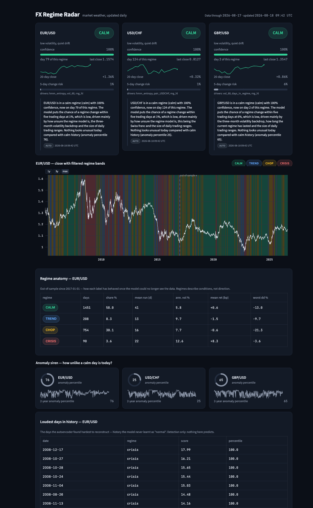
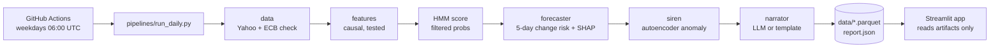
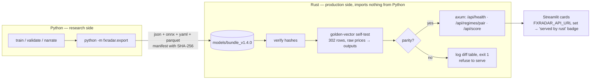

# FX Regime Radar

[](https://github.com/daniil-777/fx-regime-radar/actions/workflows/ci.yml) [](https://github.com/daniil-777/fx-regime-radar/actions/workflows/daily.yml) [](https://github.com/daniil-777/fx-regime-radar/actions/workflows/rust.yml) [](#track-record--frozen-test-vs-live-forward-record)  

<sub>Badges are real: <code>ci</code> runs lint + the full test suite on every push, <code>daily refresh</code> is the 06:00 UTC pipeline, <code>rust engine</code> replays the golden vectors, and <code>live record</code> is regenerated by the pipeline from the ledger below. After forking, run <code>make set-repo REPO=you/your-fork</code> once (the daily job also does this on its first run).</sub>

<p align="center"></p>
<p align="center"><sub>Every day's regime probabilities are one point in this tetrahedron — this is the full history moving through them.</sub></p>



A **weather station for currency markets**. Every weekday a pipeline downloads daily prices for
EUR/USD, USD/CHF and GBP/USD, computes strictly backward-looking features, and runs three small
models matched to three different questions: a hidden Markov model *nowcasts* the current regime
(calm · trend · chop · crisis), an XGBoost classifier *forecasts* the 5-day risk that the regime
changes (with SHAP explanations), and a tiny autoencoder *detects* days that look unlike any calm
day it has seen. A short LLM call then narrates the computed numbers in plain English. Nothing
here predicts price direction — by design.

**Live app:** https://fx-regime-radar.streamlit.app · **Code:** https://github.com/daniil-777/fx-regime-radar

## Track record — frozen test vs live forward record

One table, two columns, same metric code. The left column is the out-of-sample number frozen in
phase 07 (test set 2019+, scored once). The right column is the one no backtest can fake: what the
deployed pipeline actually said, written down before the outcome existed.

<!-- live-record:start -->
| 5-day regime-change forecaster | frozen test · 2019+ · scored once (n = 5,922) | **live forward record** · since 2026-08-17 · 0 resolved of 6 |
|---|---|---|
| PR-AUC ↑ | 0.548 (base rate 0.162) | — |
| Brier ↓ | 0.102 (base rate 0.136) | — |
| precision · recall @ 0.22 | 0.45 · 0.59 | — · — |
| positive rate | 16% | — |

**Warming up:** 6 forecasts recorded, 0 resolved — numbers appear at 20 resolved (≈ 7 trading days after the first entry + 5-day horizon). Every weekday the pipeline appends its just-published forecasts (one row per pair, newest date only, never backfilled) to an append-only SHA-256 hash-chained ledger (`data/ledger.parquet`) *before* the outcome exists; five trading days later each row is resolved against the regimes that actually arrived and scored with the same code as the frozen test. A model refit starts a new segment — it cannot rewrite this one. Chain ✓ verified · updated 2026-08-19.
<!-- live-record:end -->

Model refits start a new ledger segment (a refit can never rewrite the old record); the ledger's hash
chain is verified in CI. Details: [`src/fxradar/ledger.py`](src/fxradar/ledger.py),
`data/ledger.parquet`, `data/live_record.json`.

**Don't trust us — verify** (phase 20). Every ledger row since 2026-08-18 carries the four filtered
probabilities, the conformal band, the three consensus votes, the git SHA of the code and a
`schema` tag; `row_hash = sha256(prev_hash | canonical sorted-key JSON)`. Corrections are new rows that
point at the original hash — nothing is ever edited. `data/ledger_head.txt` (head hash + date) is
committed by the daily Action, so GitHub's commit timestamps notarise the chain head for free. On a
fresh clone, standard library only:

```bash
python scripts/verify_ledger.py     # VALID/BROKEN + head hash, from data/ledger.jsonl
cat data/ledger_head.txt
```

The app's **Proof** page shows the per-segment scoreboard (`reports/live_scoreboard.md`), the
conformal coverage receipt, the drift monitor (`data/status.json`: PSI / KS per feature, HMM
staleness from the saved models' predictive log-likelihood, a `model_stale` flag — refits stay a
human decision) and the verify instructions.

**Error bars (phase 22).** Every published change risk wears a Mondrian split-conformal band
(`risk_lo`, `risk_hi`): per-regime 90 % quantiles of |outcome − p̂| calibrated on the 2017–2018
validation years only (also used for early stopping and the threshold — a documented dual use); the
2019+ test was touched once, for the receipt: empirical coverage 91.6 % (calm 92 %, chop 90 %,
trend 92 %, crisis 93 %, n = 5,922). Time series violate exchangeability, so we report empirical
coverage — frozen and, as ledger rows mature, live — instead of citing the theorem. That is a
feature, not a confession: the receipt is the claim.

**Second opinion (phase 21).** A from-scratch Bayesian online changepoint detector (Adams–MacKay,
Normal-Inverse-Gamma, hazard 1/60) asks "how old is the current era?"; its P(change ≤ 5 days) votes
beside the HMM's crisis probability and the phase-04 vol rule (vol_20 above its trailing 80th
percentile). Agreement 0–3 and a template sentence ("3/3 agree: storm conditions") sit on every
weather card and in every ledger row; thresholds are train-era percentiles, nothing is smoothed.

## Architecture



Pipeline writes, app reads: all compute happens in the scheduled job, which commits small
artifacts; the dashboard only reads them and paints in about a second.

## How it works

1. **Data.** Daily OHLC since 2005 from Yahoo Finance, cross-checked against ECB reference rates
   (mean deviation ≈ 0.2 %). Corrupted prints are dropped and logged, never repaired; the
   in-progress day is excluded so reruns are reproducible.
2. **Features.** Returns, 20/60-day realised vol, a 5-day/60-day vol ratio ("storm front"),
   one-month momentum, intraday range, cross-pair correlation, one-week move. Every value at day
   *t* uses rows ≤ *t*; a truncation-invariance test proves it.
3. **Regimes → HMM.** One 4-state Gaussian HMM per pair, fit on 2005–2016 only, scored with
   *filtered* (forward-algorithm) probabilities — what you could have known on the day — never
   smoothed posteriors. States are named by a frozen rule (vol ordering + momentum).
4. **Change risk → XGBoost.** "Will the regime differ at any point in the next five days?"
   Pooled across pairs, time-ordered splits with a 5-day embargo, probabilities recalibrated on
   validation, SHAP top-3 drivers per day.
5. **Siren → autoencoder.** An 8-3-8 MLP trained only on confident calm days; the reconstruction
   error's percentile against calm history is the anomaly score.
6. **Narration.** Three sentences from a small model that sees only a JSON of the numbers above
   (deterministic template if no key). Never advice, never a price call.

## Results (frozen test set, 2019+, scored once)

The forecaster is the only model with a prediction target, so it is the one we score. Accuracy is
never reported: with a positive rate of 16 %, "never changes" would score 84 % and mean nothing.

| model | PR-AUC | precision | recall | Brier |
|---|---|---|---|---|
| XGBoost (ours, calibrated) | **0.548** | 0.45 | 0.59 | **0.102** |
| logistic regression, same features | 0.431 | 0.38 | 0.63 | 0.116 |
| one-feature rule (days_in_regime > median) | 0.143 | 0.11 | 0.38 | 0.584 |
| base rate | 0.162 | 0.16 | 1.00 | 0.136 |

Threshold 0.22 chosen on validation for recall ≥ 60 % (early-warning economics: false alarms are
cheap, missed storms are not). Full report: [reports/forecaster_eval.md](reports/forecaster_eval.md).


Regime validation ([reports/hmm_validation.md](reports/hmm_validation.md)) is deliberately
unflattering where the data is: five-seed label agreement is 40–100 % (the trend/chop split is
fragile), the HMM does not systematically lead a one-line vol rule, and a toy trend strategy is
*not* best inside the "trend" label. The siren's audit
([reports/siren_validation.md](reports/siren_validation.md)) shows the SNB shock of 2015-01-15 as
USD/CHF's loudest day in history and Brexit as GBP/USD's.

### Strategy layer (phases 14–16) — the honest part

A lag-law backtest engine (`backtest.py`), three mechanical strategies with an insurance overlay
and a blend (`strategies.py`), and a stress lab (`stress.py`) turn the signals into risk decisions
and then attack them. Result, stated up front and confirmed: **after realistic, volatility-scaled
costs there is no edge.** Test-period (2019+) net Sharpe: S1 trend −1.23, S2 mean reversion −1.36,
S3 regime gate −1.30, blend −2.18; gross Sharpe is negative for three of four, so the **breakeven
cost multiplier is 0** — nothing here survives its own transaction costs. Cost drag runs 4–7 %/yr;
one extra day of lag barely matters (there was little to lose); a ×1.5 crisis-return shock deepens
the worst drawdown by only 0.5 % because the siren stop and crisis-flat gate take risk off; block
bootstrap puts the blend's one-year max drawdown at −6 % median / −10 % 5th-percentile pain; a ±30 %
parameter sweep is a flat negative plateau (nothing overfit, nothing good). Reports:
[strategy_eval.md](reports/strategy_eval.md), [stress_report.md](reports/stress_report.md).
The deliverable is the framework and the honesty — a research demonstration, not a trading system.

## Limitations

- **Daily data only**; Yahoo's daily close is a start-of-day snapshot, so returns run a day behind highs/lows.
- **Regime labels are noisy and seed-sensitive** — read the confidence and entropy with the label.
- **Descriptive, not predictive.** Regimes describe conditions; change risk is a calibrated probability
  about the HMM's own label, not about prices; the siren detects, it does not forecast.
- **One extreme event can own a state**: for USD/CHF the "crisis" state is essentially the January-2015 shock.
- **Single training window** (2005–2016); refits are manual and re-validated.
- **Educational tool. Not investment advice.**

## Repo tour

```
src/fxradar/      config · data · features · hmm_model · validate · forecaster · siren · narrate · ledger (live record)
pipelines/        run_daily.py — the only place heavy compute happens
app/              app.py (router), views/{overview,advisor,regime_space,strategy_lab,arcade,methodology}.py, ui.py, orb.py — reads artifacts only
data/             prices/features/regimes parquet, report.json, pipeline_status.json, ledger.parquet + live_record.json + badges/ (committed)
models/           hmm_*_v0.4.0.joblib, forecaster_v1.1.0.json, siren_v1.2.0.joblib, manifest.json
reports/          validation markdown + png plots (HMM, forecaster, siren)
docs/             screenshots, model cards, interview notes, demo script, build kit
tests/            77 tests: contracts, leakage (truncation invariance), embargo, financial calcs, app
.github/          ci.yml (lint + tests, the badge), daily.yml (cron refresh), rust.yml, refit.yml (manual, re-validated refits)
```

## Run locally

```bash
make setup      # venv + pinned dependencies
make pipeline   # data → features → HMM → forecaster → siren → narrator → data/*  (loads saved models)
make run        # Streamlit dashboard, reads artifacts only
make test       # pytest — no network, no API key needed
make lint       # ruff + black
```

To retrain: `python -m fxradar.hmm_model --refit`, `python -m fxradar.forecaster --train`,
`python -m fxradar.siren --train`, then `python -m fxradar.validate` — each writes its report.

## Deploy

1. **Push to GitHub.** `.github/workflows/daily.yml` runs weekdays at 06:00 UTC (and on demand),
   refreshes `data/` and commits `data: daily refresh [skip ci]`. Check the first run is green.
2. **Streamlit Community Cloud** (free): https://share.streamlit.io → *Create app* → repo
   `daniil-777/fx-regime-radar`, branch `main`, main file `app/app.py`, app URL
   `fx-regime-radar` → *Advanced settings*: Python **3.11** → *Deploy*. `requirements.txt` ends
   with `-e .` so the `fxradar` package installs; `.python-version` pins 3.11. It redeploys on
   every commit, so the daily data commit keeps it fresh; the header shows "Data through …" and
   "updated …" from the artifacts.
   *Community Cloud sleeps idle apps* (a "wake up" screen after ~12 h without visitors). For an
   **always-on** deployment use the Docker path: `deploy/` holds a self-contained app image
   (`deploy/Dockerfile`, amd64 + arm64), a Caddy reverse proxy with automatic HTTPS
   (`deploy/docker-compose.yml`), a nightly artifact refresh (`deploy/refresh.sh`) and a first-boot
   script for an **Oracle Cloud Always-Free VM** (`deploy/cloud-init.yaml`) — step by step in
   [docs/DEPLOY_ORACLE.md](docs/DEPLOY_ORACLE.md); €0/month, loads in ~1 s, survives reboots. The
   `docker image` GitHub Action builds and health-checks the image on every relevant push.
   Locally (with Docker): `make docker` → http://localhost. Prefer managed containers? The same image
   deploys to **Google Cloud Run** (HTTPS URL, zero ops, ≈ $8–10/month kept warm or free with cold
   starts) — [docs/DEPLOY_CLOUD_RUN.md](docs/DEPLOY_CLOUD_RUN.md); the `cloud run` workflow redeploys
   after every daily refresh once `GCP_PROJECT` / `GCP_SA_KEY` are set.
3. **Secrets (optional).** Live narration needs `ANTHROPIC_API_KEY` under *App settings → Secrets*
   on Streamlit Cloud and as a GitHub repository secret. Without it everything runs on the
   deterministic template. Cost with it: ≈ 5 cents per month (three Haiku calls per weekday).
4. **Refits are manual and deliberate:** `make refit TRAIN_END=… HMM_VERSION=…` or the
   `refit-models` workflow; both regenerate `reports/hmm_validation.md` — read it before merging.

If a daily fetch fails, the pipeline exits nonzero, nothing under `data/` changes, and the app keeps
serving the last good state with its "Data through" date.

## Production serving (the wall)



The Rust crate (`rust/fxradar-serve`) computes the same features from raw price windows, runs the
HMM forward filter with precomputed precision matrices, and calls the two ONNX models. Before it
binds a port it replays every golden vector and compares with Python's exact outputs (features
1e-8, model outputs 1e-6, labels exact); on the shipped bundle the worst feature difference is
1e-13 and the worst model-output difference 3.8e-7. If any output diverges — or any file hash
does — it logs the table and exits nonzero: it would rather die than serve numbers that disagree
with research. `--skip-selftest` exists for development and logs a loud warning.

Measured (`rust/BENCH.md`): 0.43 ms per full single-row scoring path; service p50 0.42 ms /
p99 0.48 ms server-side, ~1 ms round trip; ~2 260 rows/s single-threaded.

Run it: `cargo run --release --bin fxradar-serve -- --bundle models/bundle_v1.4.0 --data-dir data`
(port 8080), or `docker compose up` (Rust service on :8080, dashboard on :8501 reading live state
from it). `POST /api/score` takes `{"pair": "USDCHF", "windows": [{pair, dates, close, high, low} × 3]}`
with ≥ 600 rows per pair (see `docs/bundle_format.md`).

## The Advisor — how stable, how durable, how much (never which way)

The one page most tools get wrong. It never says buy or sell (rules 4/5); it says what the models can
defend: a **Market Stability Index** (0–100, transparent weights over regime, change risk, siren,
volatility front and model uncertainty), **regime durability** (typical run length 1/(1−p) from the
HMM's self-transition probability vs the current run), a **risk budget** per market — the share of *your*
normal position size the models justify, with reasons (crisis ½, chop 0.8, ×(1−risk) above 30 %,
siren stop above 98) — an inverse-vol **allocation** across markets, a beginner **sizing calculator**
(capital × vol-target ÷ realised vol × budget, capped 2×), and **Ask the radar**: an LLM that answers
plain-language questions strictly from a JSON snapshot of these numbers (no web, no opinions, cites the
fields it used; template answers without a key). Everything works in the scenario explorer, so you can
ask "how much risk on 2022-11-09?" and get the honest answer: FTX day, BTC 35 % of normal size, ETH/LTC 0.

## Treasury mode — hedge / wait / ladder, in francs

The one question a treasurer with a foreign-currency receivable or payable keeps asking: how large
could the adverse move be this week, and is now a defensible moment to act? The **Treasury** page
turns an exposure (amount, currency, horizon, home currency — CHF by default) into a traffic light —
**hedge / wait / ladder** — and a price tag: VaR and expected shortfall of the 1-week move,
conditioned on the current filtered regime, converted at the latest close ("Waiting 1 more week on
€800,000 risks ≈ CHF 20,000 at the 99 % level"). Numbers come from a historical simulation of
absolute 5-day moves on the train era only (`data/treasury_risk.json`, written by the pipeline),
labelled by the regime at the window start; the page does no modelling and never says which way
the rate will move. The light combines regime, change risk, the conformal band width and days to the
next scheduled central-bank event. Method, limits, compliance posture:
[docs/TREASURY.md](docs/TREASURY.md). Educational tool. Not investment advice.

## Universes and the scenario explorer

The pipeline is universe-agnostic. `src/fxradar/universes.py` holds one record per instrument set —
**FX majors** (the defaults) and **Crypto majors** (BTC/ETH/LTC, 7-day markets with 65–120 % annualised
vol; splits train ≤ 2020, val 2021–22, test 2023+; crypto-sized corrupted-print thresholds; no ECB
check; `sqrt(365)`; exchange-fee cost model). Select with `FXRADAR_UNIVERSE=crypto` (artifacts under
`data/crypto/`, `models/crypto/`, `reports/crypto/`); build one from scratch with
`make train-universe UNIVERSE=crypto`. Crypto results: forecaster PR-AUC 0.548 vs logistic 0.488
(base 0.228); every named crash (COVID Black Thursday, May 2021, Terra, FTX) lights the siren; the
regime-gate strategy is the one series with a positive net test Sharpe (0.07, breakeven cost 1.15×).

In the app the sidebar switches universe, and the **scenario explorer** replays any past date — jump to
a named episode or pick an "as of" date — showing the weather station exactly as it was computable that
day (filtered regimes, causal risk and siren; nothing after the date is drawn). Deep links work:
`?universe=crypto&pair=BTC-USD&asof=2022-11-09`. Screenshot: `docs/screenshots/scenario_crypto_ftx.png`.

## The regime orb

The dashboard hero carries an ambient three.js particle orb for the selected pair: regime → colour and motion,
change risk → jitter, siren → a decaying pulse (`app/orb.py`; four presets mirrored in Python and JS). ≤ 900
particles, paused when the tab is hidden, gentle drift under `prefers-reduced-motion`, flat regime dot with zero
layout shift if WebGL/three.js is unavailable, no sound, no faces. Measured cost ≈ 0.3 ms per frame of JS +
render submission (≈ 2 % of one core at 60 fps under software GL; less on a real GPU). Screenshots of all states:
`docs/screenshots/orb/`. The v3 React port will use react-three-fiber with the same presets.

## Regime space — the model's feature space in 3-D

`Regime space` (Radar → Regime space) is the one place the app plots *data* in three dimensions (the orb is ambient, not a chart), and only
because the third axis is real: a hidden Markov model is a clustering of days in feature space with memory, so the features *are*
the coordinates. Two WebGL views (Plotly `Scatter3d` / `Surface`, no new dependency), read from
`features.parquet` + `regimes.parquet` and filtered to the as-of date so the scenario explorer replays honestly:

- **State-space portrait** — every trading day as a point at (realised vol, 1-month momentum, third axis: HMM
  entropy · cross-pair correlation · vol ratio · 5-day change risk · days in regime), coloured by the regime the
  filtered HMM assigned *on that day*; regime centres (medians) as diamonds; the last 20–120 days as a trail ending
  in the ringed as-of marker; the other pairs' same-day positions as hollow ghosts; ▶ replays the trail through the
  last year (Plotly frames, ~125, built in < 0.5 s). Orbit, zoom, hide a regime from the legend.
- **Regime landscape** — a density terrain of history over (vol, momentum): height = how many days lived there
  (log), colour = the regime the model most often called there (calm hill at low vol, crisis ridge at high vol),
  the same trail walking over the hills. Plain numpy (2-D histogram + binomial blur); empty cells are cut out.
- **Geometry readout** — realised-vol percentile, momentum, and z-scored distance from today to each regime's
  centre — labelled as a reading aid, distinct from the HMM's own filtered probability (which also uses persistence).

Nothing on the page predicts; the axes are computed from data up to each day (rule 1). Screenshots:
`docs/screenshots/regime_space.png` (today), `docs/screenshots/regime_space_snb.png` (USD/CHF as of 2015-01-15 —
watch the entropy axis: the model's doubt spikes on the SNB day before the label moves).

## Probability space — the tetrahedron and the landscape (display layer only)

`src/fxradar/viz3d.py` + the *Probability space* page. **(A) Regime tetrahedron:** the HMM's four
*filtered* probabilities sum to one, so each day is a point in a 3-simplex — `simplex_coords` is
exactly `probs @ V` with `V = [[1,1,1],[1,-1,-1],[-1,1,-1],[-1,-1,1]]` in the frozen order
calm · trend · chop · crisis (asserted, never inferred); the uniform ¼ row is the origin. A corner is
certainty, the centre is "no idea", an edge is a two-way tie; the path is the market's history through
those beliefs. Axes are hidden on purpose — simplex coordinates have no units. **(B) Market landscape:**
PCA(3) of the eight backward-looking features, fit on train rows only (`train_end` and the fit-row
count are stored on the object and asserted by tests), then frozen and applied to all history; days
coloured by regime, the last 60 days as a trail, today ringed. The embedding is fit *offline*
(`make viz3d`, persisted next to the models) and only loaded by the app; the four probabilities are
replayed from the frozen bundle's forward filter — the same causal function the pipeline used, and a
test checks the replay reproduces `regimes.parquet` exactly. Nothing else in the app went 3-D: the daily
operational views stay flat on purpose. `make gif` renders `assets/tetrahedron.gif` (kaleido + imageio,
dev-only, `requirements-dev.txt`).

## Runs on desktop, tablet and phone

One layout that adapts — no device sniffing, no separate mobile app. Responsive CSS in `app/ui.py`
(`@media` blocks) does the work: on phones the header stacks, the KPI strip becomes a 2×2 grid, cards
and columns stack, tables scroll inside their own box (the page never scrolls sideways), touch targets
are ≥ 40 px, the decorative 3-D orb is hidden, and a compact control bar (universe · market as
segmented controls) appears at the top because Streamlit collapses the sidebar on small screens — the
bar and the sidebar are two views of the same choice, kept in sync by callbacks. Episode replay and the
as-of date stay in the side panel (the » button, top left). Tablets keep the sidebar and show
three-across blocks two-across. Verify any width with the dev tool:
`.venv/bin/python tools/screenshot.py http://localhost:8501/ out.png --width 390 --height 844 --mobile`.
Screenshots: `docs/screenshots/mobile_overview.png`, `docs/screenshots/mobile_sidebar.png`.

## Interview material

`docs/model_cards.md` (one card per model), `docs/INTERVIEW_NOTES.md` (answers in the developer's
voice + a hard question each), `docs/DEMO_SCRIPT.md` (90-second walkthrough).

---

**Educational tool. Not investment advice.**
