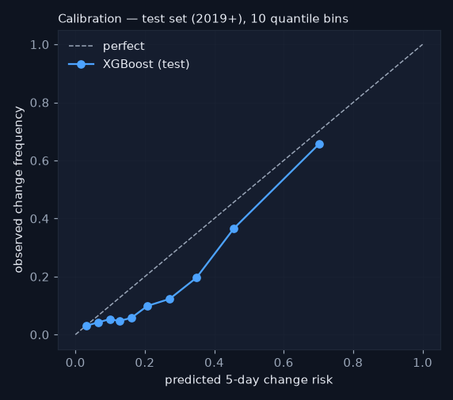
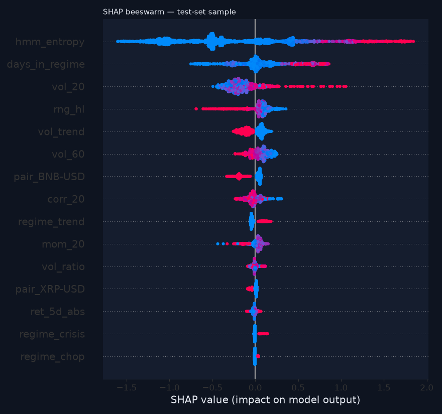

# Forecaster evaluation — 5-day regime-change risk

_Generated 2026-08-19 17:39. Pooled across pairs. Train ≤ 2020-12-31 (5420 rows), val 2021–2022 (3600 rows), test 2023+ (6579 rows); 5-trading-day embargo on both sides of every boundary. The test set was scored ONCE for this report and its numbers are frozen._

## Setup

- Label: regime label differs at any of t+1..t+5 (train positive rate 20.6%).
- Features (17): vol_20, vol_60, vol_ratio, mom_20, rng_hl, corr_20, ret_5d_abs, days_in_regime, hmm_entropy, vol_trend, regime_trend, regime_chop, regime_crisis, pair_ETH-USD, pair_XRP-USD, pair_BNB-USD, pair_ADA-USD — all causal; HMM-derived ones from FILTERED outputs (asserted by a truncation-invariance test).
- Model: XGBClassifier, fixed hyper-parameters (no grid search — deliberate restraint), scale_pos_weight 3.84 from train, early stopping on val at iteration 105 (val PR-AUC 0.648).
- Probabilities: Platt-recalibrated on VAL (a=1.41, b=-1.11) because scale_pos_weight distorts raw XGBoost probabilities; raw numbers are shown in the scoreboard for honesty.
- Threshold 0.38 chosen on VAL to reach recall ≥ 60% on transitions (val recall 0.60, precision 0.61). Early-warning economics: a false alarm costs a look; a missed storm costs the reason the tool exists — so we buy recall and pay in precision, and we say so.

## Scoreboard — test set (2019+), scored once

Never accuracy: with a test positive rate of 17%, 'never changes' would score 83% accuracy and mean nothing.

| model | threshold | pr_auc | precision | recall | brier | n | pos_rate |
|---|---|---|---|---|---|---|---|
| XGBoost (ours, calibrated) | 0.380 | 0.574 | 0.495 | 0.637 | 0.110 | 6579 | 0.167 |
| base_rate | 0.200 | 0.167 | 0.167 | 1.000 | 0.141 | 6579 | 0.167 |
| logistic | 0.230 | 0.405 | 0.308 | 0.600 | 0.129 | 6579 | 0.167 |
| one_feature | 0.500 | 0.150 | 0.131 | 0.480 | 0.619 | 6579 | 0.167 |
| XGBoost (raw, uncalibrated) | 0.600 | 0.574 | 0.481 | 0.651 | 0.191 | 6579 | 0.167 |

Baselines: base rate = constant train positive rate; logistic = LogisticRegression on the same standardised features; one_feature = 'predict change if days_in_regime > train median' (a binary rule, so its PR-AUC is that of a step function).

## Calibration

Brier 0.1101 vs base-rate Brier 0.1409. The curve below compares predicted risk with observed change frequency in 10 quantile bins on the test set.

## Drivers (SHAP)

## Honest interpretation

XGBoost reaches PR-AUC 0.574 on the test set against 0.405 for the logistic baseline and 0.167 for the base rate — a lift of +0.169 over logistic. That is a clear margin over a linear model on the same features. At the chosen threshold it catches 64% of transitions with precision 49%. Calibration: Brier 0.1101 calibrated vs 0.1912 raw vs 0.1290 logistic — the recalibrated probabilities are at least as well calibrated as the linear model's. Regime transitions in a sticky HMM are intrinsically hard to time (the label flips on the HMM's own filtered decision), so no forecaster here should be read as a market call — it is a change-risk gauge.

_Educational tool. Not investment advice._
