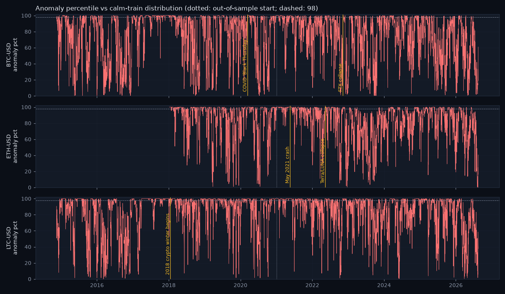

# Siren validation — does it scream at the famous shocks?

_Generated 2026-08-18 13:10. Autoencoder (8, 3, 8), trained on 1533 calm train days (2014-11-16 → 2020-12-26, regime_prob > 0.7), pooled across pairs, no pair identity. anomaly_pct = percentile of the reconstruction error against that calm-train distribution._

## BTC-USD — 15 loudest days

| date | anomaly_score | anomaly_pct |
|---|---|---|
| 2017-12-08 | 30.91 | 100.00 |
| 2017-12-13 | 28.18 | 100.00 |
| 2017-12-07 | 26.63 | 100.00 |
| 2017-12-12 | 24.41 | 100.00 |
| 2020-03-12 | 23.40 | 100.00 |
| 2017-12-09 | 22.99 | 100.00 |
| 2017-12-14 | 20.00 | 100.00 |
| 2017-12-17 | 18.59 | 100.00 |
| 2017-12-19 | 17.57 | 100.00 |
| 2017-12-16 | 17.48 | 100.00 |
| 2017-12-15 | 16.86 | 100.00 |
| 2017-12-11 | 16.64 | 100.00 |
| 2017-12-20 | 14.58 | 100.00 |
| 2017-12-18 | 14.03 | 100.00 |
| 2017-12-10 | 14.03 | 100.00 |

- **COVID 'Black Thursday' (2020-03-12)**: peak anomaly_pct 100.0 within [−1, +3] days, rank 5 of 4293 days for this pair → ✅ lights up.

- **FTX collapse (2022-11-09)**: peak anomaly_pct 100.0 within [−1, +3] days, rank 136 of 4293 days for this pair → ✅ lights up.

## ETH-USD — 15 loudest days

| date | anomaly_score | anomaly_pct |
|---|---|---|
| 2020-03-12 | 33.19 | 100.00 |
| 2021-01-06 | 24.70 | 100.00 |
| 2021-01-11 | 24.53 | 100.00 |
| 2021-01-07 | 23.96 | 100.00 |
| 2021-01-21 | 22.46 | 100.00 |
| 2021-01-10 | 20.19 | 100.00 |
| 2021-05-19 | 20.00 | 100.00 |
| 2021-05-24 | 19.82 | 100.00 |
| 2018-01-16 | 19.75 | 100.00 |
| 2021-01-12 | 18.36 | 100.00 |
| 2021-01-15 | 18.02 | 100.00 |
| 2020-03-13 | 17.35 | 100.00 |
| 2018-01-11 | 16.68 | 100.00 |
| 2018-04-25 | 15.87 | 100.00 |
| 2021-01-14 | 15.32 | 100.00 |

- **May 2021 crash (2021-05-19)**: peak anomaly_pct 100.0 within [−1, +3] days, rank 7 of 3144 days for this pair → ✅ lights up.

- **Terra/LUNA collapse (2022-05-12)**: peak anomaly_pct 100.0 within [−1, +3] days, rank 235 of 3144 days for this pair → ✅ lights up.

## LTC-USD — 15 loudest days

| date | anomaly_score | anomaly_pct |
|---|---|---|
| 2017-12-12 | 351.12 | 100.00 |
| 2017-12-13 | 223.47 | 100.00 |
| 2017-12-19 | 152.98 | 100.00 |
| 2017-12-20 | 130.01 | 100.00 |
| 2017-12-14 | 120.89 | 100.00 |
| 2017-12-18 | 112.24 | 100.00 |
| 2017-12-17 | 111.89 | 100.00 |
| 2017-12-15 | 101.74 | 100.00 |
| 2017-12-16 | 96.33 | 100.00 |
| 2017-12-21 | 85.90 | 100.00 |
| 2017-12-11 | 82.95 | 100.00 |
| 2017-12-22 | 78.21 | 100.00 |
| 2017-05-09 | 75.96 | 100.00 |
| 2015-07-10 | 75.67 | 100.00 |
| 2017-05-07 | 72.21 | 100.00 |

- **2018 crypto winter begins (2018-01-16)**: peak anomaly_pct 100.0 within [−1, +3] days, rank 398 of 4293 days for this pair → ✅ lights up.

## March 2020, all pairs

Share of March-2020 days above the 98th calm-train percentile: BTC-USD 65%, ETH-USD 74%, LTC-USD 81%.

## Sparkline

## Honest reading

Every named shock lights up (≥ 98th percentile within a few days of the event). Yahoo's daily close is a start-of-day snapshot, so a shock's return shows one day late while the intraday range shows on the day — the [−1, +3]-day window accounts for that. The siren is a detector, not a predictor: it says 'today looks unlike any calm day I learnt from', and it says it about many days that were merely volatile, not historic. Read it with the regime and the change risk, not instead of them.

_Educational tool. Not investment advice._
