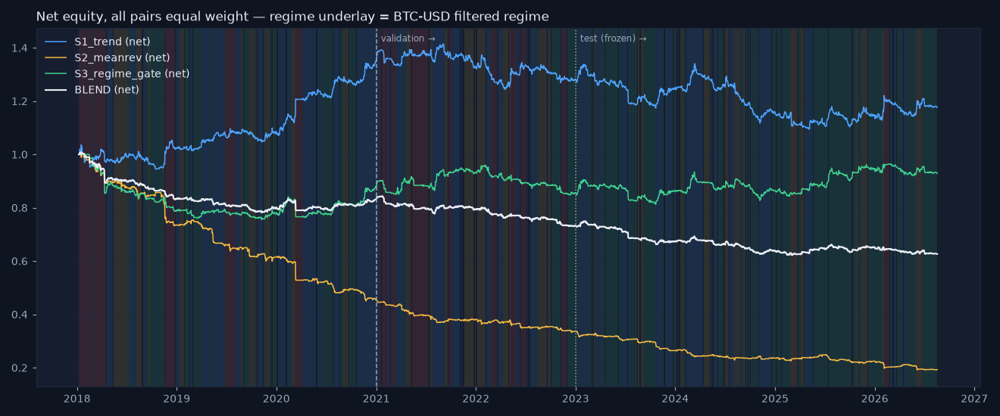

# Strategy evaluation — S1 trend, S2 mean reversion, S3 regime gate, BLEND

_Generated 2026-08-19 17:40. Daily bars, three pairs equal weight, costs 8 bp + 20×vol_20 on turnover, lag law inside the engine, overlay on every strategy (risk scaling above 0.3, siren stop above 98.0, 10% vol target, 2× cap). Parameters fixed on train+val; **test 2019+ scored once and frozen.** Research demonstration on daily data — not a live trading system._

## train — gross vs net (all pairs equal weight)

| strategy | kind | cagr | ann_vol | sharpe | max_drawdown | turnover_ann | cost_drag | hit_rate |
|---|---|---|---|---|---|---|---|---|
| S1_trend | gross | 0.160 | 0.090 | 1.691 | -0.070 | 18.827 | 0.000 | 0.532 |
| S1_trend | net | 0.106 | 0.090 | 1.158 | -0.088 | 18.827 | 0.054 | 0.503 |
| S2_meanrev | gross | -0.185 | 0.112 | -1.778 | -0.469 | 25.053 | 0.000 | 0.460 |
| S2_meanrev | net | -0.232 | 0.112 | -2.297 | -0.552 | 25.053 | 0.046 | 0.420 |
| S3_regime_gate | gross | 0.003 | 0.092 | 0.082 | -0.185 | 19.100 | 0.000 | 0.513 |
| S3_regime_gate | net | -0.042 | 0.093 | -0.417 | -0.244 | 19.100 | 0.046 | 0.476 |
| BLEND | gross | -0.011 | 0.057 | -0.168 | -0.140 | 20.773 | 0.000 | 0.525 |
| BLEND | net | -0.060 | 0.057 | -1.051 | -0.224 | 20.773 | 0.049 | 0.476 |

## val — gross vs net (all pairs equal weight)

| strategy | kind | cagr | ann_vol | sharpe | max_drawdown | turnover_ann | cost_drag | hit_rate |
|---|---|---|---|---|---|---|---|---|
| S1_trend | gross | 0.018 | 0.075 | 0.269 | -0.097 | 17.269 | 0.000 | 0.499 |
| S1_trend | net | -0.025 | 0.075 | -0.298 | -0.121 | 17.269 | 0.042 | 0.468 |
| S2_meanrev | gross | -0.089 | 0.091 | -0.980 | -0.180 | 24.840 | 0.000 | 0.494 |
| S2_meanrev | net | -0.141 | 0.091 | -1.625 | -0.270 | 24.840 | 0.052 | 0.451 |
| S3_regime_gate | gross | 0.038 | 0.079 | 0.516 | -0.081 | 20.960 | 0.000 | 0.504 |
| S3_regime_gate | net | -0.013 | 0.079 | -0.126 | -0.117 | 20.960 | 0.051 | 0.466 |
| BLEND | gross | -0.013 | 0.044 | -0.267 | -0.051 | 20.794 | 0.000 | 0.500 |
| BLEND | net | -0.061 | 0.044 | -1.399 | -0.134 | 20.794 | 0.048 | 0.440 |

## test — gross vs net (all pairs equal weight)

| strategy | kind | cagr | ann_vol | sharpe | max_drawdown | turnover_ann | cost_drag | hit_rate |
|---|---|---|---|---|---|---|---|---|
| S1_trend | gross | 0.019 | 0.079 | 0.279 | -0.144 | 23.544 | 0.000 | 0.497 |
| S1_trend | net | -0.024 | 0.079 | -0.262 | -0.184 | 23.544 | 0.043 | 0.473 |
| S2_meanrev | gross | -0.084 | 0.094 | -0.883 | -0.284 | 36.685 | 0.000 | 0.509 |
| S2_meanrev | net | -0.142 | 0.094 | -1.584 | -0.431 | 36.685 | 0.058 | 0.452 |
| S3_regime_gate | gross | 0.071 | 0.073 | 0.970 | -0.089 | 24.807 | 0.000 | 0.498 |
| S3_regime_gate | net | 0.023 | 0.073 | 0.344 | -0.115 | 24.807 | 0.048 | 0.475 |
| BLEND | gross | 0.007 | 0.047 | 0.182 | -0.084 | 27.877 | 0.000 | 0.498 |
| BLEND | net | -0.042 | 0.047 | -0.899 | -0.169 | 27.877 | 0.050 | 0.444 |

## Per-regime attribution — test, net Sharpe by the regime known when the position was decided

| strategy | calm | trend | chop | crisis |
|---|---|---|---|---|
| BLEND | -0.77 | 0.13 | -0.97 | -0.91 |
| S1_trend | 0.20 | 0.44 | -1.36 | -2.96 |
| S2_meanrev | -1.94 | -1.38 | -0.08 | 2.81 |
| S3_regime_gate | 0.26 | 0.76 | -0.16 | -4.41 |

Claim under test: trend earns in `trend` and bleeds in `chop`. Measured (S1, test): trend 0.44, chop -1.36, calm 0.20, crisis -2.96 → the pattern holds in sign. Sample sizes per regime are small out of sample (see days), so treat these as directional, not significant.

## Vol targeting and the leverage cap

Target 10% per pair with a hard 2× cap. Because the base signals average only ~0.4 in size, the cap binds on roughly half to four-fifths of training days and realised vol lands at 6–9 % per pair (pooled across three pairs it is lower still). Raising the cap would be a tuning decision we do not take; the target is therefore a ceiling-aware target, and the strategies never run hotter than it.

## Correlation of net daily returns — test

|  | S1_trend | S2_meanrev | S3_regime_gate |
|---|---|---|---|
| S1_trend | 1.000 | -0.540 | 0.766 |
| S2_meanrev | -0.540 | 1.000 | -0.255 |
| S3_regime_gate | 0.766 | -0.255 | 1.000 |

## The mutual-insurance claim

Blend max drawdown (test, net) -16.9% vs best single strategy S3_regime_gate -11.5% → **the blend does NOT beat the best single strategy on drawdown** in this sample — the insurance claim fails here. Blend Sharpe -0.90 vs S1_trend -0.26, S2_meanrev -1.58, S3_regime_gate 0.34.

## Honest closing paragraph

Out of sample and net of costs, 1 of the four series have a positive Sharpe and 3 do not (S1_trend, S2_meanrev, BLEND). Cost drag on the test set runs from 4.3% to 5.8% of CAGR per year — the vol-scaled cost model bites exactly where the strategies trade most. This is the expected outcome, stated in advance: on daily FX bars, with honest lags and honest costs, mechanical rules plus a regime gate do not produce a reliable edge. What the exercise delivers is the framework — a lag-law engine, a stress-aware cost model, an overlay that provably de-risks on the siren and change-risk signals, and a blend whose diversification benefit is measured rather than assumed — and the honesty to report the numbers as they are.

_Research demonstration on daily data — not a live trading system. Educational tool. Not investment advice._
