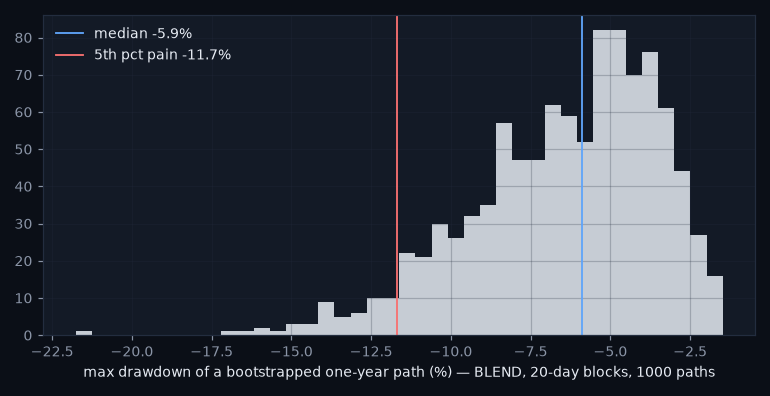
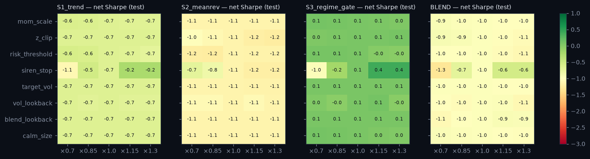

# Stress report — the strategy layer under attack

_Generated 2026-08-18 13:10. Test period 2019+ unless stated; net of the vol-scaled cost model; nothing was re-tuned after these results. Research demonstration on daily data — not a live trading system._

## 1. Historical replays

| window | strategy | return | max_drawdown | worst_day | days |
|---|---|---|---|---|---|
| SNB week (Jan 2015) | S1_trend | 0.032 | -0.000 | -0.001 | 12 |
| COVID crash (Feb–Mar 2020) | S1_trend | 0.063 | -0.019 | -0.009 | 41 |
| 2022 | S1_trend | -0.066 | -0.100 | -0.021 | 365 |
| SNB week (Jan 2015) | S2_meanrev | -0.073 | -0.073 | -0.055 | 12 |
| COVID crash (Feb–Mar 2020) | S2_meanrev | -0.112 | -0.116 | -0.101 | 41 |
| 2022 | S2_meanrev | -0.097 | -0.119 | -0.041 | 365 |
| SNB week (Jan 2015) | S3_regime_gate | -0.000 | 0.000 | -0.000 | 12 |
| COVID crash (Feb–Mar 2020) | S3_regime_gate | -0.070 | -0.077 | -0.064 | 41 |
| 2022 | S3_regime_gate | -0.035 | -0.063 | -0.026 | 365 |
| SNB week (Jan 2015) | BLEND | -0.017 | -0.017 | -0.015 | 12 |
| COVID crash (Feb–Mar 2020) | BLEND | -0.042 | -0.048 | -0.044 | 41 |
| 2022 | BLEND | -0.068 | -0.080 | -0.015 | 365 |

Siren stop (anomaly_pct > 98) inside the windows:

| window | pair | siren_days | first | last |
|---|---|---|---|---|
| SNB week (Jan 2015) | BTC-USD | 11 | 2015-01-13 | 2015-01-23 |
| SNB week (Jan 2015) | LTC-USD | 11 | 2015-01-12 | 2015-01-23 |
| COVID crash (Feb–Mar 2020) | BTC-USD | 20 | 2020-03-12 | 2020-03-31 |
| COVID crash (Feb–Mar 2020) | ETH-USD | 30 | 2020-02-20 | 2020-03-31 |
| COVID crash (Feb–Mar 2020) | LTC-USD | 31 | 2020-02-21 | 2020-03-31 |
| 2022 | BTC-USD | 62 | 2022-01-23 | 2022-12-01 |
| 2022 | ETH-USD | 119 | 2022-01-08 | 2022-11-29 |
| 2022 | LTC-USD | 101 | 2022-01-02 | 2022-12-16 |

**Verdict:** Worst window/strategy: S2_meanrev in 2022 (max DD -11.9%, worst day -4.10%). Siren stop fired on 385 pair-days across the three windows (see table) — the overlay was flat exactly when it was supposed to be.

## 2. Cost shocks and the BREAKEVEN COST

**Breakeven cost multiplier — the number practitioners ask first:**

| strategy | gross_sharpe | sharpe_at_1x | breakeven_cost_mult |
|---|---|---|---|
| S1_trend | -0.02 | -0.66 | 0.00 |
| S2_meanrev | -0.45 | -1.14 | 0.00 |
| S3_regime_gate | 0.76 | 0.07 | 1.15 |
| BLEND | 0.17 | -0.98 | 0.15 |

Net Sharpe at k× the cost model:

| strategy | 1.0 | 2.0 | 3.0 | 5.0 |
|---|---|---|---|---|
| BLEND | -0.98 | -2.12 | -3.25 | -5.45 |
| S1_trend | -0.66 | -1.30 | -1.93 | -3.19 |
| S2_meanrev | -1.14 | -1.82 | -2.51 | -3.85 |
| S3_regime_gate | 0.07 | -0.62 | -1.31 | -2.66 |

**Verdict:** No strategy has a positive gross Sharpe on the test set, so the breakeven cost multiplier is 0 for S1_trend, S2_meanrev — there is no edge to pay costs from. BLEND breakeven 0.15× the modelled cost.

## 3. Execution shock — one extra day of lag

| strategy | sharpe_net | sharpe_extra_lag | decay |
|---|---|---|---|
| S1_trend | -0.66 | -0.77 | -0.11 |
| S2_meanrev | -1.14 | -1.02 | 0.12 |
| S3_regime_gate | 0.07 | 0.30 | 0.23 |
| BLEND | -0.98 | -0.89 | 0.09 |

**Verdict:** One extra day of lag changes net Sharpe by -0.11 to +0.23. The decay is small, which mostly reflects how little there was to lose; the numbers are reported as they are.

## 4. Volatility shock — crisis-regime returns ×1.5

| strategy | max_dd_base | max_dd_shock | sharpe_base | sharpe_shock |
|---|---|---|---|---|
| S1_trend | -0.296 | -0.303 | -0.660 | -0.672 |
| S2_meanrev | -0.365 | -0.364 | -1.138 | -1.101 |
| S3_regime_gate | -0.132 | -0.140 | 0.069 | 0.054 |
| BLEND | -0.203 | -0.206 | -0.981 | -0.981 |

**Verdict:** Scaling crisis-regime returns by 1.5x deepens the worst max drawdown by only 0.8% (-36.5% → -36.4%): crisis exposure is small because the siren stop and the crisis-flat gate take risk off in exactly those days — the overlay does its job. The base drawdowns themselves are dreadful; the shock is not what makes them so.

## 5. Block bootstrap — one-year max drawdown, 1 000 paths

| strategy | median_max_dd | p5_pain_max_dd | p95_max_dd |
|---|---|---|---|
| S1_trend | -0.096 | -0.170 | -0.046 |
| S2_meanrev | -0.118 | -0.234 | -0.038 |
| S3_regime_gate | -0.072 | -0.145 | -0.032 |
| BLEND | -0.059 | -0.117 | -0.027 |

**Verdict:** BLEND one-year max drawdown: median -5.9%, 5th-percentile pain case -11.7% (20-day blocks keep the autocorrelation that day-shuffling would destroy).

## 6. Parameter robustness — ±30 %

**Verdict:** Across ±30 % of every parameter the BLEND's net Sharpe stays within a band of 0.75 (widest for siren_stop) — a flat, negative plateau: nothing is overfit to a spike, and nothing is good either. Parameters were not changed after seeing this.

## Summary

| test | verdict |
|---|---|
| historical replays | Worst window/strategy: S2_meanrev in 2022 (max DD -11.9%, worst day -4.10%). Siren stop fired on 385 pair-days across the three windows (see table) — the overlay was flat exactly when it was supposed to be. |
| cost shocks / breakeven | No strategy has a positive gross Sharpe on the test set, so the breakeven cost multiplier is 0 for S1_trend, S2_meanrev — there is no edge to pay costs from. BLEND breakeven 0.15× the modelled cost. |
| execution shock | One extra day of lag changes net Sharpe by -0.11 to +0.23. The decay is small, which mostly reflects how little there was to lose; the numbers are reported as they are. |
| volatility shock | Scaling crisis-regime returns by 1.5x deepens the worst max drawdown by only 0.8% (-36.5% → -36.4%): crisis exposure is small because the siren stop and the crisis-flat gate take risk off in exactly those days — the overlay does its job. The base drawdowns themselves are dreadful; the shock is not what makes them so. |
| block bootstrap | BLEND one-year max drawdown: median -5.9%, 5th-percentile pain case -11.7% (20-day blocks keep the autocorrelation that day-shuffling would destroy). |
| parameter robustness | Across ±30 % of every parameter the BLEND's net Sharpe stays within a band of 0.75 (widest for siren_stop) — a flat, negative plateau: nothing is overfit to a spike, and nothing is good either. Parameters were not changed after seeing this. |

_Research demonstration on daily data — not a live trading system. Educational tool. Not investment advice._
