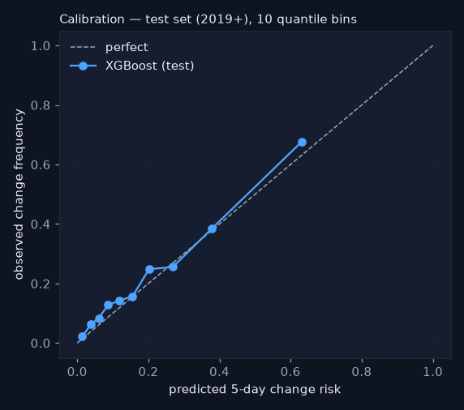
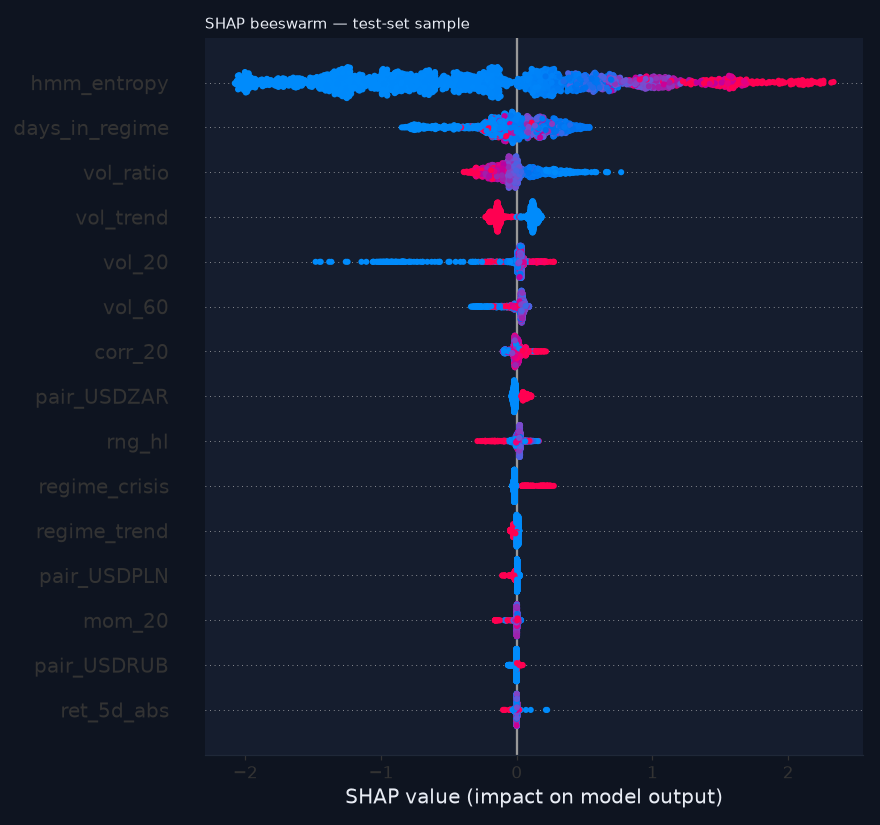

# Forecaster evaluation — 5-day regime-change risk

_Generated 2026-08-19 17:51. Pooled across pairs. Train ≤ 2016-12-31 (14803 rows), val 2017–2018 (2547 rows), test 2019+ (9867 rows); 5-trading-day embargo on both sides of every boundary. The test set was scored ONCE for this report and its numbers are frozen._

## Setup

- Label: regime label differs at any of t+1..t+5 (train positive rate 16.7%).
- Features (17): vol_20, vol_60, vol_ratio, mom_20, rng_hl, corr_20, ret_5d_abs, days_in_regime, hmm_entropy, vol_trend, regime_trend, regime_chop, regime_crisis, pair_USDBRL, pair_USDZAR, pair_USDPLN, pair_USDRUB — all causal; HMM-derived ones from FILTERED outputs (asserted by a truncation-invariance test).
- Model: XGBClassifier, fixed hyper-parameters (no grid search — deliberate restraint), scale_pos_weight 4.98 from train, early stopping on val at iteration 148 (val PR-AUC 0.569).
- Probabilities: Platt-recalibrated on VAL (a=1.13, b=-1.51) because scale_pos_weight distorts raw XGBoost probabilities; raw numbers are shown in the scoreboard for honesty.
- Threshold 0.27 chosen on VAL to reach recall ≥ 60% on transitions (val recall 0.61, precision 0.47). Early-warning economics: a false alarm costs a look; a missed storm costs the reason the tool exists — so we buy recall and pay in precision, and we say so.

## Scoreboard — test set (2019+), scored once

Never accuracy: with a test positive rate of 22%, 'never changes' would score 78% accuracy and mean nothing.

| model | threshold | pr_auc | precision | recall | brier | n | pos_rate |
|---|---|---|---|---|---|---|---|
| XGBoost (ours, calibrated) | 0.270 | 0.548 | 0.476 | 0.546 | 0.135 | 9867 | 0.216 |
| base_rate | 0.160 | 0.216 | 0.216 | 1.000 | 0.172 | 9867 | 0.216 |
| logistic | 0.170 | 0.471 | 0.442 | 0.595 | 0.147 | 9867 | 0.216 |
| one_feature | 0.500 | 0.209 | 0.196 | 0.359 | 0.456 | 9867 | 0.216 |
| XGBoost (raw, uncalibrated) | 0.610 | 0.548 | 0.472 | 0.549 | 0.193 | 9867 | 0.216 |

Baselines: base rate = constant train positive rate; logistic = LogisticRegression on the same standardised features; one_feature = 'predict change if days_in_regime > train median' (a binary rule, so its PR-AUC is that of a step function).

## Calibration

Brier 0.1348 vs base-rate Brier 0.1717. The curve below compares predicted risk with observed change frequency in 10 quantile bins on the test set.

## Drivers (SHAP)

## Honest interpretation

XGBoost reaches PR-AUC 0.548 on the test set against 0.471 for the logistic baseline and 0.216 for the base rate — a lift of +0.077 over logistic. That is a clear margin over a linear model on the same features. At the chosen threshold it catches 55% of transitions with precision 48%. Calibration: Brier 0.1348 calibrated vs 0.1926 raw vs 0.1473 logistic — the recalibrated probabilities are at least as well calibrated as the linear model's. Regime transitions in a sticky HMM are intrinsically hard to time (the label flips on the HMM's own filtered decision), so no forecaster here should be read as a market call — it is a change-risk gauge.

_Educational tool. Not investment advice._
