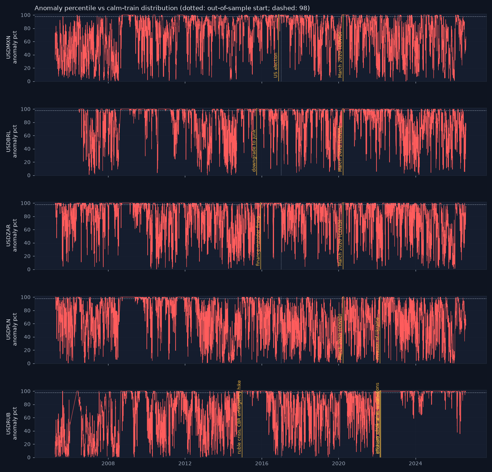

# Siren validation — does it scream at the famous shocks?

_Generated 2026-08-19 17:51. Autoencoder (8, 3, 8), trained on 4212 calm train days (2005-03-28 → 2016-11-11, regime_prob > 0.7), pooled across pairs, no pair identity. anomaly_pct = percentile of the reconstruction error against that calm-train distribution._

## USDMXN — 15 loudest days

| date | anomaly_score | anomaly_pct |
|---|---|---|
| 2008-10-09 | 85.42 | 100.00 |
| 2008-10-10 | 69.87 | 100.00 |
| 2008-10-13 | 53.04 | 100.00 |
| 2008-10-23 | 48.78 | 100.00 |
| 2008-10-16 | 47.74 | 100.00 |
| 2008-10-28 | 47.33 | 100.00 |
| 2008-10-15 | 39.25 | 100.00 |
| 2008-10-29 | 38.37 | 100.00 |
| 2008-10-30 | 36.86 | 100.00 |
| 2008-10-24 | 36.29 | 100.00 |
| 2008-10-17 | 35.52 | 100.00 |
| 2020-03-23 | 35.41 | 100.00 |
| 2008-10-31 | 34.34 | 100.00 |
| 2008-10-27 | 33.91 | 100.00 |
| 2008-10-20 | 33.51 | 100.00 |

- **US election (2016-11-09)**: peak anomaly_pct 100.0 within [−1, +3] days, rank 30 of 5570 days for this pair → ✅ lights up.

- **March 2020 (COVID) (2020-03-19)**: peak anomaly_pct 100.0 within [−1, +3] days, rank 32 of 5570 days for this pair → ✅ lights up.

## USDBRL — 15 loudest days

| date | anomaly_score | anomaly_pct |
|---|---|---|
| 2008-10-08 | 130.99 | 100.00 |
| 2008-10-09 | 98.75 | 100.00 |
| 2008-10-23 | 74.78 | 100.00 |
| 2008-10-22 | 74.00 | 100.00 |
| 2008-10-13 | 71.17 | 100.00 |
| 2008-10-28 | 66.96 | 100.00 |
| 2008-10-24 | 65.73 | 100.00 |
| 2008-10-29 | 63.81 | 100.00 |
| 2008-10-27 | 61.63 | 100.00 |
| 2008-10-14 | 61.27 | 100.00 |
| 2008-10-17 | 59.57 | 100.00 |
| 2008-10-30 | 56.46 | 100.00 |
| 2008-10-15 | 55.96 | 100.00 |
| 2008-10-31 | 55.79 | 100.00 |
| 2008-10-10 | 53.12 | 100.00 |

- **March 2020 (COVID) (2020-03-19)**: peak anomaly_pct 100.0 within [−1, +3] days, rank 52 of 5220 days for this pair → ✅ lights up.

- **downgrade to junk (2015-09-24)**: peak anomaly_pct 100.0 within [−1, +3] days, rank 29 of 5220 days for this pair → ✅ lights up.

## USDZAR — 15 loudest days

| date | anomaly_score | anomaly_pct |
|---|---|---|
| 2008-10-15 | 116.86 | 100.00 |
| 2008-10-28 | 85.33 | 100.00 |
| 2008-10-23 | 84.31 | 100.00 |
| 2008-10-29 | 80.88 | 100.00 |
| 2008-10-21 | 77.63 | 100.00 |
| 2008-10-16 | 70.55 | 100.00 |
| 2008-10-24 | 67.91 | 100.00 |
| 2008-10-27 | 66.09 | 100.00 |
| 2008-10-31 | 63.91 | 100.00 |
| 2008-11-11 | 60.18 | 100.00 |
| 2008-11-10 | 59.28 | 100.00 |
| 2008-10-20 | 57.32 | 100.00 |
| 2008-11-06 | 57.22 | 100.00 |
| 2008-10-22 | 56.64 | 100.00 |
| 2008-11-05 | 56.49 | 100.00 |

- **finance-minister firing (2015-12-10)**: peak anomaly_pct 100.0 within [−1, +3] days, rank 122 of 5559 days for this pair → ✅ lights up.

- **March 2020 (COVID) (2020-03-19)**: peak anomaly_pct 100.0 within [−1, +3] days, rank 141 of 5559 days for this pair → ✅ lights up.

## USDPLN — 15 loudest days

| date | anomaly_score | anomaly_pct |
|---|---|---|
| 2008-08-26 | 63.30 | 100.00 |
| 2008-10-28 | 51.23 | 100.00 |
| 2008-10-27 | 44.80 | 100.00 |
| 2008-10-23 | 41.95 | 100.00 |
| 2008-10-24 | 40.79 | 100.00 |
| 2008-10-29 | 36.36 | 100.00 |
| 2008-09-01 | 35.51 | 100.00 |
| 2008-11-11 | 34.71 | 100.00 |
| 2008-08-27 | 33.77 | 100.00 |
| 2008-08-28 | 32.80 | 100.00 |
| 2008-08-29 | 31.78 | 100.00 |
| 2008-11-13 | 31.23 | 100.00 |
| 2010-05-06 | 29.45 | 100.00 |
| 2008-11-12 | 27.91 | 100.00 |
| 2008-10-22 | 27.32 | 100.00 |

- **invasion of Ukraine (2022-02-24)**: peak anomaly_pct 100.0 within [−1, +3] days, rank 391 of 5548 days for this pair → ✅ lights up.

- **March 2020 (COVID) (2020-03-19)**: peak anomaly_pct 100.0 within [−1, +3] days, rank 50 of 5548 days for this pair → ✅ lights up.

## USDRUB — 15 loudest days

| date | anomaly_score | anomaly_pct |
|---|---|---|
| 2022-03-22 | 512.89 | 100.00 |
| 2022-03-28 | 450.13 | 100.00 |
| 2022-03-25 | 413.38 | 100.00 |
| 2022-03-24 | 405.85 | 100.00 |
| 2022-03-21 | 404.90 | 100.00 |
| 2022-03-23 | 383.68 | 100.00 |
| 2022-03-08 | 381.42 | 100.00 |
| 2022-03-10 | 373.95 | 100.00 |
| 2022-04-04 | 337.96 | 100.00 |
| 2022-04-01 | 320.90 | 100.00 |
| 2022-03-01 | 314.19 | 100.00 |
| 2022-03-30 | 311.83 | 100.00 |
| 2022-03-11 | 308.14 | 100.00 |
| 2022-03-31 | 307.71 | 100.00 |
| 2022-03-09 | 302.80 | 100.00 |

- **ruble crisis, CBR emergency hike (2014-12-16)**: peak anomaly_pct 100.0 within [−1, +3] days, rank 35 of 5445 days for this pair → ✅ lights up.

- **invasion of Ukraine — sanctions (2022-02-24)**: peak anomaly_pct 100.0 within [−1, +3] days, rank 182 of 5445 days for this pair → ✅ lights up.

- **offshore ruble at its weakest (2022-03-07)**: peak anomaly_pct 100.0 within [−1, +3] days, rank 7 of 5445 days for this pair → ✅ lights up.

## March 2020, all pairs

Share of March-2020 days above the 98th calm-train percentile: USDBRL 86%, USDMXN 100%, USDPLN 64%, USDRUB 86%, USDZAR 100%.

## Sparkline

## Honest reading

Every named shock lights up (≥ 98th percentile within a few days of the event). Yahoo's daily close is a start-of-day snapshot, so a shock's return shows one day late while the intraday range shows on the day — the [−1, +3]-day window accounts for that. The siren is a detector, not a predictor: it says 'today looks unlike any calm day I learnt from', and it says it about many days that were merely volatile, not historic. Read it with the regime and the change risk, not instead of them.

_Educational tool. Not investment advice._
