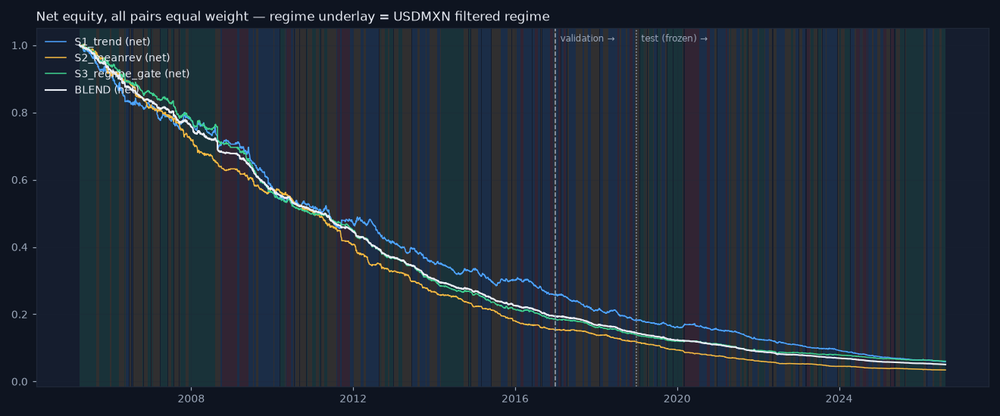

# Strategy evaluation — S1 trend, S2 mean reversion, S3 regime gate, BLEND

_Generated 2026-08-19 17:52. Daily bars, three pairs equal weight, costs 3 bp + 120×vol_20 on turnover, lag law inside the engine, overlay on every strategy (risk scaling above 0.3, siren stop above 98.0, 10% vol target, 2× cap). Parameters fixed on train+val; **test 2019+ scored once and frozen.** Research demonstration on daily data — not a live trading system._

## train — gross vs net (all pairs equal weight)

| strategy | kind | cagr | ann_vol | sharpe | max_drawdown | turnover_ann | cost_drag | hit_rate |
|---|---|---|---|---|---|---|---|---|
| S1_trend | gross | 0.017 | 0.053 | 0.338 | -0.116 | 73.200 | 0.000 | 0.500 |
| S1_trend | net | -0.106 | 0.053 | -2.073 | -0.743 | 73.200 | 0.122 | 0.410 |
| S2_meanrev | gross | -0.010 | 0.042 | -0.211 | -0.245 | 90.342 | 0.000 | 0.498 |
| S2_meanrev | net | -0.143 | 0.042 | -3.605 | -0.847 | 90.342 | 0.133 | 0.349 |
| S3_regime_gate | gross | -0.012 | 0.041 | -0.269 | -0.241 | 71.141 | 0.000 | 0.495 |
| S3_regime_gate | net | -0.129 | 0.041 | -3.362 | -0.815 | 71.141 | 0.118 | 0.374 |
| BLEND | gross | -0.002 | 0.027 | -0.062 | -0.118 | 78.099 | 0.000 | 0.503 |
| BLEND | net | -0.126 | 0.028 | -4.836 | -0.806 | 78.099 | 0.124 | 0.304 |

## val — gross vs net (all pairs equal weight)

| strategy | kind | cagr | ann_vol | sharpe | max_drawdown | turnover_ann | cost_drag | hit_rate |
|---|---|---|---|---|---|---|---|---|
| S1_trend | gross | -0.022 | 0.055 | -0.372 | -0.095 | 82.956 | 0.000 | 0.487 |
| S1_trend | net | -0.153 | 0.055 | -2.989 | -0.301 | 82.956 | 0.132 | 0.397 |
| S2_meanrev | gross | 0.031 | 0.044 | 0.708 | -0.064 | 93.323 | 0.000 | 0.489 |
| S2_meanrev | net | -0.120 | 0.044 | -2.880 | -0.238 | 93.323 | 0.150 | 0.382 |
| S3_regime_gate | gross | 0.002 | 0.041 | 0.076 | -0.044 | 81.217 | 0.000 | 0.480 |
| S3_regime_gate | net | -0.131 | 0.042 | -3.346 | -0.251 | 81.217 | 0.134 | 0.364 |
| BLEND | gross | 0.007 | 0.026 | 0.276 | -0.041 | 86.207 | 0.000 | 0.488 |
| BLEND | net | -0.132 | 0.027 | -5.246 | -0.254 | 86.207 | 0.139 | 0.342 |

## test — gross vs net (all pairs equal weight)

| strategy | kind | cagr | ann_vol | sharpe | max_drawdown | turnover_ann | cost_drag | hit_rate |
|---|---|---|---|---|---|---|---|---|
| S1_trend | gross | -0.013 | 0.053 | -0.220 | -0.197 | 77.077 | 0.000 | 0.502 |
| S1_trend | net | -0.135 | 0.053 | -2.699 | -0.681 | 77.077 | 0.122 | 0.408 |
| S2_meanrev | gross | -0.010 | 0.043 | -0.206 | -0.219 | 91.478 | 0.000 | 0.507 |
| S2_meanrev | net | -0.145 | 0.044 | -3.561 | -0.710 | 91.478 | 0.135 | 0.364 |
| S3_regime_gate | gross | 0.017 | 0.041 | 0.441 | -0.068 | 70.078 | 0.000 | 0.503 |
| S3_regime_gate | net | -0.100 | 0.041 | -2.543 | -0.566 | 70.078 | 0.118 | 0.392 |
| BLEND | gross | -0.000 | 0.027 | 0.010 | -0.088 | 79.137 | 0.000 | 0.503 |
| BLEND | net | -0.125 | 0.027 | -4.901 | -0.650 | 79.137 | 0.125 | 0.321 |

## Per-regime attribution — test, net Sharpe by the regime known when the position was decided

| strategy | calm | trend | chop | crisis |
|---|---|---|---|---|
| BLEND | -3.24 | -2.70 | -3.81 | -2.88 |
| S1_trend | -1.47 | -1.27 | -2.98 | -1.91 |
| S2_meanrev | -1.99 | -2.99 | -2.11 | -1.29 |
| S3_regime_gate | -1.53 | -1.32 | -2.15 | -1.27 |

Claim under test: trend earns in `trend` and bleeds in `chop`. Measured (S1, test): trend -1.27, chop -2.98, calm -1.47, crisis -1.91 → the pattern holds in sign. Sample sizes per regime are small out of sample (see days), so treat these as directional, not significant.

## Vol targeting and the leverage cap

Target 10% per pair with a hard 2× cap. Because the base signals average only ~0.4 in size, the cap binds on roughly half to four-fifths of training days and realised vol lands at 6–9 % per pair (pooled across three pairs it is lower still). Raising the cap would be a tuning decision we do not take; the target is therefore a ceiling-aware target, and the strategies never run hotter than it.

## Correlation of net daily returns — test

|  | S1_trend | S2_meanrev | S3_regime_gate |
|---|---|---|---|
| S1_trend | 1.000 | -0.489 | 0.558 |
| S2_meanrev | -0.489 | 1.000 | 0.025 |
| S3_regime_gate | 0.558 | 0.025 | 1.000 |

## The mutual-insurance claim

Blend max drawdown (test, net) -65.0% vs best single strategy S3_regime_gate -56.6% → **the blend does NOT beat the best single strategy on drawdown** in this sample — the insurance claim fails here. Blend Sharpe -4.90 vs S1_trend -2.70, S2_meanrev -3.56, S3_regime_gate -2.54.

## Honest closing paragraph

Out of sample and net of costs, 0 of the four series have a positive Sharpe and 4 do not (S1_trend, S2_meanrev, S3_regime_gate, BLEND). Cost drag on the test set runs from 11.8% to 13.5% of CAGR per year — the vol-scaled cost model bites exactly where the strategies trade most. This is the expected outcome, stated in advance: on daily FX bars, with honest lags and honest costs, mechanical rules plus a regime gate do not produce a reliable edge. What the exercise delivers is the framework — a lag-law engine, a stress-aware cost model, an overlay that provably de-risks on the siren and change-risk signals, and a blend whose diversification benefit is measured rather than assumed — and the honesty to report the numbers as they are.

_Research demonstration on daily data — not a live trading system. Educational tool. Not investment advice._
