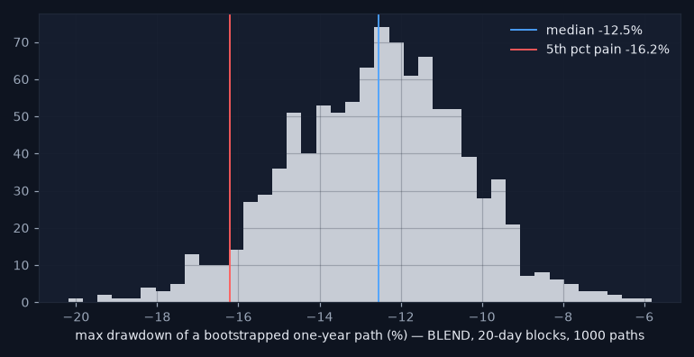
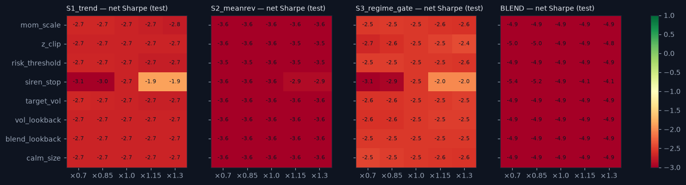

# Stress report — the strategy layer under attack

_Generated 2026-08-19 17:52. Test period 2019+ unless stated; net of the vol-scaled cost model; nothing was re-tuned after these results. Research demonstration on daily data — not a live trading system._

## 1. Historical replays

| window | strategy | return | max_drawdown | worst_day | days |
|---|---|---|---|---|---|
| SNB week (Jan 2015) | S1_trend | -0.006 | -0.008 | -0.005 | 10 |
| COVID crash (Feb–Mar 2020) | S1_trend | 0.044 | -0.011 | -0.005 | 29 |
| 2022 | S1_trend | -0.141 | -0.142 | -0.015 | 260 |
| SNB week (Jan 2015) | S2_meanrev | 0.001 | -0.006 | -0.005 | 10 |
| COVID crash (Feb–Mar 2020) | S2_meanrev | -0.060 | -0.062 | -0.018 | 29 |
| 2022 | S2_meanrev | -0.140 | -0.147 | -0.012 | 260 |
| SNB week (Jan 2015) | S3_regime_gate | -0.002 | -0.007 | -0.002 | 10 |
| COVID crash (Feb–Mar 2020) | S3_regime_gate | 0.009 | -0.021 | -0.014 | 29 |
| 2022 | S3_regime_gate | -0.072 | -0.096 | -0.013 | 260 |
| SNB week (Jan 2015) | BLEND | -0.002 | -0.005 | -0.002 | 10 |
| COVID crash (Feb–Mar 2020) | BLEND | -0.008 | -0.015 | -0.007 | 29 |
| 2022 | BLEND | -0.117 | -0.119 | -0.012 | 260 |

Siren stop (anomaly_pct > 98) inside the windows:

| window | pair | siren_days | first | last |
|---|---|---|---|---|
| SNB week (Jan 2015) | USDPLN | 7 | 2015-01-12 | 2015-01-22 |
| SNB week (Jan 2015) | USDRUB | 10 | 2015-01-12 | 2015-01-23 |
| COVID crash (Feb–Mar 2020) | USDBRL | 19 | 2020-03-05 | 2020-03-31 |
| COVID crash (Feb–Mar 2020) | USDMXN | 23 | 2020-02-27 | 2020-03-31 |
| COVID crash (Feb–Mar 2020) | USDPLN | 14 | 2020-03-09 | 2020-03-31 |
| COVID crash (Feb–Mar 2020) | USDRUB | 23 | 2020-02-25 | 2020-03-31 |
| COVID crash (Feb–Mar 2020) | USDZAR | 22 | 2020-03-02 | 2020-03-31 |
| 2022 | USDBRL | 146 | 2022-01-04 | 2022-12-12 |
| 2022 | USDMXN | 16 | 2022-02-25 | 2022-12-06 |
| 2022 | USDPLN | 86 | 2022-02-04 | 2022-11-22 |
| 2022 | USDRUB | 239 | 2022-01-06 | 2022-12-30 |
| 2022 | USDZAR | 89 | 2022-01-13 | 2022-12-29 |

**Verdict:** Worst window/strategy: S2_meanrev in 2022 (max DD -14.7%, worst day -1.19%). Siren stop fired on 694 pair-days across the three windows (see table) — the overlay was flat exactly when it was supposed to be.

## 2. Cost shocks and the BREAKEVEN COST

**Breakeven cost multiplier — the number practitioners ask first:**

| strategy | gross_sharpe | sharpe_at_1x | breakeven_cost_mult |
|---|---|---|---|
| S1_trend | -0.22 | -2.70 | 0.00 |
| S2_meanrev | -0.21 | -3.56 | 0.00 |
| S3_regime_gate | 0.44 | -2.54 | 0.15 |
| BLEND | 0.01 | -4.90 | 0.05 |

Net Sharpe at k× the cost model:

| strategy | 1.0 | 2.0 | 3.0 | 5.0 |
|---|---|---|---|---|
| BLEND | -4.90 | -9.36 | -13.12 | -18.45 |
| S1_trend | -2.70 | -5.10 | -7.34 | -11.20 |
| S2_meanrev | -3.56 | -6.77 | -9.71 | -14.59 |
| S3_regime_gate | -2.54 | -5.38 | -7.93 | -12.02 |

**Verdict:** No strategy has a positive gross Sharpe on the test set, so the breakeven cost multiplier is 0 for S1_trend, S2_meanrev — there is no edge to pay costs from. BLEND breakeven 0.05× the modelled cost. A practitioner reads this row first: nothing here survives its own transaction costs.

## 3. Execution shock — one extra day of lag

| strategy | sharpe_net | sharpe_extra_lag | decay |
|---|---|---|---|
| S1_trend | -2.70 | -2.72 | -0.02 |
| S2_meanrev | -3.56 | -3.43 | 0.13 |
| S3_regime_gate | -2.54 | -2.40 | 0.14 |
| BLEND | -4.90 | -4.75 | 0.15 |

**Verdict:** One extra day of lag changes net Sharpe by -0.02 to +0.15. The decay is small, which mostly reflects how little there was to lose; the numbers are reported as they are.

## 4. Volatility shock — crisis-regime returns ×1.5

| strategy | max_dd_base | max_dd_shock | sharpe_base | sharpe_shock |
|---|---|---|---|---|
| S1_trend | -0.681 | -0.682 | -2.699 | -2.668 |
| S2_meanrev | -0.710 | -0.715 | -3.561 | -3.526 |
| S3_regime_gate | -0.566 | -0.564 | -2.543 | -2.468 |
| BLEND | -0.650 | -0.652 | -4.901 | -4.847 |

**Verdict:** Scaling crisis-regime returns by 1.5x deepens the worst max drawdown by only 0.5% (-71.0% → -71.5%): crisis exposure is small because the siren stop and the crisis-flat gate take risk off in exactly those days — the overlay does its job. The base drawdowns themselves are dreadful; the shock is not what makes them so.

## 5. Block bootstrap — one-year max drawdown, 1 000 paths

| strategy | median_max_dd | p5_pain_max_dd | p95_max_dd |
|---|---|---|---|
| S1_trend | -0.147 | -0.201 | -0.083 |
| S2_meanrev | -0.149 | -0.209 | -0.093 |
| S3_regime_gate | -0.109 | -0.160 | -0.061 |
| BLEND | -0.125 | -0.162 | -0.093 |

**Verdict:** BLEND one-year max drawdown: median -12.5%, 5th-percentile pain case -16.2% (20-day blocks keep the autocorrelation that day-shuffling would destroy).

## 6. Parameter robustness — ±30 %

**Verdict:** Across ±30 % of every parameter the BLEND's net Sharpe stays within a band of 1.29 (widest for siren_stop) — a flat, negative plateau: nothing is overfit to a spike, and nothing is good either. Parameters were not changed after seeing this.

## Summary

| test | verdict |
|---|---|
| historical replays | Worst window/strategy: S2_meanrev in 2022 (max DD -14.7%, worst day -1.19%). Siren stop fired on 694 pair-days across the three windows (see table) — the overlay was flat exactly when it was supposed to be. |
| cost shocks / breakeven | No strategy has a positive gross Sharpe on the test set, so the breakeven cost multiplier is 0 for S1_trend, S2_meanrev — there is no edge to pay costs from. BLEND breakeven 0.05× the modelled cost. A practitioner reads this row first: nothing here survives its own transaction costs. |
| execution shock | One extra day of lag changes net Sharpe by -0.02 to +0.15. The decay is small, which mostly reflects how little there was to lose; the numbers are reported as they are. |
| volatility shock | Scaling crisis-regime returns by 1.5x deepens the worst max drawdown by only 0.5% (-71.0% → -71.5%): crisis exposure is small because the siren stop and the crisis-flat gate take risk off in exactly those days — the overlay does its job. The base drawdowns themselves are dreadful; the shock is not what makes them so. |
| block bootstrap | BLEND one-year max drawdown: median -12.5%, 5th-percentile pain case -16.2% (20-day blocks keep the autocorrelation that day-shuffling would destroy). |
| parameter robustness | Across ±30 % of every parameter the BLEND's net Sharpe stays within a band of 1.29 (widest for siren_stop) — a flat, negative plateau: nothing is overfit to a spike, and nothing is good either. Parameters were not changed after seeing this. |

_Research demonstration on daily data — not a live trading system. Educational tool. Not investment advice._
