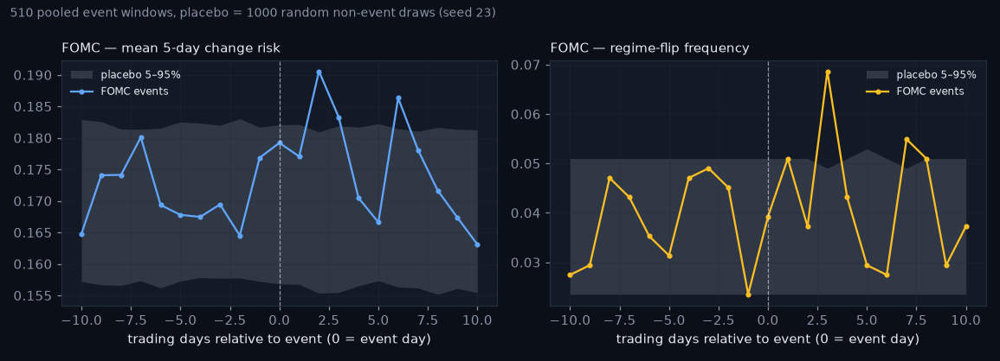
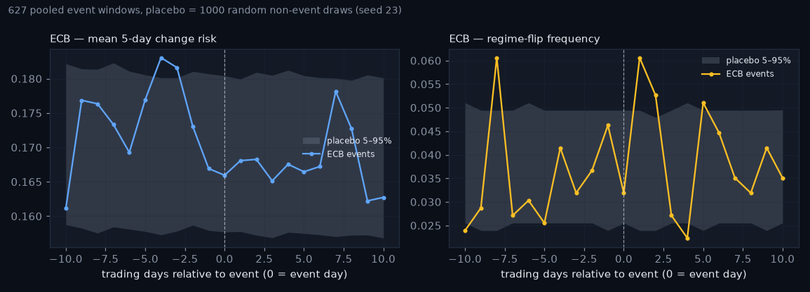
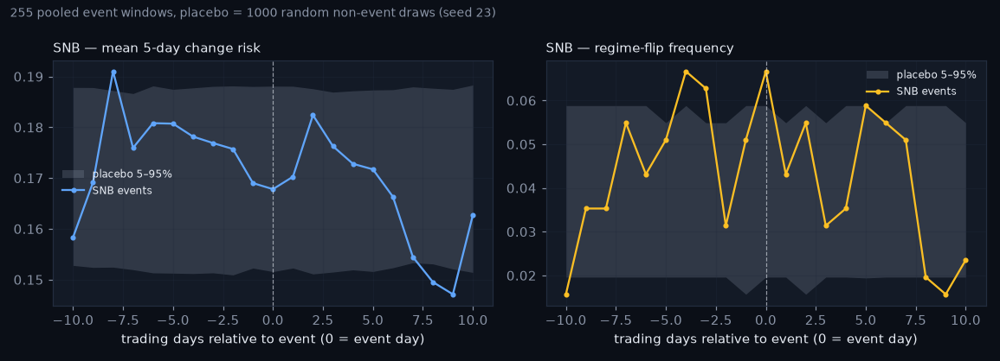
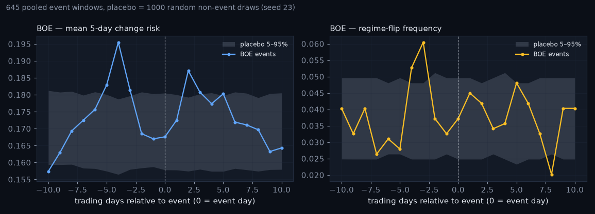
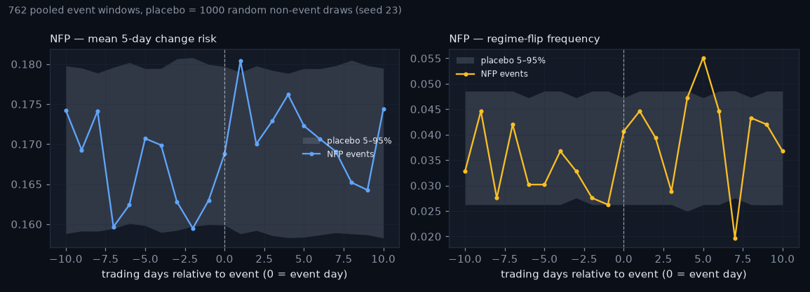
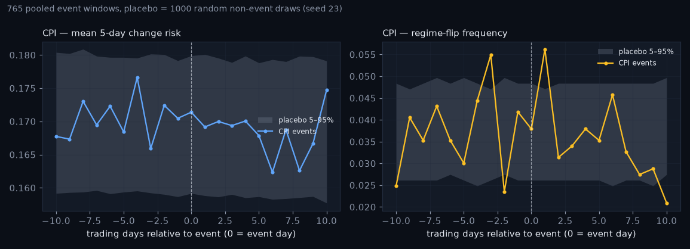

# Event study — the radar around scheduled macro events

_Generated 2026-08-19 16:03. Window -10..+10 trading days, pooled across 3 pairs; data/regimes.parquet through 2026-08-18; events from data/events.csv (scheduled dates only). Placebo band = 5th/95th percentile of the same statistic over 1000 seeded draws of random non-event anchors (any non-event day with a full window), each the size of the real sample._

## Summary

| type | n_events | risk_day0 | risk_placebo_median_day0 | flip_day0 | flip_day+1 | flip_placebo_median_day0 | days_outside_band_risk | days_outside_band_flip | outside_days_flip |
|---|---|---|---|---|---|---|---|---|---|
| FOMC | 510 | 0.179 | 0.169 | 0.039 | 0.051 | 0.037 | 3 | 2 | 3,7 |
| ECB | 627 | 0.166 | 0.169 | 0.032 | 0.061 | 0.037 | 2 | 6 | -10,-8,1,2,4,5 |
| SNB | 255 | 0.168 | 0.169 | 0.067 | 0.043 | 0.035 | 3 | 5 | -10,-4,-3,0,9 |
| BOE | 645 | 0.168 | 0.169 | 0.037 | 0.045 | 0.037 | 7 | 3 | -4,-3,8 |
| NFP | 762 | 0.169 | 0.169 | 0.041 | 0.045 | 0.037 | 2 | 2 | 5,7 |
| CPI | 765 | 0.171 | 0.169 | 0.038 | 0.056 | 0.037 | 0 | 5 | -10,-3,-2,1,10 |

`flip_day0` = share of event days on which the filtered regime label differs from the day before (flips happen at +1..+5 too, so see the figures); `days_outside_band_*` counts relative days whose mean leaves the placebo band (21 days per curve; ~2 would leave it by chance at 90% coverage).

## Figures

## How to read it

The placebo separates signal from luck: if the event curve sits inside the grey band, an event day is statistically indistinguishable from a random day for this radar. Flip frequency is the honest metric — it is what the forecaster's label actually measures; change risk is the model's opinion. A bump at k = 0 / +1 says the HMM's label reacts to the event day's move (events are scheduled, the move is not); a lead BEFORE k = 0 would say the forecaster partly conditions on the run-up already (via vol_ratio, entropy) — and the challenger's days_to_* features make that explicit. No price direction is studied here.

_Educational tool. Not investment advice._
