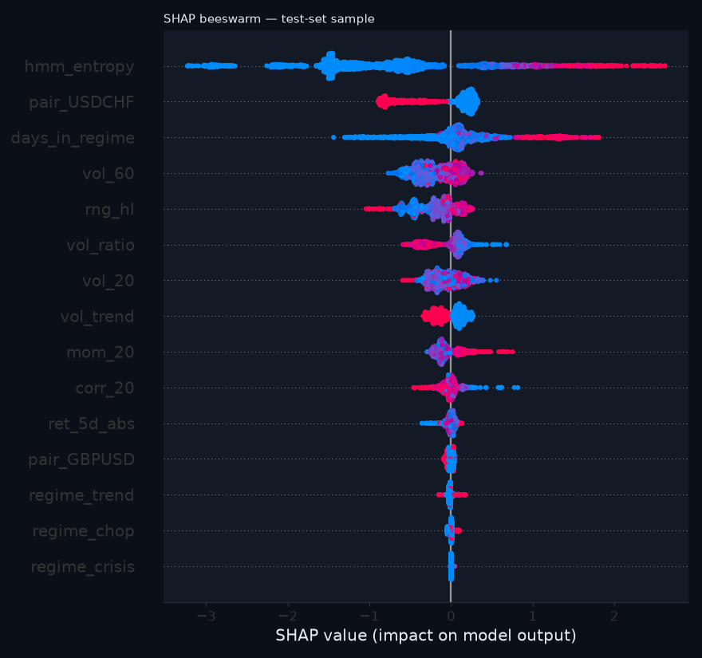

# Forecaster evaluation — 5-day regime-change risk

_Generated 2026-08-18 11:37. Pooled across pairs. Train ≤ 2016-12-31 (9136 rows), val 2017–2018 (1527 rows), test 2019+ (5922 rows); 5-trading-day embargo on both sides of every boundary. The test set was scored ONCE for this report and its numbers are frozen._

## Setup

- Label: regime label differs at any of t+1..t+5 (train positive rate 17.0%).
- Features (15): vol_20, vol_60, vol_ratio, mom_20, rng_hl, corr_20, ret_5d_abs, days_in_regime, hmm_entropy, vol_trend, regime_trend, regime_chop, regime_crisis, pair_GBPUSD, pair_USDCHF — all causal; HMM-derived ones from FILTERED outputs (asserted by a truncation-invariance test).
- Model: XGBClassifier, fixed hyper-parameters (no grid search — deliberate restraint), scale_pos_weight 4.88 from train, early stopping on val at iteration 283 (val PR-AUC 0.479).
- Probabilities: Platt-recalibrated on VAL (a=0.95, b=-1.30) because scale_pos_weight distorts raw XGBoost probabilities; raw numbers are shown in the scoreboard for honesty.
- Threshold 0.22 chosen on VAL to reach recall ≥ 60% on transitions (val recall 0.62, precision 0.39). Early-warning economics: a false alarm costs a look; a missed storm costs the reason the tool exists — so we buy recall and pay in precision, and we say so.

## Scoreboard — test set (2019+), scored once

Never accuracy: with a test positive rate of 16%, 'never changes' would score 84% accuracy and mean nothing.

| model | threshold | pr_auc | precision | recall | brier | n | pos_rate |
|---|---|---|---|---|---|---|---|
| XGBoost (ours, calibrated) | 0.220 | 0.548 | 0.452 | 0.594 | 0.102 | 5922 | 0.162 |
| base_rate | 0.170 | 0.162 | 0.162 | 1.000 | 0.136 | 5922 | 0.162 |
| logistic | 0.150 | 0.431 | 0.381 | 0.626 | 0.116 | 5922 | 0.162 |
| one_feature | 0.500 | 0.143 | 0.113 | 0.380 | 0.584 | 5922 | 0.162 |
| XGBoost (raw, uncalibrated) | 0.520 | 0.548 | 0.455 | 0.579 | 0.128 | 5922 | 0.162 |

Baselines: base rate = constant train positive rate; logistic = LogisticRegression on the same standardised features; one_feature = 'predict change if days_in_regime > train median' (a binary rule, so its PR-AUC is that of a step function).

## Calibration

Brier 0.1023 vs base-rate Brier 0.1359. The curve below compares predicted risk with observed change frequency in 10 quantile bins on the test set.

## Drivers (SHAP)

## Honest interpretation

XGBoost reaches PR-AUC 0.548 on the test set against 0.431 for the logistic baseline and 0.162 for the base rate — a lift of +0.116 over logistic. That is a clear margin over a linear model on the same features. At the chosen threshold it catches 59% of transitions with precision 45%. Calibration: Brier 0.1023 calibrated vs 0.1282 raw vs 0.1156 logistic — the recalibrated probabilities are at least as well calibrated as the linear model's. Regime transitions in a sticky HMM are intrinsically hard to time (the label flips on the HMM's own filtered decision), so no forecaster here should be read as a market call — it is a change-risk gauge.

_Educational tool. Not investment advice._
