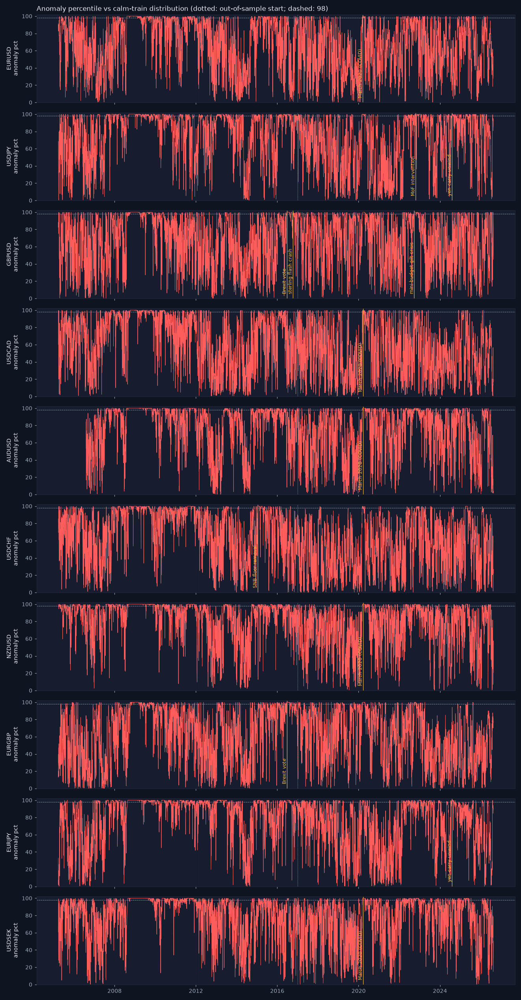

# Siren validation — does it scream at the famous shocks?

_Generated 2026-08-19 17:37. Autoencoder (8, 3, 8), trained on 8802 calm train days (2005-03-28 → 2016-12-30, regime_prob > 0.7), pooled across pairs, no pair identity. anomaly_pct = percentile of the reconstruction error against that calm-train distribution._

## EURUSD — 15 loudest days

| date | anomaly_score | anomaly_pct |
|---|---|---|
| 2008-12-17 | 15.80 | 99.99 |
| 2008-10-28 | 14.55 | 99.99 |
| 2008-11-04 | 13.62 | 99.99 |
| 2008-11-13 | 13.22 | 99.99 |
| 2008-08-26 | 11.00 | 99.99 |
| 2008-11-05 | 10.50 | 99.99 |
| 2008-11-07 | 10.28 | 99.99 |
| 2008-10-27 | 10.14 | 99.99 |
| 2008-12-16 | 9.90 | 99.99 |
| 2008-10-29 | 9.44 | 99.99 |
| 2008-12-19 | 9.40 | 99.99 |
| 2008-12-18 | 9.13 | 99.99 |
| 2008-11-06 | 8.86 | 99.99 |
| 2008-09-22 | 8.86 | 99.99 |
| 2008-11-17 | 8.85 | 99.99 |

- **March 2020 (COVID) (2020-03-16)**: peak anomaly_pct 99.3 within [−1, +3] days, rank 555 of 5541 days for this pair → ✅ lights up.

## USDJPY — 15 loudest days

| date | anomaly_score | anomaly_pct |
|---|---|---|
| 2008-10-28 | 33.29 | 100.00 |
| 2008-11-13 | 22.74 | 100.00 |
| 2008-11-04 | 21.49 | 100.00 |
| 2008-10-30 | 21.06 | 100.00 |
| 2008-10-27 | 19.97 | 99.99 |
| 2008-10-29 | 19.80 | 99.99 |
| 2008-11-05 | 19.65 | 99.99 |
| 2008-11-03 | 18.48 | 99.99 |
| 2008-11-07 | 18.10 | 99.99 |
| 2008-11-06 | 17.91 | 99.99 |
| 2008-10-31 | 16.08 | 99.99 |
| 2008-11-18 | 15.91 | 99.99 |
| 2008-12-10 | 15.84 | 99.99 |
| 2008-11-10 | 15.69 | 99.99 |
| 2008-11-14 | 14.81 | 99.99 |

- **yen carry unwind (2024-08-05)**: peak anomaly_pct 100.0 within [−1, +3] days, rank 61 of 5544 days for this pair → ✅ lights up.

- **MoF intervention (2022-10-21)**: peak anomaly_pct 99.9 within [−1, +3] days, rank 374 of 5544 days for this pair → ✅ lights up.

## GBPUSD — 15 loudest days

| date | anomaly_score | anomaly_pct |
|---|---|---|
| 2016-06-27 | 26.06 | 100.00 |
| 2016-06-28 | 21.34 | 100.00 |
| 2016-06-29 | 20.25 | 99.99 |
| 2016-07-21 | 20.05 | 99.99 |
| 2008-10-28 | 19.63 | 99.99 |
| 2016-07-13 | 19.55 | 99.99 |
| 2016-06-30 | 19.43 | 99.99 |
| 2008-11-04 | 18.92 | 99.99 |
| 2008-10-27 | 18.77 | 99.99 |
| 2020-03-19 | 18.67 | 99.99 |
| 2016-07-15 | 18.27 | 99.99 |
| 2016-07-05 | 17.89 | 99.99 |
| 2016-07-22 | 17.70 | 99.99 |
| 2016-07-01 | 16.95 | 99.99 |
| 2008-11-17 | 16.14 | 99.99 |

- **Brexit vote (2016-06-24)**: peak anomaly_pct 100.0 within [−1, +3] days, rank 1 of 5559 days for this pair → ✅ lights up.

- **sterling flash crash (2016-10-07)**: peak anomaly_pct 99.9 within [−1, +3] days, rank 234 of 5559 days for this pair → ✅ lights up.

- **mini-budget gilt crisis (2022-09-26)**: peak anomaly_pct 100.0 within [−1, +3] days, rank 65 of 5559 days for this pair → ✅ lights up.

## USDCAD — 15 loudest days

| date | anomaly_score | anomaly_pct |
|---|---|---|
| 2008-11-04 | 21.96 | 100.00 |
| 2008-11-03 | 20.12 | 99.99 |
| 2008-10-29 | 18.53 | 99.99 |
| 2008-11-06 | 18.11 | 99.99 |
| 2008-11-24 | 15.13 | 99.99 |
| 2008-11-10 | 14.58 | 99.99 |
| 2008-11-25 | 14.56 | 99.99 |
| 2008-11-13 | 14.43 | 99.99 |
| 2008-11-20 | 14.18 | 99.99 |
| 2008-11-07 | 13.91 | 99.99 |
| 2008-10-28 | 13.63 | 99.99 |
| 2008-11-05 | 12.97 | 99.99 |
| 2008-11-19 | 12.83 | 99.99 |
| 2008-11-11 | 12.58 | 99.99 |
| 2008-10-10 | 12.35 | 99.99 |

- **March 2020 (COVID) (2020-03-19)**: peak anomaly_pct 99.9 within [−1, +3] days, rank 210 of 5564 days for this pair → ✅ lights up.

## AUDUSD — 15 loudest days

| date | anomaly_score | anomaly_pct |
|---|---|---|
| 2008-10-28 | 138.37 | 100.00 |
| 2008-10-29 | 126.34 | 100.00 |
| 2008-10-16 | 113.16 | 100.00 |
| 2008-10-30 | 112.53 | 100.00 |
| 2008-10-20 | 105.75 | 100.00 |
| 2008-11-06 | 104.98 | 100.00 |
| 2008-10-13 | 103.30 | 100.00 |
| 2008-11-05 | 103.25 | 100.00 |
| 2008-11-04 | 101.53 | 100.00 |
| 2008-10-31 | 100.06 | 100.00 |
| 2008-10-27 | 97.46 | 100.00 |
| 2008-10-23 | 96.42 | 100.00 |
| 2008-10-22 | 91.75 | 100.00 |
| 2008-11-03 | 89.57 | 100.00 |
| 2008-10-24 | 88.66 | 100.00 |

- **March 2020 (COVID) (2020-03-19)**: peak anomaly_pct 100.0 within [−1, +3] days, rank 45 of 5208 days for this pair → ✅ lights up.

## USDCHF — 15 loudest days

| date | anomaly_score | anomaly_pct |
|---|---|---|
| 2015-01-16 | 131.46 | 100.00 |
| 2015-02-12 | 106.20 | 100.00 |
| 2015-02-11 | 105.47 | 100.00 |
| 2015-02-10 | 104.15 | 100.00 |
| 2015-02-09 | 102.51 | 100.00 |
| 2015-02-06 | 101.75 | 100.00 |
| 2015-01-27 | 99.78 | 100.00 |
| 2015-02-05 | 95.26 | 100.00 |
| 2015-01-23 | 94.66 | 100.00 |
| 2015-01-28 | 93.51 | 100.00 |
| 2015-01-26 | 93.44 | 100.00 |
| 2015-02-04 | 92.45 | 100.00 |
| 2015-02-03 | 92.18 | 100.00 |
| 2015-01-30 | 89.32 | 100.00 |
| 2015-02-02 | 86.66 | 100.00 |

- **SNB floor removal (2015-01-15)**: peak anomaly_pct 100.0 within [−1, +3] days, rank 1 of 5560 days for this pair → ✅ lights up.

## NZDUSD — 15 loudest days

| date | anomaly_score | anomaly_pct |
|---|---|---|
| 2008-10-28 | 55.17 | 100.00 |
| 2008-11-04 | 44.55 | 100.00 |
| 2008-10-29 | 43.52 | 100.00 |
| 2008-10-27 | 41.63 | 100.00 |
| 2008-11-06 | 41.52 | 100.00 |
| 2008-10-30 | 41.19 | 100.00 |
| 2008-10-31 | 37.24 | 100.00 |
| 2008-11-05 | 36.57 | 100.00 |
| 2008-11-03 | 36.39 | 100.00 |
| 2008-11-07 | 35.20 | 100.00 |
| 2008-10-24 | 35.09 | 100.00 |
| 2008-11-13 | 34.41 | 100.00 |
| 2008-11-20 | 33.61 | 100.00 |
| 2008-10-16 | 32.85 | 100.00 |
| 2008-11-10 | 32.69 | 100.00 |

- **March 2020 (COVID) (2020-03-19)**: peak anomaly_pct 100.0 within [−1, +3] days, rank 41 of 5558 days for this pair → ✅ lights up.

## EURGBP — 15 loudest days

| date | anomaly_score | anomaly_pct |
|---|---|---|
| 2016-06-29 | 13.62 | 99.99 |
| 2016-06-27 | 13.04 | 99.99 |
| 2016-06-30 | 12.78 | 99.99 |
| 2008-12-31 | 11.71 | 99.99 |
| 2009-01-13 | 11.28 | 99.99 |
| 2009-01-06 | 11.20 | 99.99 |
| 2020-03-19 | 10.96 | 99.99 |
| 2009-01-09 | 10.92 | 99.99 |
| 2016-06-28 | 10.86 | 99.99 |
| 2016-07-13 | 10.43 | 99.99 |
| 2016-07-15 | 10.01 | 99.99 |
| 2009-01-30 | 9.88 | 99.99 |
| 2009-01-05 | 9.85 | 99.99 |
| 2016-07-01 | 9.81 | 99.99 |
| 2009-01-14 | 9.46 | 99.99 |

- **Brexit vote (2016-06-24)**: peak anomaly_pct 100.0 within [−1, +3] days, rank 2 of 5566 days for this pair → ✅ lights up.

## EURJPY — 15 loudest days

| date | anomaly_score | anomaly_pct |
|---|---|---|
| 2008-10-28 | 84.19 | 100.00 |
| 2008-11-04 | 72.44 | 100.00 |
| 2008-11-13 | 69.75 | 100.00 |
| 2008-11-05 | 65.59 | 100.00 |
| 2008-11-07 | 59.96 | 100.00 |
| 2008-11-06 | 57.99 | 100.00 |
| 2008-10-30 | 56.73 | 100.00 |
| 2008-10-29 | 55.99 | 100.00 |
| 2008-11-10 | 55.65 | 100.00 |
| 2008-10-27 | 54.54 | 100.00 |
| 2008-10-31 | 49.51 | 100.00 |
| 2008-11-18 | 48.86 | 100.00 |
| 2008-11-17 | 48.50 | 100.00 |
| 2008-11-14 | 47.55 | 100.00 |
| 2008-11-03 | 46.08 | 100.00 |

- **yen carry unwind (2024-08-05)**: peak anomaly_pct 100.0 within [−1, +3] days, rank 121 of 5552 days for this pair → ✅ lights up.

## USDSEK — 15 loudest days

| date | anomaly_score | anomaly_pct |
|---|---|---|
| 2008-10-28 | 27.92 | 100.00 |
| 2008-11-24 | 24.16 | 100.00 |
| 2020-03-25 | 24.09 | 100.00 |
| 2020-03-23 | 24.06 | 100.00 |
| 2009-03-27 | 24.02 | 100.00 |
| 2008-11-04 | 23.80 | 100.00 |
| 2020-03-27 | 23.10 | 100.00 |
| 2020-03-26 | 22.14 | 100.00 |
| 2020-03-30 | 22.01 | 100.00 |
| 2009-03-30 | 21.54 | 100.00 |
| 2020-03-24 | 21.21 | 100.00 |
| 2008-11-13 | 20.65 | 100.00 |
| 2008-10-30 | 19.80 | 99.99 |
| 2008-11-10 | 19.41 | 99.99 |
| 2009-03-25 | 18.99 | 99.99 |

- **March 2020 (COVID) (2020-03-19)**: peak anomaly_pct 100.0 within [−1, +3] days, rank 18 of 5549 days for this pair → ✅ lights up.

## March 2020, all pairs

Share of March-2020 days above the 98th calm-train percentile: AUDUSD 73%, EURGBP 68%, EURJPY 64%, EURUSD 45%, GBPUSD 59%, NZDUSD 77%, USDCAD 59%, USDCHF 45%, USDJPY 86%, USDSEK 68%.

## Sparkline

## Honest reading

Every named shock lights up (≥ 98th percentile within a few days of the event). Yahoo's daily close is a start-of-day snapshot, so a shock's return shows one day late while the intraday range shows on the day — the [−1, +3]-day window accounts for that. The siren is a detector, not a predictor: it says 'today looks unlike any calm day I learnt from', and it says it about many days that were merely volatile, not historic. Read it with the regime and the change risk, not instead of them.

_Educational tool. Not investment advice._
