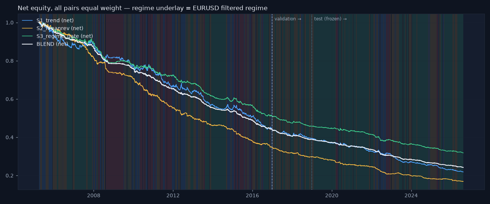

# Strategy evaluation — S1 trend, S2 mean reversion, S3 regime gate, BLEND

_Generated 2026-08-19 17:38. Daily bars, three pairs equal weight, costs 1 bp + 80×vol_20 on turnover, lag law inside the engine, overlay on every strategy (risk scaling above 0.3, siren stop above 98.0, 10% vol target, 2× cap). Parameters fixed on train+val; **test 2019+ scored once and frozen.** Research demonstration on daily data — not a live trading system._

## train — gross vs net (all pairs equal weight)

| strategy | kind | cagr | ann_vol | sharpe | max_drawdown | turnover_ann | cost_drag | hit_rate |
|---|---|---|---|---|---|---|---|---|
| S1_trend | gross | 0.003 | 0.045 | 0.082 | -0.115 | 79.550 | 0.000 | 0.488 |
| S1_trend | net | -0.065 | 0.045 | -1.464 | -0.559 | 79.550 | 0.068 | 0.430 |
| S2_meanrev | gross | -0.004 | 0.035 | -0.096 | -0.135 | 101.771 | 0.000 | 0.512 |
| S2_meanrev | net | -0.084 | 0.035 | -2.484 | -0.656 | 101.771 | 0.080 | 0.411 |
| S3_regime_gate | gross | 0.008 | 0.027 | 0.294 | -0.078 | 71.849 | 0.000 | 0.509 |
| S3_regime_gate | net | -0.054 | 0.028 | -2.001 | -0.491 | 71.849 | 0.062 | 0.425 |
| BLEND | gross | 0.004 | 0.021 | 0.180 | -0.047 | 83.201 | 0.000 | 0.503 |
| BLEND | net | -0.065 | 0.021 | -3.203 | -0.561 | 83.201 | 0.069 | 0.377 |

## val — gross vs net (all pairs equal weight)

| strategy | kind | cagr | ann_vol | sharpe | max_drawdown | turnover_ann | cost_drag | hit_rate |
|---|---|---|---|---|---|---|---|---|
| S1_trend | gross | 0.002 | 0.041 | 0.078 | -0.042 | 80.504 | 0.000 | 0.503 |
| S1_trend | net | -0.054 | 0.041 | -1.341 | -0.112 | 80.504 | 0.057 | 0.449 |
| S2_meanrev | gross | 0.009 | 0.032 | 0.298 | -0.034 | 114.556 | 0.000 | 0.547 |
| S2_meanrev | net | -0.070 | 0.032 | -2.249 | -0.148 | 114.556 | 0.079 | 0.464 |
| S3_regime_gate | gross | -0.001 | 0.021 | -0.025 | -0.032 | 69.255 | 0.000 | 0.511 |
| S3_regime_gate | net | -0.050 | 0.021 | -2.479 | -0.106 | 69.255 | 0.050 | 0.412 |
| BLEND | gross | 0.003 | 0.017 | 0.178 | -0.024 | 85.900 | 0.000 | 0.509 |
| BLEND | net | -0.057 | 0.017 | -3.402 | -0.118 | 85.900 | 0.060 | 0.403 |

## test — gross vs net (all pairs equal weight)

| strategy | kind | cagr | ann_vol | sharpe | max_drawdown | turnover_ann | cost_drag | hit_rate |
|---|---|---|---|---|---|---|---|---|
| S1_trend | gross | -0.016 | 0.044 | -0.333 | -0.140 | 77.714 | 0.000 | 0.489 |
| S1_trend | net | -0.072 | 0.044 | -1.665 | -0.449 | 77.714 | 0.056 | 0.442 |
| S2_meanrev | gross | 0.008 | 0.038 | 0.218 | -0.095 | 113.086 | 0.000 | 0.501 |
| S2_meanrev | net | -0.069 | 0.038 | -1.870 | -0.435 | 113.086 | 0.077 | 0.407 |
| S3_regime_gate | gross | 0.003 | 0.025 | 0.116 | -0.065 | 61.543 | 0.000 | 0.497 |
| S3_regime_gate | net | -0.045 | 0.025 | -1.841 | -0.307 | 61.543 | 0.048 | 0.423 |
| BLEND | gross | 0.000 | 0.020 | 0.015 | -0.056 | 80.116 | 0.000 | 0.490 |
| BLEND | net | -0.058 | 0.020 | -2.917 | -0.378 | 80.116 | 0.058 | 0.357 |

## Per-regime attribution — test, net Sharpe by the regime known when the position was decided

| strategy | calm | trend | chop | crisis |
|---|---|---|---|---|
| BLEND | -2.18 | -1.84 | -2.49 | -3.45 |
| S1_trend | -0.89 | -1.33 | -2.06 | -2.25 |
| S2_meanrev | -1.58 | -1.38 | -1.55 | -0.68 |
| S3_regime_gate | -0.86 | -1.29 | -1.52 | -2.92 |

Claim under test: trend earns in `trend` and bleeds in `chop`. Measured (S1, test): trend -1.33, chop -2.06, calm -0.89, crisis -2.25 → the pattern holds in sign. Sample sizes per regime are small out of sample (see days), so treat these as directional, not significant.

## Vol targeting and the leverage cap

Target 10% per pair with a hard 2× cap. Because the base signals average only ~0.4 in size, the cap binds on roughly half to four-fifths of training days and realised vol lands at 6–9 % per pair (pooled across three pairs it is lower still). Raising the cap would be a tuning decision we do not take; the target is therefore a ceiling-aware target, and the strategies never run hotter than it.

## Correlation of net daily returns — test

|  | S1_trend | S2_meanrev | S3_regime_gate |
|---|---|---|---|
| S1_trend | 1.000 | -0.487 | 0.731 |
| S2_meanrev | -0.487 | 1.000 | -0.094 |
| S3_regime_gate | 0.731 | -0.094 | 1.000 |

## The mutual-insurance claim

Blend max drawdown (test, net) -37.8% vs best single strategy S3_regime_gate -30.7% → **the blend does NOT beat the best single strategy on drawdown** in this sample — the insurance claim fails here. Blend Sharpe -2.92 vs S1_trend -1.66, S2_meanrev -1.87, S3_regime_gate -1.84.

## Honest closing paragraph

Out of sample and net of costs, 0 of the four series have a positive Sharpe and 4 do not (S1_trend, S2_meanrev, S3_regime_gate, BLEND). Cost drag on the test set runs from 4.8% to 7.7% of CAGR per year — the vol-scaled cost model bites exactly where the strategies trade most. This is the expected outcome, stated in advance: on daily FX bars, with honest lags and honest costs, mechanical rules plus a regime gate do not produce a reliable edge. What the exercise delivers is the framework — a lag-law engine, a stress-aware cost model, an overlay that provably de-risks on the siren and change-risk signals, and a blend whose diversification benefit is measured rather than assumed — and the honesty to report the numbers as they are.

_Research demonstration on daily data — not a live trading system. Educational tool. Not investment advice._
