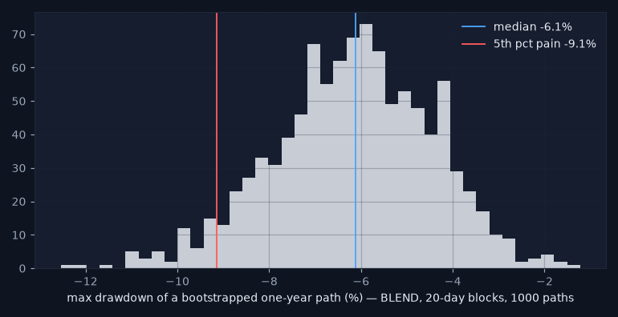
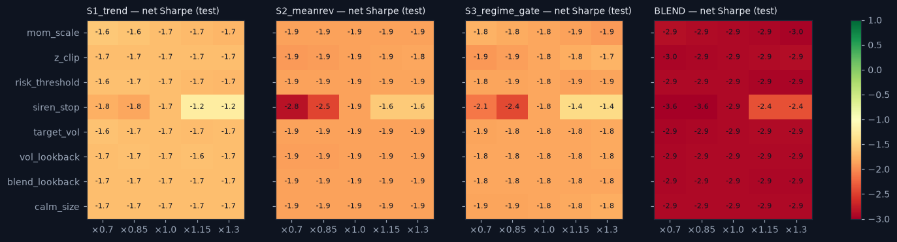

# Stress report — the strategy layer under attack

_Generated 2026-08-19 17:38. Test period 2019+ unless stated; net of the vol-scaled cost model; nothing was re-tuned after these results. Research demonstration on daily data — not a live trading system._

## 1. Historical replays

| window | strategy | return | max_drawdown | worst_day | days |
|---|---|---|---|---|---|
| SNB week (Jan 2015) | S1_trend | 0.013 | -0.001 | -0.004 | 10 |
| COVID crash (Feb–Mar 2020) | S1_trend | -0.007 | -0.012 | -0.004 | 29 |
| 2022 | S1_trend | -0.054 | -0.080 | -0.011 | 260 |
| SNB week (Jan 2015) | S2_meanrev | -0.009 | -0.012 | -0.007 | 10 |
| COVID crash (Feb–Mar 2020) | S2_meanrev | -0.035 | -0.040 | -0.010 | 29 |
| 2022 | S2_meanrev | -0.154 | -0.161 | -0.012 | 260 |
| SNB week (Jan 2015) | S3_regime_gate | 0.012 | -0.002 | -0.003 | 10 |
| COVID crash (Feb–Mar 2020) | S3_regime_gate | -0.012 | -0.013 | -0.005 | 29 |
| 2022 | S3_regime_gate | -0.074 | -0.086 | -0.011 | 260 |
| SNB week (Jan 2015) | BLEND | 0.005 | -0.001 | -0.001 | 10 |
| COVID crash (Feb–Mar 2020) | BLEND | -0.018 | -0.018 | -0.005 | 29 |
| 2022 | BLEND | -0.096 | -0.097 | -0.011 | 260 |

Siren stop (anomaly_pct > 98) inside the windows:

| window | pair | siren_days | first | last |
|---|---|---|---|---|
| SNB week (Jan 2015) | EURJPY | 8 | 2015-01-12 | 2015-01-23 |
| SNB week (Jan 2015) | NZDUSD | 2 | 2015-01-16 | 2015-01-23 |
| SNB week (Jan 2015) | USDCHF | 7 | 2015-01-15 | 2015-01-23 |
| SNB week (Jan 2015) | USDJPY | 2 | 2015-01-15 | 2015-01-19 |
| COVID crash (Feb–Mar 2020) | AUDUSD | 16 | 2020-03-09 | 2020-03-31 |
| COVID crash (Feb–Mar 2020) | EURGBP | 15 | 2020-03-03 | 2020-03-31 |
| COVID crash (Feb–Mar 2020) | EURJPY | 14 | 2020-03-03 | 2020-03-31 |
| COVID crash (Feb–Mar 2020) | EURUSD | 10 | 2020-03-09 | 2020-03-31 |
| COVID crash (Feb–Mar 2020) | GBPUSD | 13 | 2020-03-13 | 2020-03-31 |
| COVID crash (Feb–Mar 2020) | NZDUSD | 17 | 2020-03-09 | 2020-03-31 |
| COVID crash (Feb–Mar 2020) | USDCAD | 13 | 2020-03-09 | 2020-03-31 |
| COVID crash (Feb–Mar 2020) | USDCHF | 10 | 2020-03-09 | 2020-03-31 |
| COVID crash (Feb–Mar 2020) | USDJPY | 19 | 2020-03-02 | 2020-03-31 |
| COVID crash (Feb–Mar 2020) | USDSEK | 15 | 2020-03-10 | 2020-03-31 |
| 2022 | AUDUSD | 89 | 2022-02-01 | 2022-12-26 |
| 2022 | EURGBP | 33 | 2022-02-18 | 2022-12-16 |
| 2022 | EURJPY | 66 | 2022-02-11 | 2022-12-30 |
| 2022 | EURUSD | 39 | 2022-02-01 | 2022-12-28 |
| 2022 | GBPUSD | 80 | 2022-02-25 | 2022-12-16 |
| 2022 | NZDUSD | 70 | 2022-03-17 | 2022-12-29 |
| 2022 | USDCAD | 22 | 2022-02-02 | 2022-12-09 |
| 2022 | USDCHF | 28 | 2022-05-20 | 2022-12-23 |
| 2022 | USDJPY | 69 | 2022-03-29 | 2022-12-30 |
| 2022 | USDSEK | 101 | 2022-01-21 | 2022-12-29 |

**Verdict:** Worst window/strategy: S2_meanrev in 2022 (max DD -16.1%, worst day -1.16%). Siren stop fired on 758 pair-days across the three windows (see table) — the overlay was flat exactly when it was supposed to be.

## 2. Cost shocks and the BREAKEVEN COST

**Breakeven cost multiplier — the number practitioners ask first:**

| strategy | gross_sharpe | sharpe_at_1x | breakeven_cost_mult |
|---|---|---|---|
| S1_trend | -0.33 | -1.66 | 0.00 |
| S2_meanrev | 0.22 | -1.87 | 0.15 |
| S3_regime_gate | 0.12 | -1.84 | 0.10 |
| BLEND | 0.01 | -2.92 | 0.05 |

Net Sharpe at k× the cost model:

| strategy | 1.0 | 2.0 | 3.0 | 5.0 |
|---|---|---|---|---|
| BLEND | -2.92 | -5.77 | -8.46 | -13.21 |
| S1_trend | -1.66 | -2.98 | -4.28 | -6.76 |
| S2_meanrev | -1.87 | -3.93 | -5.95 | -9.75 |
| S3_regime_gate | -1.84 | -3.76 | -5.61 | -8.95 |

**Verdict:** No strategy has a positive gross Sharpe on the test set, so the breakeven cost multiplier is 0 for S1_trend — there is no edge to pay costs from. BLEND breakeven 0.05× the modelled cost. A practitioner reads this row first: nothing here survives its own transaction costs.

## 3. Execution shock — one extra day of lag

| strategy | sharpe_net | sharpe_extra_lag | decay |
|---|---|---|---|
| S1_trend | -1.66 | -1.58 | 0.09 |
| S2_meanrev | -1.87 | -1.84 | 0.03 |
| S3_regime_gate | -1.84 | -1.86 | -0.02 |
| BLEND | -2.92 | -2.87 | 0.05 |

**Verdict:** One extra day of lag changes net Sharpe by -0.02 to +0.09. The decay is small, which mostly reflects how little there was to lose; the numbers are reported as they are.

## 4. Volatility shock — crisis-regime returns ×1.5

| strategy | max_dd_base | max_dd_shock | sharpe_base | sharpe_shock |
|---|---|---|---|---|
| S1_trend | -0.449 | -0.452 | -1.665 | -1.633 |
| S2_meanrev | -0.435 | -0.435 | -1.870 | -1.843 |
| S3_regime_gate | -0.307 | -0.308 | -1.841 | -1.825 |
| BLEND | -0.378 | -0.379 | -2.917 | -2.883 |

**Verdict:** Scaling crisis-regime returns by 1.5x deepens the worst max drawdown by only 0.4% (-44.9% → -45.2%): crisis exposure is small because the siren stop and the crisis-flat gate take risk off in exactly those days — the overlay does its job. The base drawdowns themselves are dreadful; the shock is not what makes them so.

## 5. Block bootstrap — one-year max drawdown, 1 000 paths

| strategy | median_max_dd | p5_pain_max_dd | p95_max_dd |
|---|---|---|---|
| S1_trend | -0.087 | -0.141 | -0.043 |
| S2_meanrev | -0.077 | -0.134 | -0.036 |
| S3_regime_gate | -0.052 | -0.087 | -0.027 |
| BLEND | -0.061 | -0.091 | -0.035 |

**Verdict:** BLEND one-year max drawdown: median -6.1%, 5th-percentile pain case -9.1% (20-day blocks keep the autocorrelation that day-shuffling would destroy).

## 6. Parameter robustness — ±30 %

**Verdict:** Across ±30 % of every parameter the BLEND's net Sharpe stays within a band of 1.22 (widest for siren_stop) — a flat, negative plateau: nothing is overfit to a spike, and nothing is good either. Parameters were not changed after seeing this.

## Summary

| test | verdict |
|---|---|
| historical replays | Worst window/strategy: S2_meanrev in 2022 (max DD -16.1%, worst day -1.16%). Siren stop fired on 758 pair-days across the three windows (see table) — the overlay was flat exactly when it was supposed to be. |
| cost shocks / breakeven | No strategy has a positive gross Sharpe on the test set, so the breakeven cost multiplier is 0 for S1_trend — there is no edge to pay costs from. BLEND breakeven 0.05× the modelled cost. A practitioner reads this row first: nothing here survives its own transaction costs. |
| execution shock | One extra day of lag changes net Sharpe by -0.02 to +0.09. The decay is small, which mostly reflects how little there was to lose; the numbers are reported as they are. |
| volatility shock | Scaling crisis-regime returns by 1.5x deepens the worst max drawdown by only 0.4% (-44.9% → -45.2%): crisis exposure is small because the siren stop and the crisis-flat gate take risk off in exactly those days — the overlay does its job. The base drawdowns themselves are dreadful; the shock is not what makes them so. |
| block bootstrap | BLEND one-year max drawdown: median -6.1%, 5th-percentile pain case -9.1% (20-day blocks keep the autocorrelation that day-shuffling would destroy). |
| parameter robustness | Across ±30 % of every parameter the BLEND's net Sharpe stays within a band of 1.22 (widest for siren_stop) — a flat, negative plateau: nothing is overfit to a spike, and nothing is good either. Parameters were not changed after seeing this. |

_Research demonstration on daily data — not a live trading system. Educational tool. Not investment advice._
