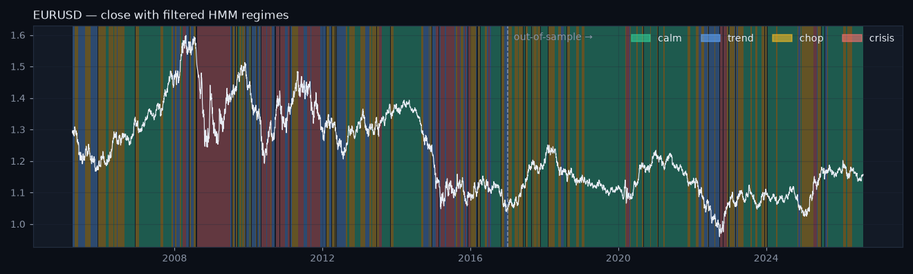
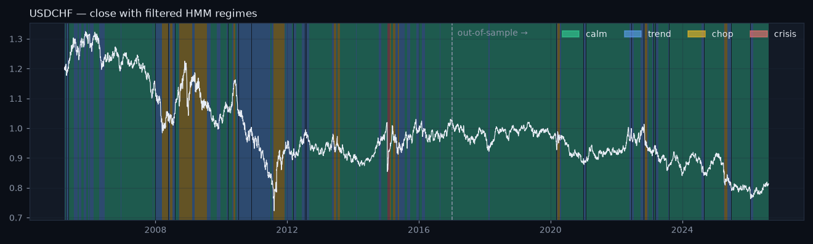
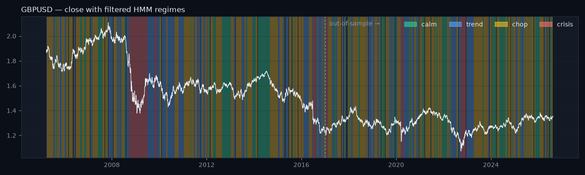
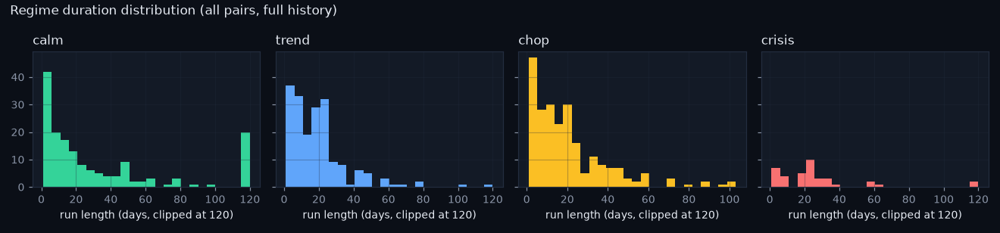

# HMM validation — are these regimes real, stable and useful?

_Generated 2026-08-18 11:18. Train = dates ≤ 2016-12-31; out-of-sample (OOS) = 2017-01-01 onward — nothing after the train end touched the fit. All regime labels are FILTERED (causal)._

## 1. Regime anatomy (train vs out-of-sample)

Frequency, mean run length, annualised vol of daily returns, mean daily return (bp) and worst drawdown of the return stream *inside* each label. Ordering by vol is by construction (calm < … < crisis); everything else is a genuine test.

**EURUSD**

| period | regime | days | freq_pct | mean_duration_d | ann_vol_pct | mean_ret_bp | worst_dd_pct |
|---|---|---|---|---|---|---|---|
| oos | calm | 1451 | 57.97 | 41.46 | 5.77 | 0.64 | -13.01 |
| oos | trend | 208 | 8.31 | 13.00 | 9.72 | -1.55 | -9.65 |
| oos | chop | 754 | 30.12 | 15.71 | 7.72 | -0.60 | -21.34 |
| oos | crisis | 90 | 3.60 | 22.50 | 12.65 | 8.25 | -3.62 |
| train | calm | 766 | 25.21 | 38.30 | 6.00 | 2.88 | -8.24 |
| train | trend | 710 | 23.37 | 16.90 | 9.82 | -2.30 | -21.41 |
| train | chop | 857 | 28.21 | 17.85 | 8.53 | 0.56 | -14.37 |
| train | crisis | 705 | 23.21 | 32.05 | 15.00 | -4.38 | -28.50 |

**USDCHF**

| period | regime | days | freq_pct | mean_duration_d | ann_vol_pct | mean_ret_bp | worst_dd_pct |
|---|---|---|---|---|---|---|---|
| oos | calm | 2198 | 87.81 | 169.08 | 6.63 | -0.09 | -16.30 |
| oos | trend | 242 | 9.67 | 15.12 | 9.97 | -5.13 | -18.02 |
| oos | chop | 63 | 2.52 | 15.75 | 15.50 | -12.62 | -12.97 |
| oos | crisis | 0 | 0.00 | nan | nan | nan | nan |
| train | calm | 1618 | 52.93 | 44.94 | 7.86 | 1.04 | -19.11 |
| train | trend | 969 | 31.70 | 23.07 | 10.59 | -3.14 | -37.67 |
| train | chop | 450 | 14.72 | 37.50 | 17.43 | 1.45 | -17.65 |
| train | crisis | 20 | 0.65 | 20.00 | 65.93 | -46.36 | -2.18 |

**GBPUSD**

| period | regime | days | freq_pct | mean_duration_d | ann_vol_pct | mean_ret_bp | worst_dd_pct |
|---|---|---|---|---|---|---|---|
| oos | calm | 530 | 21.17 | 14.32 | 5.95 | 0.51 | -7.65 |
| oos | trend | 610 | 24.37 | 19.06 | 9.86 | 0.10 | -17.46 |
| oos | chop | 1249 | 49.90 | 19.83 | 7.55 | -0.37 | -19.31 |
| oos | crisis | 114 | 4.55 | 22.80 | 17.95 | 9.70 | -6.83 |
| train | calm | 486 | 15.90 | 23.14 | 5.20 | 0.69 | -4.99 |
| train | trend | 880 | 28.80 | 21.46 | 9.92 | -1.58 | -23.33 |
| train | chop | 1414 | 46.27 | 24.81 | 7.75 | -0.61 | -19.95 |
| train | crisis | 276 | 9.03 | 46.00 | 19.41 | -8.29 | -25.82 |

Reading: the vol ordering survives out of sample for every pair (a label is not just an in-sample artefact). Mean returns inside labels are tiny relative to vol — regimes describe *conditions*, not direction. Note USDCHF: its `crisis` state was learnt almost entirely from the January-2015 SNB shock (20 train days, ~65 % annualised vol) and never fires out of sample; USDCHF's 2008–2011 stress carries the `chop` name instead. This is a labelling artefact of the frozen naming rule plus one extreme event, and it is reported rather than patched.

## 2. Seed stability

The seed-42 model is the reference; each cell is the share of days on which a model refit with another seed (same data, same naming rule) gives the same label.

| pair | 1 | 2 | 3 | 4 | 5 | mean |
|---|---|---|---|---|---|---|
| EURUSD | 0.696 | 1.000 | 0.625 | 0.698 | 0.534 | 0.711 |
| GBPUSD | 0.995 | 0.996 | 0.895 | 0.996 | 0.403 | 0.857 |
| USDCHF | 0.985 | 0.905 | 0.649 | 0.588 | 0.905 | 0.807 |

Interpretation, honestly: agreement ranges from 40% to 100%. Some refits land on the same optimum (≥ 99 % agreement) and others on a different one where the middle two states split the data differently — EURUSD is the least stable (mean 71%, below the 80 % warning threshold). The calm/crisis ends are the stable part; the trend/chop split is the fragile part. EM finds local optima, and a rule that names states by mean vol/momentum inherits that. Practical consequences: (a) treat `trend` vs `chop` as soft; (b) a production refit should use several restarts and keep the best likelihood, and be checked against the previous labelling before it replaces it (phase 06 refit path); (c) `regime_prob`/`hmm_entropy` are more trustworthy than the label itself.

## 3. Baseline: does the HMM add anything to a one-line vol rule?

Naive rule: *stressed* when vol_20 is above its trailing 250-day 80th percentile, else *quiet* (causal). Compared with HMM `crisis` out of sample.

| pair | hmm_crisis_pct | naive_stress_pct | agreement_pct | kappa |
|---|---|---|---|---|
| EURUSD | 3.60 | 19.10 | 84.10 | 0.25 |
| GBPUSD | 4.55 | 19.54 | 83.98 | 0.28 |
| USDCHF | 0.00 | 19.62 | 80.38 | 0.00 |

Where the two disagree the naive rule is usually earlier by construction (a percentile flips the day vol crosses it) while the HMM waits for the transition to be likely — it trades a few days of lag for far fewer flickers (compare mean durations above). Dated episodes (full history) where both flagged stress within 15 trading days of each other (lead_days > 0 = HMM first); the three largest HMM leads are shown:

**EURUSD** — 20 matched episodes; HMM led in 3, naive led in 8, same day 9.

| hmm_start | naive_start | lead_days |
|---|---|---|
| 2011-09-12 | 2011-10-03 | 15 |
| 2010-09-27 | 2010-10-05 | 6 |
| 2011-05-06 | 2011-05-12 | 4 |

**USDCHF** — 1 matched episodes; HMM led in 0, naive led in 0, same day 1.

| hmm_start | naive_start | lead_days |
|---|---|---|
| 2015-01-16 | 2015-01-16 | 0 |

**GBPUSD** — 9 matched episodes; HMM led in 1, naive led in 6, same day 2.

| hmm_start | naive_start | lead_days |
|---|---|---|
| 2006-05-11 | 2006-05-15 | 2 |
| 2016-10-07 | 2016-10-07 | 0 |
| 2017-01-18 | 2017-01-18 | 0 |

Verdict: the HMM does **not** systematically lead the naive rule — across all matched episodes it led in 4 and lagged in 14. When it leads it can be by several days (EURUSD, autumn 2011), but more often it is simultaneous or later. Its value is not earlier warnings but a four-way, sticky, probabilistic description (with confidence and entropy) instead of a binary flicker — and that is what the forecaster and narrator consume.

## 4. Economic meaning: a toy trend rule inside each regime (out of sample)

MA(50/200) long/short decided at t, earned at t+1, gross of costs — a diagnostic only. Claim under test: trend-following should look best in `trend` and worst in `chop`.

**EURUSD**

| regime | days | sharpe | ann_ret_pct |
|---|---|---|---|
| calm | 1450 | -0.27 | -1.69 |
| trend | 208 | -0.22 | -1.98 |
| chop | 754 | 0.77 | 5.88 |
| crisis | 90 | -2.41 | -25.64 |
| ALL | 2502 | -0.04 | -0.29 |

**USDCHF**

| regime | days | sharpe | ann_ret_pct |
|---|---|---|---|
| calm | 2197 | -0.56 | -3.86 |
| trend | 242 | -0.90 | -9.35 |
| chop | 63 | 0.06 | 0.59 |
| crisis | 0 | nan | nan |
| ALL | 2502 | -0.58 | -4.28 |

**GBPUSD**

| regime | days | sharpe | ann_ret_pct |
|---|---|---|---|
| calm | 529 | -0.45 | -3.24 |
| trend | 610 | -0.05 | -0.49 |
| chop | 1249 | -0.19 | -1.43 |
| crisis | 114 | -1.37 | -20.30 |
| ALL | 2502 | -0.28 | -2.45 |

Reading: EURUSD: best in `chop`, worst in `crisis`; USDCHF: best in `chop`, worst in `trend`; GBPUSD: best in `trend`, worst in `crisis`. The claim holds for 1/3 pairs on 'best in trend' and 0/3 on 'worst in chop' — it does **not** hold as a general pattern, and `crisis` is where a moving-average rule gets whipsawed hardest. Differences between labels are also within noise for these sample sizes. The regimes are descriptive states of volatility/momentum, not a trading edge, and this report says so.

## 5. Plots

## 6. Limitations

- **Daily data only.** Intraday storms are averaged away; Yahoo's daily close is a start-of-day snapshot, so returns are one day late relative to highs/lows.
- **Label noise.** Filtered labels flicker near state boundaries and the trend/chop split is seed-sensitive (section 2). Read `regime_prob` and `hmm_entropy` with the label.
- **Descriptive, not predictive.** A regime describes the recent past; the transition matrix says regimes are sticky, nothing more. Direction is not modelled anywhere.
- **Frozen naming rule + rare events.** One extreme episode (SNB 2015) can own a whole state (USDCHF); the rule then mislabels the ordinary stress state.
- **Single training window (2005–2016).** Post-2016 structure (2020, 2022) is scored, not learnt; a monthly expanding refit is the phase-06 plan.
- **Gaussian emissions.** Fat tails are absorbed by the high-vol state rather than modelled.

_Educational tool. Not investment advice._
