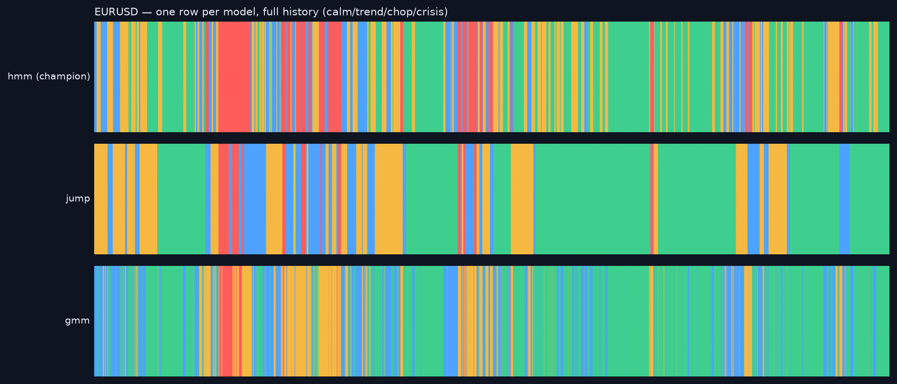

# Model lab — a choice of models, raced under one protocol

_Universe `fx` · generated 2026-08-19 18:10 UTC. Research copies only: the shipped champions, the bundle/goldens and the live ledger are untouched. Regime alternatives: the statistical jump model (Bemporad 2018; Nystrup et al. 2020/21; Aydınhan–Kolm–Mulvey–Shu 2024) with GREEDY ONLINE (causal) inference and λ matched per pair to the champion's TRAIN-era switching rate; a temporally-uncoupled GMM as the persistence ablation. Forecaster engines: the XGBoost champion, sklearn's HistGradientBoosting (LightGBM-style, zero new dependencies), and the logistic reference — identical splits, embargo, Platt calibration on validation, recall-targeted threshold; each engine's frozen test scored once, here._

## Regime models — out-of-sample anatomy (≥ 2017-01-01; λ per pair: EURUSD=2, GBPUSD=1, USDCHF=1)

**hmm (champion)**

| pair | share_calm | share_crisis | mean_run_d | switches_yr | vol_ordering_ok | vol_calm | vol_crisis |
|---|---|---|---|---|---|---|---|
| EURUSD | 58% | 3.6% | 24 | 10.3 | True | 5.8 | 12.6 |
| GBPUSD | 21% | 4.6% | 18 | 13.7 | True | 5.9 | 17.9 |
| USDCHF | 88% | 0.0% | 76 | 3.2 | True | 6.6 | — |

**jump** · OOS label agreement with champion 59%

| pair | share_calm | share_crisis | mean_run_d | switches_yr | vol_ordering_ok | vol_calm | vol_crisis |
|---|---|---|---|---|---|---|---|
| EURUSD | 79% | 0.6% | 139 | 1.7 | True | 6.5 | — |
| GBPUSD | 53% | 1.4% | 28 | 8.8 | True | 7.4 | 23.1 |
| USDCHF | 93% | 0.0% | 132 | 1.8 | True | 6.9 | — |

**gmm** · OOS label agreement with champion 65%

| pair | share_calm | share_crisis | mean_run_d | switches_yr | vol_ordering_ok | vol_calm | vol_crisis |
|---|---|---|---|---|---|---|---|
| EURUSD | 72% | 0.0% | 7 | 34.7 | True | 5.2 | — |
| GBPUSD | 56% | 4.0% | 3 | 88.1 | True | 4.6 | 20.2 |
| USDCHF | 95% | 0.0% | 29 | 8.5 | True | 6.5 | — |

Reading: the jump model's whole point is fewer, longer regimes at matched training persistence — compare `switches_yr` and `mean_run_d` with the champion; the GMM row shows what removing temporal coupling costs (label flicker). `vol_ordering_ok` checks calm is still the lowest-vol label out of sample — the anatomy test a regime label must pass to mean anything.

## Forecaster engines — same matrix, same protocol (never accuracy)

| engine | threshold | val PR-AUC | test PR-AUC ↑ | test Brier ↓ | precision | recall | selection |
|---|---|---|---|---|---|---|---|
| xgb | 0.22 | 0.481 | **0.548** | 0.1024 | 0.45 | 0.59 | 283 |
| histgb | 0.24 | 0.486 | **0.546** | 0.1034 | 0.44 | 0.55 | 200 |
| logistic | 0.17 | 0.409 | **0.433** | 0.1152 | 0.40 | 0.61 | early stop |

Reading: two different GBDT implementations landing within noise of each other says the signal is in the features and the protocol, not in a library — a robustness result. The linear model's gap is the value of interactions. Promotion of any engine is a deliberate act through the challenger-ledger protocol (train → race live under its own model_version → promote after ≥ 60 matured days), never a flag flip.

_Educational tool. Not investment advice._
