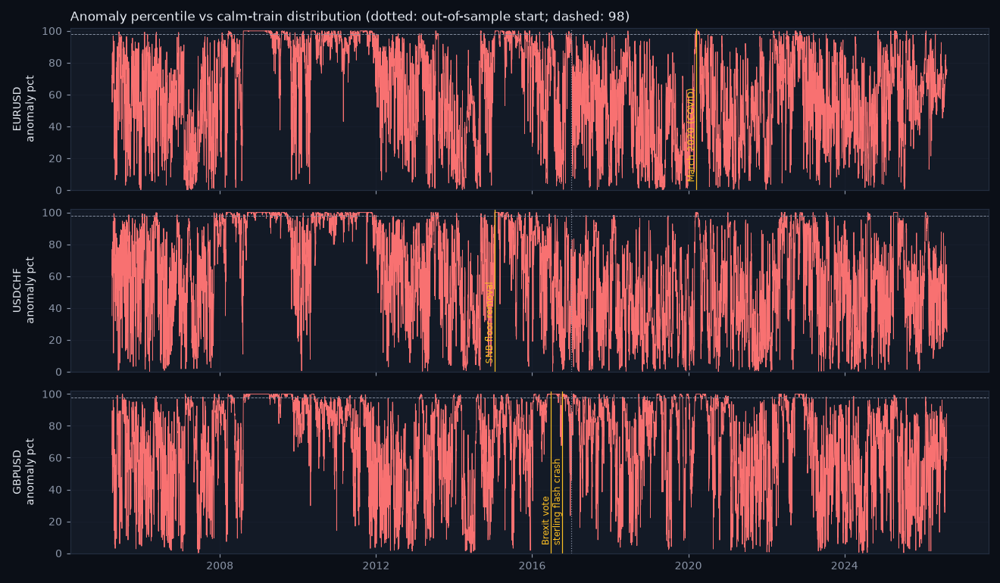

# Siren validation — does it scream at the famous shocks?

_Generated 2026-08-18 11:39. Autoencoder (8, 3, 8), trained on 2788 calm train days (2005-04-07 → 2016-12-30, regime_prob > 0.7), pooled across pairs, no pair identity. anomaly_pct = percentile of the reconstruction error against that calm-train distribution._

## EURUSD — 15 loudest days

| date | anomaly_score | anomaly_pct |
|---|---|---|
| 2008-12-17 | 17.99 | 99.96 |
| 2008-10-27 | 16.21 | 99.96 |
| 2008-10-28 | 15.65 | 99.96 |
| 2008-10-24 | 15.44 | 99.96 |
| 2008-11-04 | 15.03 | 99.96 |
| 2008-08-26 | 14.48 | 99.96 |
| 2008-11-13 | 14.16 | 99.96 |
| 2008-11-06 | 13.66 | 99.96 |
| 2008-11-05 | 12.31 | 99.96 |
| 2008-11-14 | 11.66 | 99.96 |
| 2008-12-19 | 11.60 | 99.96 |
| 2008-11-07 | 11.43 | 99.96 |
| 2008-10-31 | 11.38 | 99.96 |
| 2008-10-30 | 11.20 | 99.96 |
| 2008-11-03 | 11.16 | 99.96 |

- **March 2020 (COVID) (2020-03-16)**: peak anomaly_pct 99.9 within [−1, +3] days, rank 319 of 5541 days for this pair → ✅ lights up.

## USDCHF — 15 loudest days

| date | anomaly_score | anomaly_pct |
|---|---|---|
| 2015-01-16 | 343.26 | 100.00 |
| 2015-01-22 | 143.08 | 100.00 |
| 2015-01-21 | 129.59 | 100.00 |
| 2015-01-19 | 127.39 | 100.00 |
| 2015-01-20 | 110.80 | 100.00 |
| 2015-02-12 | 107.16 | 100.00 |
| 2015-02-11 | 106.62 | 100.00 |
| 2015-02-10 | 106.20 | 100.00 |
| 2015-02-06 | 105.43 | 100.00 |
| 2015-02-09 | 103.48 | 100.00 |
| 2015-01-27 | 101.28 | 100.00 |
| 2015-02-05 | 100.62 | 100.00 |
| 2015-01-28 | 100.54 | 100.00 |
| 2015-02-04 | 99.54 | 100.00 |
| 2015-01-23 | 99.26 | 100.00 |

- **SNB floor removal (2015-01-15)**: peak anomaly_pct 100.0 within [−1, +3] days, rank 1 of 5560 days for this pair → ✅ lights up.

## GBPUSD — 15 loudest days

| date | anomaly_score | anomaly_pct |
|---|---|---|
| 2016-06-27 | 60.78 | 100.00 |
| 2016-06-28 | 36.21 | 100.00 |
| 2008-10-27 | 31.37 | 100.00 |
| 2020-03-19 | 30.26 | 100.00 |
| 2016-07-01 | 29.75 | 100.00 |
| 2016-06-29 | 29.64 | 100.00 |
| 2016-06-30 | 28.65 | 100.00 |
| 2008-11-12 | 26.67 | 100.00 |
| 2008-10-24 | 24.42 | 100.00 |
| 2008-11-03 | 23.54 | 100.00 |
| 2008-11-14 | 22.36 | 100.00 |
| 2008-10-28 | 22.33 | 100.00 |
| 2008-10-31 | 22.27 | 100.00 |
| 2016-07-06 | 21.86 | 100.00 |
| 2020-03-20 | 21.44 | 100.00 |

- **Brexit vote (2016-06-24)**: peak anomaly_pct 100.0 within [−1, +3] days, rank 1 of 5559 days for this pair → ✅ lights up.

- **sterling flash crash (2016-10-07)**: peak anomaly_pct 100.0 within [−1, +3] days, rank 139 of 5559 days for this pair → ✅ lights up.

## March 2020, all pairs

Share of March-2020 days above the 98th calm-train percentile: EURUSD 68%, GBPUSD 82%, USDCHF 68%.

## Sparkline

## Honest reading

Every named shock lights up (≥ 98th percentile within a few days of the event). Yahoo's daily close is a start-of-day snapshot, so a shock's return shows one day late while the intraday range shows on the day — the [−1, +3]-day window accounts for that. The siren is a detector, not a predictor: it says 'today looks unlike any calm day I learnt from', and it says it about many days that were merely volatile, not historic. Read it with the regime and the change risk, not instead of them.

_Educational tool. Not investment advice._
