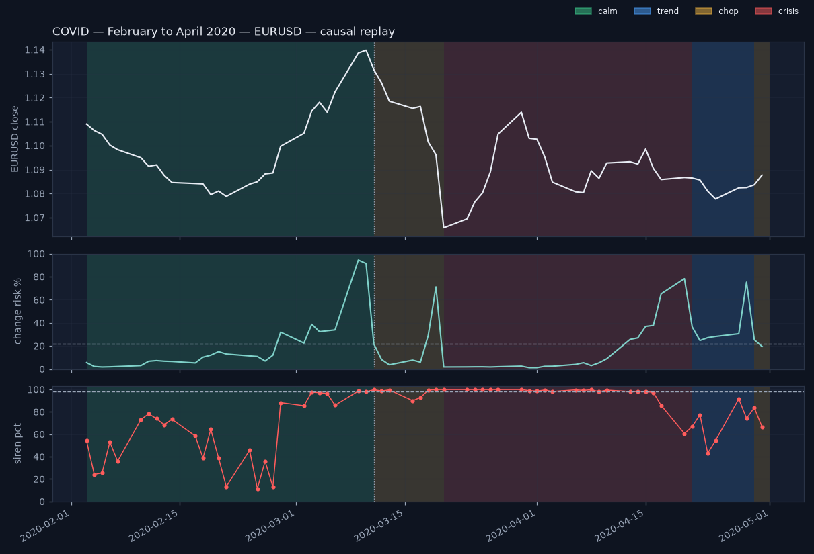

# Storm replay — COVID — February to April 2020 (EURUSD)

> **Causal reconstruction — not the live record. The live record starts 2026-08-17; see the Proof page.**
>
> Windows are the three named crises every Swiss treasurer remembers, fixed in advance; no window was chosen after seeing the results.

_Window 2020-02-03 → 2020-04-30, 64 trading days. For each day t the prices were truncated at t and scored with the saved models exactly as the daily pipeline does (filtered HMM, forecaster, siren); no refit, no smoothing. Alarm threshold 0.22 is the forecaster's frozen validation choice._

## The numbers

- First alarm (change risk ≥ 0.22): **2020-02-28** at 32 %
- First crisis day: **2020-03-20**
- Alarm → regime flip: **15** trading days
- Peak siren: **2020-03-20** at percentile **100** (25 days ≥ 98)
- Crisis days: **22** of 64 (longest run 22); window ended in **chop**

## Buildup

EURUSD started the window in the calm regime. From 2020-02-03 until the day before 2020-03-20, change risk peaked at 95 % (alarm threshold 22 %) and the siren peaked at percentile 100. The reference event for this window is the WHO pandemic declaration (11 March). Context: The WHO declared a pandemic on 11 March 2020; the Federal Reserve's emergency rate decisions came on 3 and 15 March and dollar swap lines were widened on 19 March.

## Alarm timing

The first alarm — change risk at or above the frozen threshold of 22 % — came on 2020-02-28 (32 %). Change risk was at or above the threshold on 23 of 64 days, with a maximum of 95 % on 2020-03-09. The regime label first read crisis on 2020-03-20. That is 15 trading days after the first alarm. The siren peaked on 2020-03-20 at percentile 100; 25 days scored at or above 98.

## Aftermath

Crisis was the label on 22 of 64 days (longest unbroken run 22, last crisis day 2020-04-20). The window ended in the chop regime.

## Day by day

| date | regime | confidence | change risk | siren pct | risk lo | risk hi | consensus |
|---|---|---|---|---|---|---|---|
| 2020-02-03 | calm | 1.00 | 6 | 54 | 0 | 55 | 0/3 agree: quiet conditions — no voter sees stress |
| 2020-02-04 | calm | 1.00 | 2 | 24 | 0 | 52 | 0/3 agree: quiet conditions — no voter sees stress |
| 2020-02-05 | calm | 1.00 | 2 | 26 | 0 | 51 | 0/3 agree: quiet conditions — no voter sees stress |
| 2020-02-06 | calm | 1.00 | 2 | 53 | 0 | 51 | 0/3 agree: quiet conditions — no voter sees stress |
| 2020-02-07 | calm | 1.00 | 2 | 36 | 0 | 52 | 0/3 agree: quiet conditions — no voter sees stress |
| 2020-02-10 | calm | 1.00 | 3 | 73 | 0 | 52 | 0/3 agree: quiet conditions — no voter sees stress |
| 2020-02-11 | calm | 1.00 | 7 | 78 | 0 | 56 | 0/3 agree: quiet conditions — no voter sees stress |
| 2020-02-12 | calm | 1.00 | 7 | 74 | 0 | 57 | 0/3 agree: quiet conditions — no voter sees stress |
| 2020-02-13 | calm | 1.00 | 7 | 69 | 0 | 56 | 0/3 agree: quiet conditions — no voter sees stress |
| 2020-02-14 | calm | 1.00 | 7 | 73 | 0 | 56 | 0/3 agree: quiet conditions — no voter sees stress |
| 2020-02-17 | calm | 1.00 | 5 | 59 | 0 | 55 | 0/3 agree: quiet conditions — no voter sees stress |
| 2020-02-18 | calm | 1.00 | 10 | 39 | 0 | 60 | 0/3 agree: quiet conditions — no voter sees stress |
| 2020-02-19 | calm | 1.00 | 12 | 64 | 0 | 61 | 0/3 agree: quiet conditions — no voter sees stress |
| 2020-02-20 | calm | 1.00 | 15 | 39 | 0 | 64 | 0/3 agree: quiet conditions — no voter sees stress |
| 2020-02-21 | calm | 1.00 | 13 | 13 | 0 | 62 | 0/3 agree: quiet conditions — no voter sees stress |
| 2020-02-24 | calm | 1.00 | 11 | 46 | 0 | 61 | 0/3 agree: quiet conditions — no voter sees stress |
| 2020-02-25 | calm | 1.00 | 11 | 12 | 0 | 60 | 0/3 agree: quiet conditions — no voter sees stress |
| 2020-02-26 | calm | 1.00 | 7 | 36 | 0 | 56 | 0/3 agree: quiet conditions — no voter sees stress |
| 2020-02-27 | calm | 1.00 | 12 | 13 | 0 | 61 | 0/3 agree: quiet conditions — no voter sees stress |
| 2020-02-28 | calm | 1.00 | 32 | 88 | 0 | 81 | 2/3 agree: conditions are shifting — two voters see stress |
| 2020-03-02 | calm | 1.00 | 23 | 86 | 0 | 72 | 2/3 agree: conditions are shifting — two voters see stress |
| 2020-03-03 | calm | 1.00 | 39 | 98 | 0 | 88 | 2/3 agree: conditions are shifting — two voters see stress |
| 2020-03-04 | calm | 1.00 | 32 | 97 | 0 | 82 | 2/3 agree: conditions are shifting — two voters see stress |
| 2020-03-05 | calm | 1.00 | 33 | 96 | 0 | 82 | 1/3 — likely a one-day spike; one voter sees stress |
| 2020-03-06 | calm | 1.00 | 34 | 86 | 0 | 83 | 1/3 — likely a one-day spike; one voter sees stress |
| 2020-03-09 | calm | 0.55 | 95 | 99 | 45 | 100 | 1/3 — likely a one-day spike; one voter sees stress |
| 2020-03-10 | calm | 0.80 | 92 | 98 | 42 | 100 | 1/3 — likely a one-day spike; one voter sees stress |
| 2020-03-11 | chop | 0.90 | 22 | 100 | 0 | 100 | 2/3 agree: conditions are shifting — two voters see stress |
| 2020-03-12 | chop | 0.99 | 8 | 99 | 0 | 86 | 2/3 agree: conditions are shifting — two voters see stress |
| 2020-03-13 | chop | 1.00 | 4 | 100 | 0 | 82 | 2/3 agree: conditions are shifting — two voters see stress |
| 2020-03-16 | chop | 1.00 | 8 | 90 | 0 | 86 | 2/3 agree: conditions are shifting — two voters see stress |
| 2020-03-17 | chop | 1.00 | 6 | 93 | 0 | 84 | 1/3 — likely a one-day spike; one voter sees stress |
| 2020-03-18 | chop | 0.94 | 29 | 99 | 0 | 100 | 1/3 — likely a one-day spike; one voter sees stress |
| 2020-03-19 | chop | 0.79 | 71 | 100 | 0 | 100 | 1/3 — likely a one-day spike; one voter sees stress |
| 2020-03-20 | crisis | 1.00 | 2 | 100 | 0 | 71 | 3/3 agree: storm conditions — every voter sees stress |
| 2020-03-23 | crisis | 1.00 | 2 | 100 | 0 | 71 | 3/3 agree: storm conditions — every voter sees stress |
| 2020-03-24 | crisis | 1.00 | 2 | 100 | 0 | 71 | 3/3 agree: storm conditions — every voter sees stress |
| 2020-03-25 | crisis | 1.00 | 2 | 100 | 0 | 71 | 3/3 agree: storm conditions — every voter sees stress |
| 2020-03-26 | crisis | 1.00 | 2 | 100 | 0 | 71 | 3/3 agree: storm conditions — every voter sees stress |
| 2020-03-27 | crisis | 1.00 | 2 | 100 | 0 | 71 | 3/3 agree: storm conditions — every voter sees stress |
| 2020-03-30 | crisis | 1.00 | 3 | 100 | 0 | 72 | 2/3 agree: conditions are shifting — two voters see stress |
| 2020-03-31 | crisis | 1.00 | 1 | 99 | 0 | 70 | 2/3 agree: conditions are shifting — two voters see stress |
| 2020-04-01 | crisis | 1.00 | 1 | 99 | 0 | 70 | 2/3 agree: conditions are shifting — two voters see stress |
| 2020-04-02 | crisis | 1.00 | 2 | 99 | 0 | 72 | 2/3 agree: conditions are shifting — two voters see stress |
| 2020-04-03 | crisis | 1.00 | 2 | 98 | 0 | 72 | 3/3 agree: storm conditions — every voter sees stress |
| 2020-04-06 | crisis | 1.00 | 4 | 100 | 0 | 73 | 2/3 agree: conditions are shifting — two voters see stress |
| 2020-04-07 | crisis | 1.00 | 6 | 99 | 0 | 75 | 2/3 agree: conditions are shifting — two voters see stress |
| 2020-04-08 | crisis | 1.00 | 3 | 100 | 0 | 72 | 2/3 agree: conditions are shifting — two voters see stress |
| 2020-04-09 | crisis | 1.00 | 5 | 98 | 0 | 75 | 2/3 agree: conditions are shifting — two voters see stress |
| 2020-04-10 | crisis | 1.00 | 9 | 99 | 0 | 78 | 2/3 agree: conditions are shifting — two voters see stress |
| 2020-04-13 | crisis | 1.00 | 26 | 98 | 0 | 95 | 2/3 agree: conditions are shifting — two voters see stress |
| 2020-04-14 | crisis | 1.00 | 27 | 98 | 0 | 96 | 3/3 agree: storm conditions — every voter sees stress |
| 2020-04-15 | crisis | 1.00 | 37 | 98 | 0 | 100 | 2/3 agree: conditions are shifting — two voters see stress |
| 2020-04-16 | crisis | 1.00 | 38 | 97 | 0 | 100 | 2/3 agree: conditions are shifting — two voters see stress |
| 2020-04-17 | crisis | 0.97 | 65 | 86 | 0 | 100 | 2/3 agree: conditions are shifting — two voters see stress |
| 2020-04-20 | crisis | 0.83 | 78 | 61 | 9 | 100 | 2/3 agree: conditions are shifting — two voters see stress |
| 2020-04-21 | trend | 0.61 | 37 | 67 | 0 | 100 | 1/3 — likely a one-day spike; one voter sees stress |
| 2020-04-22 | trend | 0.94 | 25 | 78 | 0 | 100 | 2/3 agree: conditions are shifting — two voters see stress |
| 2020-04-23 | trend | 1.00 | 27 | 43 | 0 | 100 | 1/3 — likely a one-day spike; one voter sees stress |
| 2020-04-24 | trend | 0.98 | 28 | 54 | 0 | 100 | 1/3 — likely a one-day spike; one voter sees stress |
| 2020-04-27 | trend | 0.98 | 31 | 92 | 0 | 100 | 1/3 — likely a one-day spike; one voter sees stress |
| 2020-04-28 | trend | 0.69 | 75 | 74 | 0 | 100 | 1/3 — likely a one-day spike; one voter sees stress |
| 2020-04-29 | chop | 0.79 | 25 | 84 | 0 | 100 | 1/3 — likely a one-day spike; one voter sees stress |
| 2020-04-30 | chop | 0.99 | 20 | 67 | 0 | 98 | 1/3 — likely a one-day spike; one voter sees stress |

## The other pairs, same days

- **GBPUSD**: first alarm 2020-02-03, first crisis 2020-03-19, peak siren 100 on 2020-03-19, crisis days 27/64.
- **USDCHF**: first alarm 2020-04-06, first crisis none, peak siren 100 on 2020-03-09, crisis days 0/64.

_Generated 2026-08-19 14:05 UTC from the saved models (see data/storm_replays.json). Educational tool. Not investment advice._
