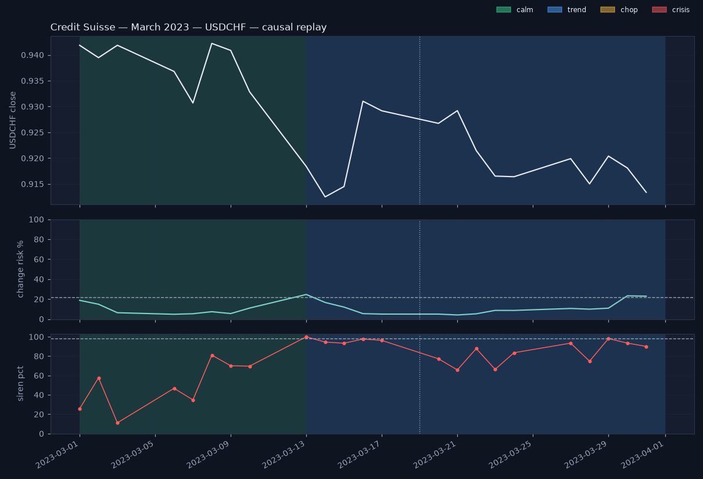

# Storm replay — Credit Suisse — March 2023 (USDCHF)

> **Causal reconstruction — not the live record. The live record starts 2026-08-17; see the Proof page.**
>
> Windows are the three named crises every Swiss treasurer remembers, fixed in advance; no window was chosen after seeing the results.

_Window 2023-03-01 → 2023-03-31, 23 trading days. For each day t the prices were truncated at t and scored with the saved models exactly as the daily pipeline does (filtered HMM, forecaster, siren); no refit, no smoothing. Alarm threshold 0.22 is the forecaster's frozen validation choice._

## The numbers

- First alarm (change risk ≥ 0.22): **2023-03-13** at 25 %
- First crisis day: **none in window**
- Alarm → regime flip: **–** trading days
- Peak siren: **2023-03-13** at percentile **100** (2 days ≥ 98)
- Crisis days: **0** of 23 (longest run 0); window ended in **trend**

## Buildup

USDCHF started the window in the calm regime. Over the whole window (2023-03-01 to 2023-03-31), change risk peaked at 25 % (alarm threshold 22 %) and the siren peaked at percentile 100. The reference event for this window is the announcement of the UBS takeover (Sunday 19 March; first trading day 20 March). Context: Silicon Valley Bank failed on Friday 10 March 2023; on 15 March Credit Suisse's largest shareholder ruled out further capital and the SNB announced a liquidity backstop that night; UBS's takeover of Credit Suisse was announced on Sunday 19 March.

## Alarm timing

The first alarm — change risk at or above the frozen threshold of 22 % — came on 2023-03-13 (25 %). Change risk was at or above the threshold on 3 of 23 days, with a maximum of 25 % on 2023-03-13. The regime label never read crisis in this window. The siren peaked on 2023-03-13 at percentile 100; 2 days scored at or above 98.

## Aftermath

Regimes seen in the window: calm, trend. The window ended in the trend regime.

## Day by day

| date | regime | confidence | change risk | siren pct | risk lo | risk hi | consensus |
|---|---|---|---|---|---|---|---|
| 2023-03-01 | calm | 1.00 | 19 | 26 | 0 | 68 | 0/3 agree: quiet conditions — no voter sees stress |
| 2023-03-02 | calm | 1.00 | 15 | 58 | 0 | 64 | 0/3 agree: quiet conditions — no voter sees stress |
| 2023-03-03 | calm | 1.00 | 6 | 11 | 0 | 56 | 0/3 agree: quiet conditions — no voter sees stress |
| 2023-03-06 | calm | 1.00 | 5 | 47 | 0 | 54 | 0/3 agree: quiet conditions — no voter sees stress |
| 2023-03-07 | calm | 1.00 | 5 | 35 | 0 | 55 | 0/3 agree: quiet conditions — no voter sees stress |
| 2023-03-08 | calm | 1.00 | 7 | 81 | 0 | 57 | 0/3 agree: quiet conditions — no voter sees stress |
| 2023-03-09 | calm | 1.00 | 6 | 70 | 0 | 55 | 0/3 agree: quiet conditions — no voter sees stress |
| 2023-03-10 | calm | 1.00 | 11 | 70 | 0 | 60 | 0/3 agree: quiet conditions — no voter sees stress |
| 2023-03-13 | trend | 0.53 | 25 | 100 | 0 | 100 | 1/3 — likely a one-day spike; one voter sees stress |
| 2023-03-14 | trend | 0.90 | 17 | 95 | 0 | 98 | 1/3 — likely a one-day spike; one voter sees stress |
| 2023-03-15 | trend | 0.98 | 12 | 93 | 0 | 94 | 0/3 agree: quiet conditions — no voter sees stress |
| 2023-03-16 | trend | 0.99 | 5 | 98 | 0 | 87 | 2/3 agree: conditions are shifting — two voters see stress |
| 2023-03-17 | trend | 1.00 | 5 | 96 | 0 | 87 | 1/3 — likely a one-day spike; one voter sees stress |
| 2023-03-20 | trend | 1.00 | 5 | 77 | 0 | 87 | 1/3 — likely a one-day spike; one voter sees stress |
| 2023-03-21 | trend | 1.00 | 4 | 66 | 0 | 86 | 1/3 — likely a one-day spike; one voter sees stress |
| 2023-03-22 | trend | 1.00 | 5 | 88 | 0 | 87 | 1/3 — likely a one-day spike; one voter sees stress |
| 2023-03-23 | trend | 1.00 | 9 | 66 | 0 | 90 | 1/3 — likely a one-day spike; one voter sees stress |
| 2023-03-24 | trend | 1.00 | 9 | 84 | 0 | 90 | 1/3 — likely a one-day spike; one voter sees stress |
| 2023-03-27 | trend | 1.00 | 11 | 93 | 0 | 92 | 1/3 — likely a one-day spike; one voter sees stress |
| 2023-03-28 | trend | 1.00 | 10 | 75 | 0 | 92 | 1/3 — likely a one-day spike; one voter sees stress |
| 2023-03-29 | trend | 1.00 | 11 | 98 | 0 | 93 | 1/3 — likely a one-day spike; one voter sees stress |
| 2023-03-30 | trend | 1.00 | 23 | 93 | 0 | 100 | 1/3 — likely a one-day spike; one voter sees stress |
| 2023-03-31 | trend | 1.00 | 23 | 90 | 0 | 100 | 1/3 — likely a one-day spike; one voter sees stress |

## The other pairs, same days

- **EURUSD**: first alarm 2023-03-02, first crisis none, peak siren 98 on 2023-03-16, crisis days 0/23.
- **GBPUSD**: first alarm 2023-03-06, first crisis none, peak siren 97 on 2023-03-13, crisis days 0/23.

_Generated 2026-08-19 14:05 UTC from the saved models (see data/storm_replays.json). Educational tool. Not investment advice._
