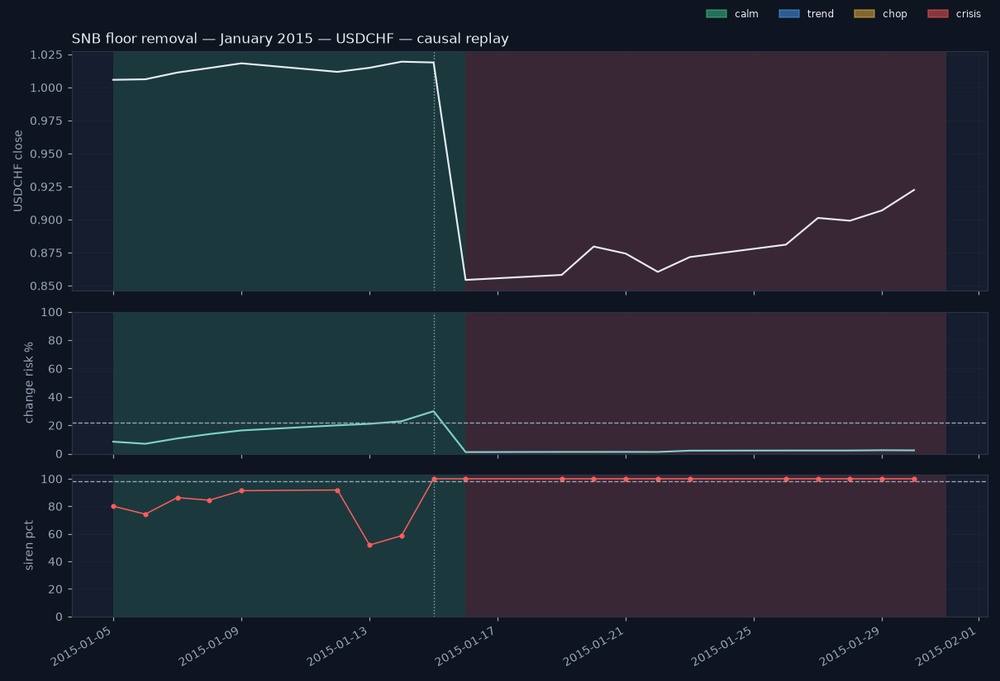

# Storm replay — SNB floor removal — January 2015 (USDCHF)

> **Causal reconstruction — not the live record. The live record starts 2026-08-17; see the Proof page.**
>
> Windows are the three named crises every Swiss treasurer remembers, fixed in advance; no window was chosen after seeing the results.

_Window 2015-01-05 → 2015-01-30, 20 trading days. For each day t the prices were truncated at t and scored with the saved models exactly as the daily pipeline does (filtered HMM, forecaster, siren); no refit, no smoothing. Alarm threshold 0.22 is the forecaster's frozen validation choice._

## The numbers

- First alarm (change risk ≥ 0.22): **2015-01-14** at 23 %
- First crisis day: **2015-01-16**
- Alarm → regime flip: **2** trading days
- Peak siren: **2015-01-15** at percentile **100** (12 days ≥ 98)
- Crisis days: **11** of 20 (longest run 11); window ended in **crisis**

## Buildup

USDCHF started the window in the calm regime. From 2015-01-05 until the day before 2015-01-16, change risk peaked at 30 % (alarm threshold 22 %) and the siren peaked at percentile 100. The reference event for this window is the EUR/CHF floor removal (15 January). Context: The SNB discontinued the EUR/CHF minimum exchange rate of 1.20 on 15 January 2015 at 10:30 CET, without prior signal; its next scheduled policy assessment was 19 March.

## Alarm timing

The first alarm — change risk at or above the frozen threshold of 22 % — came on 2015-01-14 (23 %). Change risk was at or above the threshold on 2 of 20 days, with a maximum of 30 % on 2015-01-15. The regime label first read crisis on 2015-01-16. That is 2 trading days after the first alarm. The siren peaked on 2015-01-15 at percentile 100; 12 days scored at or above 98.

## Aftermath

Crisis was the label on 11 of 20 days (longest unbroken run 11, last crisis day 2015-01-30). The window ended in the crisis regime.

## Day by day

| date | regime | confidence | change risk | siren pct | risk lo | risk hi | consensus |
|---|---|---|---|---|---|---|---|
| 2015-01-05 | calm | 0.99 | 8 | 80 | 0 | 58 | 0/3 agree: quiet conditions — no voter sees stress |
| 2015-01-06 | calm | 1.00 | 7 | 74 | 0 | 56 | 0/3 agree: quiet conditions — no voter sees stress |
| 2015-01-07 | calm | 1.00 | 11 | 86 | 0 | 60 | 0/3 agree: quiet conditions — no voter sees stress |
| 2015-01-08 | calm | 1.00 | 14 | 84 | 0 | 63 | 0/3 agree: quiet conditions — no voter sees stress |
| 2015-01-09 | calm | 1.00 | 16 | 91 | 0 | 66 | 0/3 agree: quiet conditions — no voter sees stress |
| 2015-01-12 | calm | 1.00 | 20 | 92 | 0 | 69 | 0/3 agree: quiet conditions — no voter sees stress |
| 2015-01-13 | calm | 1.00 | 21 | 52 | 0 | 70 | 0/3 agree: quiet conditions — no voter sees stress |
| 2015-01-14 | calm | 1.00 | 23 | 59 | 0 | 72 | 0/3 agree: quiet conditions — no voter sees stress |
| 2015-01-15 | calm | 1.00 | 30 | 100 | 0 | 79 | 0/3 agree: quiet conditions — no voter sees stress |
| 2015-01-16 | crisis | 1.00 | 1 | 100 | 0 | 70 | 3/3 agree: storm conditions — every voter sees stress |
| 2015-01-19 | crisis | 1.00 | 1 | 100 | 0 | 70 | 3/3 agree: storm conditions — every voter sees stress |
| 2015-01-20 | crisis | 1.00 | 1 | 100 | 0 | 70 | 3/3 agree: storm conditions — every voter sees stress |
| 2015-01-21 | crisis | 1.00 | 1 | 100 | 0 | 70 | 3/3 agree: storm conditions — every voter sees stress |
| 2015-01-22 | crisis | 1.00 | 1 | 100 | 0 | 70 | 3/3 agree: storm conditions — every voter sees stress |
| 2015-01-23 | crisis | 1.00 | 2 | 100 | 0 | 71 | 3/3 agree: storm conditions — every voter sees stress |
| 2015-01-26 | crisis | 1.00 | 2 | 100 | 0 | 71 | 3/3 agree: storm conditions — every voter sees stress |
| 2015-01-27 | crisis | 1.00 | 2 | 100 | 0 | 71 | 2/3 agree: conditions are shifting — two voters see stress |
| 2015-01-28 | crisis | 1.00 | 2 | 100 | 0 | 71 | 2/3 agree: conditions are shifting — two voters see stress |
| 2015-01-29 | crisis | 1.00 | 2 | 100 | 0 | 72 | 2/3 agree: conditions are shifting — two voters see stress |
| 2015-01-30 | crisis | 1.00 | 2 | 100 | 0 | 71 | 2/3 agree: conditions are shifting — two voters see stress |

## The other pairs, same days

- **EURUSD**: first alarm 2015-01-08, first crisis 2015-01-23, peak siren 100 on 2015-01-19, crisis days 6/20.
- **GBPUSD**: first alarm 2015-01-15, first crisis none, peak siren 100 on 2015-01-09, crisis days 0/20.
## Sidebar — what a pegged EUR/CHF looked like

From September 2011 to 15 January 2015 the SNB held EUR/CHF at or above 1.20. A pegged cross has
almost no realised volatility: its 20- and 60-day vol sit near zero, its vol ratio is flat, its
range is narrow. Every input of this radar is a volatility, range or correlation feature, so a
pegged cross reads **calm** — right until the day the peg goes. This project does not carry an
EUR/CHF series at all; the point holds for any vol-based radar looking at a managed rate.

USD/CHF was not pegged, but it inherited the franc's suppressed volatility. **What the radar did
NOT do: warn.** On the five trading days before 15 January change risk read 08 Jan 14 %, 09 Jan 16 %, 12 Jan 20 %, 13 Jan 21 %, 14 Jan 23 % — at or above the 22 % threshold on 1 of them, with the regime label calm throughout. The gauge's frozen test precision at that threshold is 45 %: more than half of its alarms are not followed by a change, so a reading a few points over the line is a marginal alarm, not a call. The floor removal was unscheduled — the next SNB policy assessment
was due on 19 March 2015 — so no calendar feature (a `days_to_SNB` count) could have flagged it
either, and a radar that claimed it had would be lying about what was knowable.

What the radar DID do: the siren scored 15 January at percentile 100 while the regime label still read calm that evening; the label flipped to crisis on 16 January — because the MOVE was unprecedented for the series, not
because it was predicted. This is detection, not forecasting, and it is published here exactly as
the replay computed it. The phase-23 cross-asset context (other currency crosses, rates, equity
volatility) is the response to this blind spot; it widens what the radar can see, it does not make
pegs predictable.

Data note: in the daily bars used here the "close" of 15 January is a start-of-day snapshot (the
data layer documents this), so that bar carries an extreme high–low range but a small close-to-close
return. The range feature is what the siren reacted to on the 15th; the move reached `ret_1d` — the
HMM's main input — on the 16th, which is why the label flipped a day after the siren.

_Generated 2026-08-19 14:05 UTC from the saved models (see data/storm_replays.json). Educational tool. Not investment advice._
