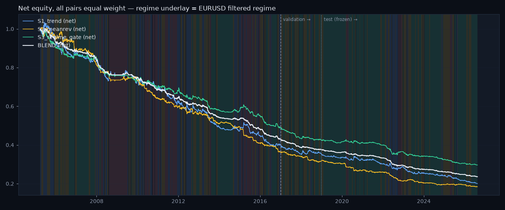

# Strategy evaluation — S1 trend, S2 mean reversion, S3 regime gate, BLEND

_Generated 2026-08-18 12:31. Daily bars, three pairs equal weight, costs 1 bp + 80×vol_20 on turnover, lag law inside the engine, overlay on every strategy (risk scaling above 0.3, siren stop above 98.0, 10% vol target, 2× cap). Parameters fixed on train+val; **test 2019+ scored once and frozen.** Research demonstration on daily data — not a live trading system._

## train — gross vs net (all pairs equal weight)

| strategy | kind | cagr | ann_vol | sharpe | max_drawdown | turnover_ann | cost_drag | hit_rate |
|---|---|---|---|---|---|---|---|---|
| S1_trend | gross | -0.010 | 0.065 | -0.130 | -0.194 | 79.010 | 0.000 | 0.479 |
| S1_trend | net | -0.073 | 0.065 | -1.128 | -0.620 | 79.010 | 0.062 | 0.422 |
| S2_meanrev | gross | -0.007 | 0.049 | -0.117 | -0.163 | 99.081 | 0.000 | 0.505 |
| S2_meanrev | net | -0.080 | 0.049 | -1.688 | -0.640 | 99.081 | 0.073 | 0.419 |
| S3_regime_gate | gross | -0.002 | 0.042 | -0.034 | -0.109 | 70.055 | 0.000 | 0.485 |
| S3_regime_gate | net | -0.057 | 0.042 | -1.381 | -0.513 | 70.055 | 0.055 | 0.421 |
| BLEND | gross | -0.004 | 0.030 | -0.130 | -0.102 | 81.559 | 0.000 | 0.497 |
| BLEND | net | -0.067 | 0.030 | -2.269 | -0.572 | 81.559 | 0.063 | 0.387 |

## val — gross vs net (all pairs equal weight)

| strategy | kind | cagr | ann_vol | sharpe | max_drawdown | turnover_ann | cost_drag | hit_rate |
|---|---|---|---|---|---|---|---|---|
| S1_trend | gross | -0.001 | 0.054 | 0.000 | -0.072 | 81.675 | 0.000 | 0.503 |
| S1_trend | net | -0.057 | 0.055 | -1.048 | -0.129 | 81.675 | 0.056 | 0.464 |
| S2_meanrev | gross | 0.012 | 0.045 | 0.291 | -0.055 | 113.882 | 0.000 | 0.507 |
| S2_meanrev | net | -0.063 | 0.045 | -1.407 | -0.152 | 113.882 | 0.075 | 0.439 |
| S3_regime_gate | gross | -0.014 | 0.034 | -0.383 | -0.070 | 75.167 | 0.000 | 0.503 |
| S3_regime_gate | net | -0.065 | 0.034 | -1.955 | -0.133 | 75.167 | 0.052 | 0.408 |
| BLEND | gross | -0.002 | 0.025 | -0.086 | -0.046 | 89.196 | 0.000 | 0.499 |
| BLEND | net | -0.063 | 0.025 | -2.541 | -0.128 | 89.196 | 0.060 | 0.397 |

## test — gross vs net (all pairs equal weight)

| strategy | kind | cagr | ann_vol | sharpe | max_drawdown | turnover_ann | cost_drag | hit_rate |
|---|---|---|---|---|---|---|---|---|
| S1_trend | gross | -0.018 | 0.057 | -0.298 | -0.177 | 76.571 | 0.000 | 0.493 |
| S1_trend | net | -0.069 | 0.057 | -1.234 | -0.432 | 76.571 | 0.051 | 0.443 |
| S2_meanrev | gross | 0.005 | 0.050 | 0.122 | -0.135 | 112.574 | 0.000 | 0.506 |
| S2_meanrev | net | -0.067 | 0.050 | -1.360 | -0.429 | 112.574 | 0.072 | 0.421 |
| S3_regime_gate | gross | -0.002 | 0.035 | -0.027 | -0.116 | 62.247 | 0.000 | 0.506 |
| S3_regime_gate | net | -0.045 | 0.035 | -1.302 | -0.309 | 62.247 | 0.043 | 0.438 |
| BLEND | gross | -0.004 | 0.027 | -0.130 | -0.099 | 80.356 | 0.000 | 0.494 |
| BLEND | net | -0.057 | 0.027 | -2.177 | -0.373 | 80.356 | 0.054 | 0.393 |

## Per-regime attribution — test, net Sharpe by the regime known when the position was decided

| strategy | calm | trend | chop | crisis |
|---|---|---|---|---|
| BLEND | -1.74 | -2.48 | -1.35 | -3.21 |
| S1_trend | -0.83 | -1.82 | -1.58 | -2.54 |
| S2_meanrev | -1.22 | -1.43 | -0.58 | -1.27 |
| S3_regime_gate | -0.85 | -1.82 | -0.61 | -2.13 |

Claim under test: trend earns in `trend` and bleeds in `chop`. Measured (S1, test): trend -1.82, chop -1.58, calm -0.83, crisis -2.54 → the pattern does NOT hold: S1 was not better in `trend` than in `chop`. Sample sizes per regime are small out of sample (see days), so treat these as directional, not significant.

## Vol targeting and the leverage cap

Target 10% per pair with a hard 2× cap. Because the base signals average only ~0.4 in size, the cap binds on roughly half to four-fifths of training days and realised vol lands at 6–9 % per pair (pooled across three pairs it is lower still). Raising the cap would be a tuning decision we do not take; the target is therefore a ceiling-aware target, and the strategies never run hotter than it.

## Correlation of net daily returns — test

|  | S1_trend | S2_meanrev | S3_regime_gate |
|---|---|---|---|
| S1_trend | 1.000 | -0.470 | 0.617 |
| S2_meanrev | -0.470 | 1.000 | -0.025 |
| S3_regime_gate | 0.617 | -0.025 | 1.000 |

## The mutual-insurance claim

Blend max drawdown (test, net) -37.3% vs best single strategy S3_regime_gate -30.9% → **the blend does NOT beat the best single strategy on drawdown** in this sample — the insurance claim fails here. Blend Sharpe -2.18 vs S1_trend -1.23, S2_meanrev -1.36, S3_regime_gate -1.30.

## Honest closing paragraph

Out of sample and net of costs, 0 of the four series have a positive Sharpe and 4 do not (S1_trend, S2_meanrev, S3_regime_gate, BLEND). Cost drag on the test set runs from 4.3% to 7.2% of CAGR per year — the vol-scaled cost model bites exactly where the strategies trade most. This is the expected outcome, stated in advance: on daily FX bars, with honest lags and honest costs, mechanical rules plus a regime gate do not produce a reliable edge. What the exercise delivers is the framework — a lag-law engine, a stress-aware cost model, an overlay that provably de-risks on the siren and change-risk signals, and a blend whose diversification benefit is measured rather than assumed — and the honesty to report the numbers as they are.

_Research demonstration on daily data — not a live trading system. Educational tool. Not investment advice._
