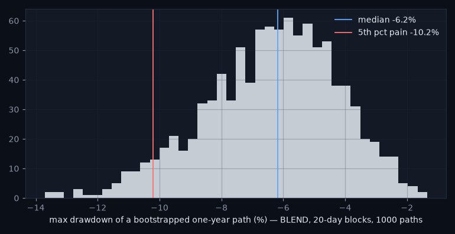
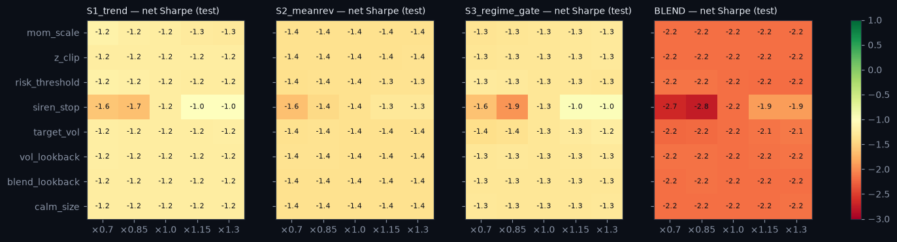

# Stress report — the strategy layer under attack

_Generated 2026-08-18 12:38. Test period 2019+ unless stated; net of the vol-scaled cost model; nothing was re-tuned after these results. Research demonstration on daily data — not a live trading system._

## 1. Historical replays

| window | strategy | return | max_drawdown | worst_day | days |
|---|---|---|---|---|---|
| SNB week (Jan 2015) | S1_trend | 0.006 | -0.004 | -0.008 | 10 |
| COVID crash (Feb–Mar 2020) | S1_trend | -0.012 | -0.025 | -0.017 | 29 |
| 2022 | S1_trend | -0.050 | -0.116 | -0.017 | 260 |
| SNB week (Jan 2015) | S2_meanrev | -0.002 | -0.011 | -0.003 | 10 |
| COVID crash (Feb–Mar 2020) | S2_meanrev | -0.059 | -0.063 | -0.021 | 29 |
| 2022 | S2_meanrev | -0.178 | -0.183 | -0.024 | 260 |
| SNB week (Jan 2015) | S3_regime_gate | 0.007 | -0.003 | -0.006 | 10 |
| COVID crash (Feb–Mar 2020) | S3_regime_gate | -0.005 | -0.019 | -0.016 | 29 |
| 2022 | S3_regime_gate | -0.085 | -0.131 | -0.014 | 260 |
| SNB week (Jan 2015) | BLEND | 0.004 | -0.002 | -0.002 | 10 |
| COVID crash (Feb–Mar 2020) | BLEND | -0.021 | -0.022 | -0.015 | 29 |
| 2022 | BLEND | -0.113 | -0.130 | -0.013 | 260 |

Siren stop (anomaly_pct > 98) inside the windows:

| window | pair | siren_days | first | last |
|---|---|---|---|---|
| SNB week (Jan 2015) | EURUSD | 5 | 2015-01-19 | 2015-01-23 |
| SNB week (Jan 2015) | USDCHF | 7 | 2015-01-15 | 2015-01-23 |
| COVID crash (Feb–Mar 2020) | EURUSD | 15 | 2020-03-09 | 2020-03-31 |
| COVID crash (Feb–Mar 2020) | GBPUSD | 18 | 2020-03-03 | 2020-03-31 |
| COVID crash (Feb–Mar 2020) | USDCHF | 15 | 2020-03-09 | 2020-03-31 |
| 2022 | EURUSD | 27 | 2022-03-07 | 2022-11-21 |
| 2022 | GBPUSD | 80 | 2022-02-25 | 2022-12-16 |
| 2022 | USDCHF | 30 | 2022-05-20 | 2022-12-06 |

**Verdict:** Worst window/strategy: S2_meanrev in 2022 (max DD -18.3%, worst day -2.39%). Siren stop fired on 197 pair-days across the three windows (see table) — the overlay was flat exactly when it was supposed to be.

## 2. Cost shocks and the BREAKEVEN COST

**Breakeven cost multiplier — the number practitioners ask first:**

| strategy | gross_sharpe | sharpe_at_1x | breakeven_cost_mult |
|---|---|---|---|
| S1_trend | -0.30 | -1.23 | 0.00 |
| S2_meanrev | 0.12 | -1.36 | 0.10 |
| S3_regime_gate | -0.03 | -1.30 | 0.00 |
| BLEND | -0.13 | -2.18 | 0.00 |

Net Sharpe at k× the cost model:

| strategy | 1.0 | 2.0 | 3.0 | 5.0 |
|---|---|---|---|---|
| BLEND | -2.18 | -4.17 | -6.07 | -9.44 |
| S1_trend | -1.23 | -2.16 | -3.08 | -4.84 |
| S2_meanrev | -1.36 | -2.82 | -4.24 | -6.92 |
| S3_regime_gate | -1.30 | -2.56 | -3.77 | -6.02 |

**Verdict:** No strategy has a positive gross Sharpe on the test set, so the breakeven cost multiplier is 0 for S1_trend, S3_regime_gate, BLEND — there is no edge to pay costs from. BLEND breakeven 0× the modelled cost. A practitioner reads this row first: nothing here survives its own transaction costs.

## 3. Execution shock — one extra day of lag

| strategy | sharpe_net | sharpe_extra_lag | decay |
|---|---|---|---|
| S1_trend | -1.23 | -1.06 | 0.18 |
| S2_meanrev | -1.36 | -1.26 | 0.10 |
| S3_regime_gate | -1.30 | -1.30 | -0.00 |
| BLEND | -2.18 | -1.98 | 0.19 |

**Verdict:** One extra day of lag changes net Sharpe by -0.00 to +0.19. The decay is small, which mostly reflects how little there was to lose; the numbers are reported as they are.

## 4. Volatility shock — crisis-regime returns ×1.5

| strategy | max_dd_base | max_dd_shock | sharpe_base | sharpe_shock |
|---|---|---|---|---|
| S1_trend | -0.432 | -0.427 | -1.234 | -1.181 |
| S2_meanrev | -0.429 | -0.434 | -1.360 | -1.353 |
| S3_regime_gate | -0.309 | -0.303 | -1.302 | -1.234 |
| BLEND | -0.373 | -0.371 | -2.177 | -2.143 |

**Verdict:** Scaling crisis-regime returns by 1.5x deepens the worst max drawdown by only 0.5% (-43.2% → -43.4%): crisis exposure is small because the siren stop and the crisis-flat gate take risk off in exactly those days — the overlay does its job. The base drawdowns themselves are dreadful; the shock is not what makes them so.

## 5. Block bootstrap — one-year max drawdown, 1 000 paths

| strategy | median_max_dd | p5_pain_max_dd | p95_max_dd |
|---|---|---|---|
| S1_trend | -0.094 | -0.157 | -0.046 |
| S2_meanrev | -0.081 | -0.157 | -0.036 |
| S3_regime_gate | -0.059 | -0.106 | -0.027 |
| BLEND | -0.062 | -0.102 | -0.031 |

**Verdict:** BLEND one-year max drawdown: median -6.2%, 5th-percentile pain case -10.2% (20-day blocks keep the autocorrelation that day-shuffling would destroy).

## 6. Parameter robustness — ±30 %

**Verdict:** Across ±30 % of every parameter the BLEND's net Sharpe stays within a band of 0.86 (widest for siren_stop) — a flat, negative plateau: nothing is overfit to a spike, and nothing is good either. Parameters were not changed after seeing this.

## Summary

| test | verdict |
|---|---|
| historical replays | Worst window/strategy: S2_meanrev in 2022 (max DD -18.3%, worst day -2.39%). Siren stop fired on 197 pair-days across the three windows (see table) — the overlay was flat exactly when it was supposed to be. |
| cost shocks / breakeven | No strategy has a positive gross Sharpe on the test set, so the breakeven cost multiplier is 0 for S1_trend, S3_regime_gate, BLEND — there is no edge to pay costs from. BLEND breakeven 0× the modelled cost. A practitioner reads this row first: nothing here survives its own transaction costs. |
| execution shock | One extra day of lag changes net Sharpe by -0.00 to +0.19. The decay is small, which mostly reflects how little there was to lose; the numbers are reported as they are. |
| volatility shock | Scaling crisis-regime returns by 1.5x deepens the worst max drawdown by only 0.5% (-43.2% → -43.4%): crisis exposure is small because the siren stop and the crisis-flat gate take risk off in exactly those days — the overlay does its job. The base drawdowns themselves are dreadful; the shock is not what makes them so. |
| block bootstrap | BLEND one-year max drawdown: median -6.2%, 5th-percentile pain case -10.2% (20-day blocks keep the autocorrelation that day-shuffling would destroy). |
| parameter robustness | Across ±30 % of every parameter the BLEND's net Sharpe stays within a band of 0.86 (widest for siren_stop) — a flat, negative plateau: nothing is overfit to a spike, and nothing is good either. Parameters were not changed after seeing this. |

_Research demonstration on daily data — not a live trading system. Educational tool. Not investment advice._
