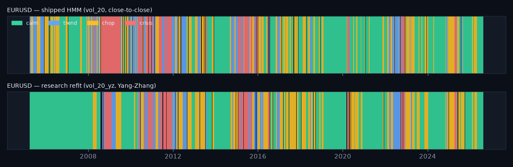

# Yang-Zhang ablation — research copy only

_Generated 2026-08-19 16:12. The phase-03 GaussianHMM (4 states, train <= 2016-12-31, same n_iter/seed) was refit with `vol_20` swapped for `vol_20_yz` (Yang & Zhang 2000, 20-day, annualised). Nothing under models/ or the bundle changed — this compares a research refit with the SHIPPED regimes._

## Regime share, run length, agreement

| pair | model | share_calm | share_trend | share_chop | share_crisis | mean_run_days | switches_per_year | agreement_with_shipped |
|---|---|---|---|---|---|---|---|---|
| EURUSD | shipped (vol_20) | 0.400 | 0.166 | 0.291 | 0.143 | 23.684 | 10.640 | 0.675 |
| EURUSD | research (vol_20_yz) | 0.478 | 0.124 | 0.296 | 0.102 | 34.638 | 7.275 | 0.675 |
| GBPUSD | shipped (vol_20) | 0.183 | 0.268 | 0.479 | 0.070 | 21.303 | 11.829 | 0.308 |
| GBPUSD | research (vol_20_yz) | 0.316 | 0.410 | 0.217 | 0.057 | 35.414 | 7.116 | 0.308 |
| USDCHF | shipped (vol_20) | 0.686 | 0.218 | 0.092 | 0.004 | 45.211 | 5.574 | 0.352 |
| USDCHF | research (vol_20_yz) | 0.257 | 0.518 | 0.190 | 0.035 | 38.618 | 6.525 | 0.352 |

Mean label agreement research vs shipped: 44.5% (range 30.8%–67.5%). Shares and run lengths are over the full history (the shipped model's own numbers are the 'shipped' rows).

## Reading it

Yang-Zhang uses the open/high/low/close range, so it is a less noisy variance estimate than the close-to-close std for the same 20-day window. On this data source the overnight term is nearly zero (Yahoo's daily FX open is a start-of-day snapshot of the previous close), so the estimator is carried by the Rogers-Satchell and open-close terms; it also inherits any bad high/low prints. The state NAMING rule (sort by mean vol, then |mom|) was kept, so labels are comparable but not identical: a different vol input moves the state boundaries, hence the agreement below 100%. Where agreement is far below 100% (GBPUSD, USDCHF in the table) the lesson is that the HMM's state identities are NOT robust to the volatility estimator — the strongest argument for treating a YZ adoption as a full rebuild with validation (phase-04 style) rather than a swap.

**Decision:** `vol_20_yz` ships in `features_ext.parquet` for the challenger only. Adopting it inside the HMM / the Rust wall is a follow-up for the next scheduled bundle rebuild (new feature_spec, goldens, selftest) — not a silent swap.

_Educational tool. Not investment advice._
